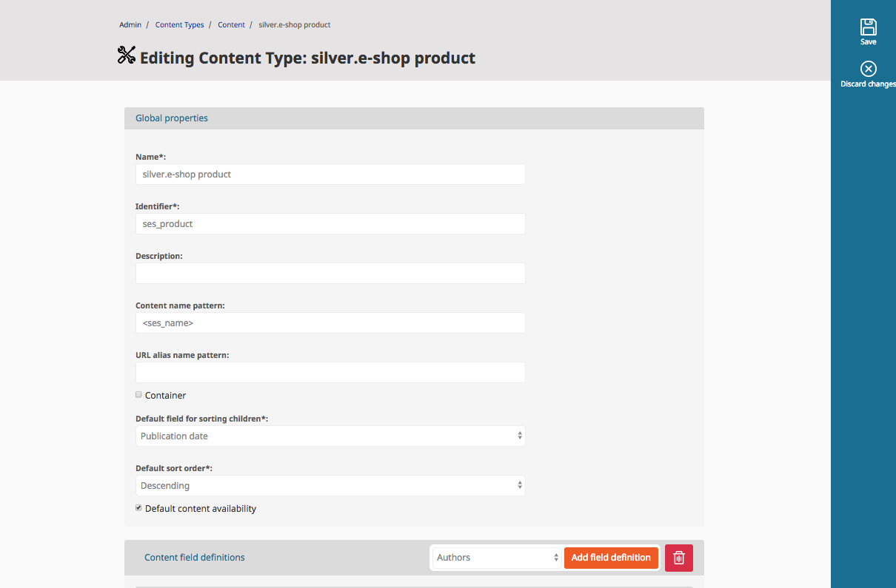
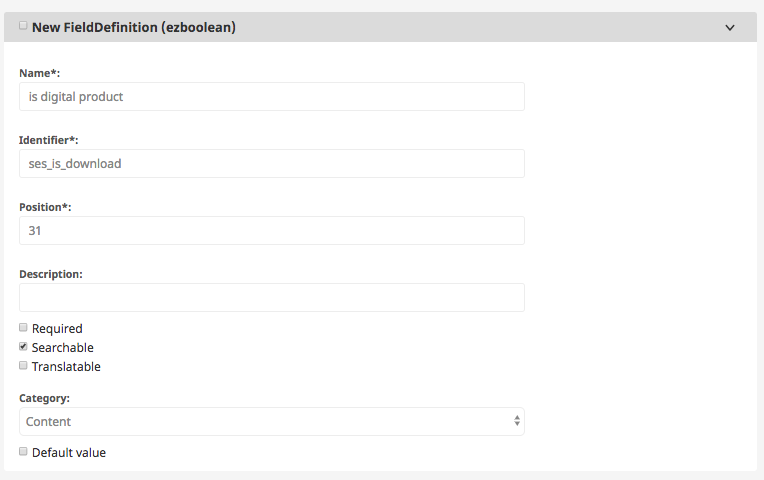
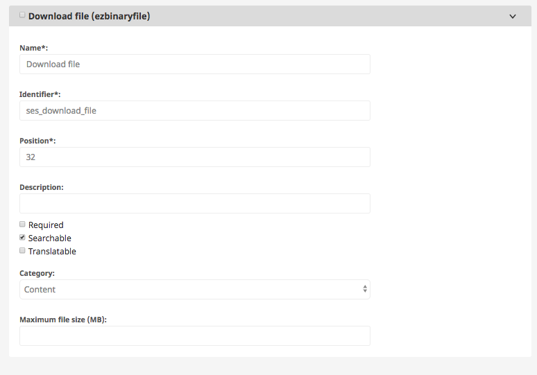
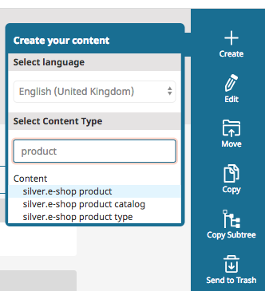
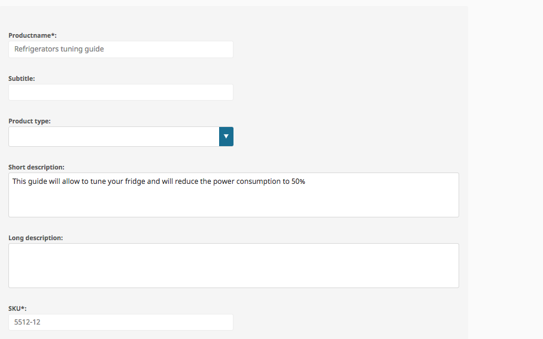
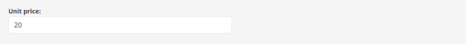
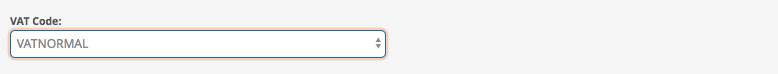
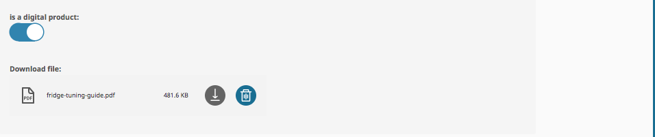

# Step 2 - Add new field for products in the Backend

!!! note "What we want to achieve"

    The product class already consists all required attributes, like sku or price. However, depending on your business focus, you might want to maintain additional attributes, that are not offered by default.

    This can be done in a quite easy way.

## Add additional product data

In the Admin/Content Types area (/admin/contenttypegroup/1/) click on the edit button for the ses\_product content type.

One thing that you have to keep in mind, is that the field identifier MUST start with the prefix ***ses*** und you have to use the *snake\_case* convention.

Examples of valid identifiers: ses\_identifier, ses\_book\_author, ses\_copyright\_date

Another thing, that you have to keep in mind is, that not all eZ fields are currently supported to be stored automatically in the product data, see below.  

**Please add 2 new fields to the product:**

Field "ses\_is\_download" (ezboolean):

Field "ses\_download\_file" (ezbinaryfile)

## Create a new  a product "Refrigerators tuning guide"

 Navigate to a product group (/admin/content/location/253) e.g.

Home / Product Catalog / Major Appliances / Refrigerators 

And click on Create → silver.eshop product

**Fill out at least the following fields:**

