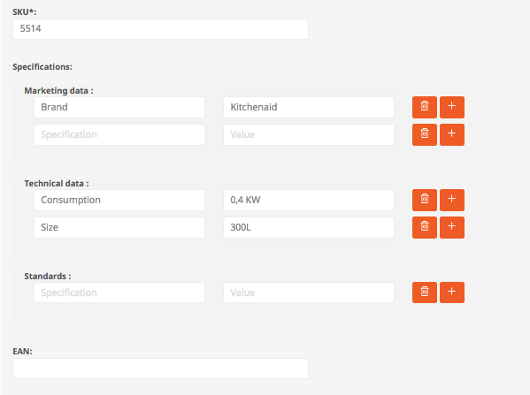

# First steps in the frontend and backend

## The frontend

The shop frontend can be accessed using the URL:

`http://localhost`

## Login to the backend

You can login to the backend using the domain or IP setup for your installation. The eZ Commerce backend uses the same login form and backend as eZ Platform.

http://localhost/admin

The default credentials are:

Username: admin

Password: publish

Afterwards the backend will be displayed. You will find new item in the main navigation enriching eZ Platform with eCommerce features

## Navigate to a product

Click on "Browse" and navigate through the catalog to a fridge:

Aftwerwards you can edit the fridge in the backend by clicking on "Edit" in the right tab.

## Watch the Cockpit

The Cockpit offers a good overview about the current usage of your shop. You will find the Cockpit in the main tab eZ Commerce 

## Edit a product

Search for a product (e.g. using the SKU 5514)

Click on the Edit icon in the right column. 

