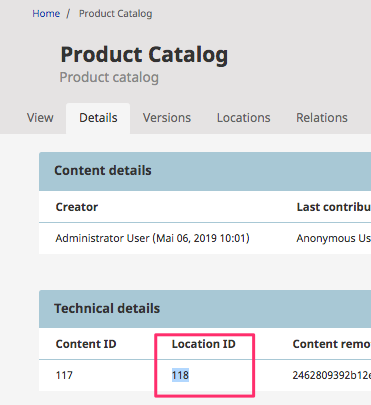

# Installation

## Install a fresh eZ Commerce

The eZ Commerce installer will install eZ Platform and eZ Commerce in one step. An eZ Platform Enterprise license is required. 

**Prerequisite**:

Make sure to configure proper authentication parameters for the updates.ez.no update server. You will receive the login parameters from the customer portal at <https://www.ibexa.co/>:

``` json
~/.composer/auth.json
{
    "http-basic": {
        "updates.ez.no": {
            "username": "xxxxxxxxxxx",
            "password": "xxxxxx"
        },
    },
}
```

## Step 1 - Create a DB

``` mysql
// start mysql and run
CREATE database ezcommerce;
```

## Step 2 - Create the project

**Option A - Using composer**

``` bash
php composer.phar create-project ezsystems/ezcommerce
## fetching a special version
php composer.phar create-project ezsystems/ezcommerce=v2.5.0
```

The installer will ask for some missing parameters:

**Important**:

- Make sure that the parameter `siso_imagemagick_path` is set properly (for linux system it is usually `/usr/bin/convert` and for MAC `/usr/local/bin/convert`). 
- Please run `./vendor/defuse/php-encryption/bin/generate-defuse-key` after the installer asks for the parameters (e.g. using a separate window) and copy the secret for the payment system (`JMS_PAYMENT_SECRET`) to your clipboard. 

``` 
Some parameters are missing. Please provide them.
env(SYMFONY_SECRET) (ThisEzPlatformTokenIsNotSoSecret_PleaseChangeIt):
env(JMS_PAYMENT_SECRET) (def00000706ea7318427e72fcea2c8ceb86773a4310e35119c48e3029196acfead1ba8cc898f48d1ef9cb3f7ebe191ab46eaf67ec94a2b6bd17c079ac7277de0175b9e3e):
env(DATABASE_DRIVER) (pdo_mysql):
env(DATABASE_HOST) (localhost):
env(DATABASE_PORT) (null):
env(DATABASE_NAME) (ezcommerce): ezcommerce
env(DATABASE_USER) (root):
env(DATABASE_PASSWORD) (null): 
env(DATABASE_CHARSET) (utf8):
env(DATABASE_COLLATION) (utf8_general_ci):
env(DATABASE_SERVER_VERSION) (mariadb-10.2.12): 5.7.19
env(SISO_SEARCH_SOLR_HOST) (localhost):
env(SISO_SEARCH_SOLR_PORT) (8983): 8983
env(SISO_SEARCH_SOLR_CORE) (collection1):
env(SISO_SEARCH_SOLR_PATH) (/solr):
env(SOLR_DSN) ('http://%env(SISO_SEARCH_SOLR_HOST)%:%env(SISO_SEARCH_SOLR_PORT)%%env(SISO_SEARCH_SOLR_PATH)%'):
env(SOLR_CORE) ('%env(SISO_SEARCH_SOLR_CORE)%'):
siso_imagemagick_path (/usr/bin/convert): /usr/bin/convert
siso_core.siteaccess_group (ezdemo_site_clean_group):
apache_tika_path ('%kernel.project_dir%/bin/tika-app-1.20.jar'):
> eZ\Bundle\EzPublishCoreBundle\Composer\ScriptHandler::clearCache
```

## Step 3 - Install and Start Solr

eZ Commerce requires Solr as search engine. The demo provides a Solr installation which has to be started:

Get and install and start Solr

If you are using the standard port 8983 you do not need to pass the port as a parameter

``` bash
bash ./install-solr.sh 8983
```

## Step 4 - Run installer

The installer will create the database and will provide a clean Installation for eZ Commerce. 

``` bash
php composer.phar ezcommerce-install
```

## Step 5 - Start the PHP Server

The fastest way to start a PHP server and run the application is to use the build in PHP webserver:

``` bash
php bin/console server:run
```

## Adjust the access rights

Please check the eZ Platform documentation depending on the operating system you are using:  https://doc.ezplatform.com/en/2.2/getting_started/install_ez_platform/#set-up-permissions

For linux based systems:

``` bash
#Linux:
sudo setfacl -dR -m u:www-data:rwX -m u:$(whoami):rwX var/logs/ var/cache/ var/sessions/ web/*
sudo setfacl -R -m u:www-data:rwX -m u:$(whoami):rwX var/logs/ var/cache/ var/sessions/ web/*
```

# Install Demo products and use econtent

Check which location id is used for the "Productcatalog":



``` bash
php bin/console silversolutions:switchdataprovider econtent --location-id=118 --new-root-node=2
```

Install Demo data

``` bash
php bin/console ezplatform:install ezcommerce_econtent_demo
```

Install Demo images

``` bash
cd vendor/ezsystems/
git clone https://github.com/ezsystems/ezcommerce-demo-assets.git
cd ../..
cp -R vendor/ezsystems/ezcommerce-demo-assets/assets/ web/var/assets/
```
