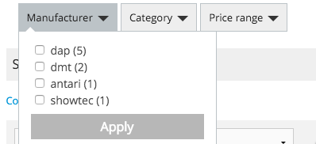

# Term - Facet

A facet is a collection of attributes provided by a product or content. 

A facet could be e.g. the color or a price range. Example:

Facet showing the manufactures

A facet is build dynamically based on the current search result. 
