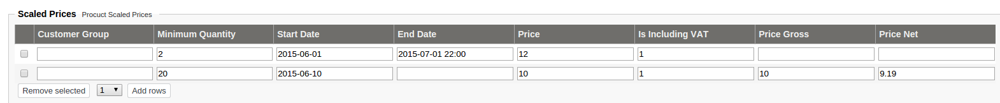

# Term - Scaled Prices

**Scaled Prices** is an array of configured prices that have additional information.

Those parameters have to match, if this scaled price is going to be shown on the website.

E.g. lets assume that in the backend there are scaled prices set like on the image below:

In the first case the price "**12**" including VAT will be shown on the website, if additional conditions will match:

- minimum quantity is 2
- the current date is between 2015-06-01 and 2015-07-01 22:00 
