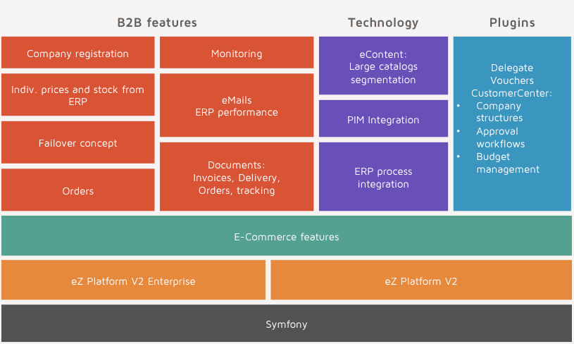

# Architecture

eZ Commerce is divided into several bundles located in the vendor directory:

|Bundle|Description|
|--- |--- |
|EshopBundle|Core bundle of the shop|
|ComparisonBundle|Comparison feature|
|TranslationBundle|Translation handling|
|ToolsBundle|Misc tools|
|PriceBundle|Price engine standard features|
|CheckoutBundle|Checkout for the shop|
|QuickOrderBundle|Quickorder feature|
|SearchBundle|Search using SolrBundle|
|PaymentBundle|Core payment bundle|
|PaypalPaymentBundle|PayPal implementation|
|TelecashPaymentBundle|Telecash implementation|
|OgonePaymentBundle|Ogone implementation|
|DatatypesBundle|Fieldtypes for the shop|
|EzStudioBundle|Page Builder blocks and controllers|
|LocalOrderManagementBundle|Local order handling|
|VariantTypeBundle|Variant handling|

