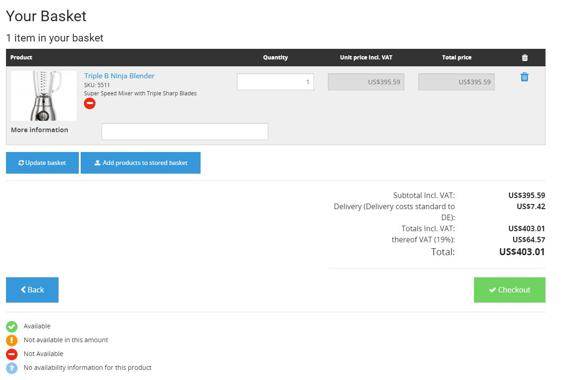

# Basket

## Introduction

eZ Commerce provides a flexible basket system. A basket is identified by 

- a session id (e.g. if the user is not logged in)
- a user id (if the user is logged in)

Doctrine is used to store the basket in the database.  

The basket is used for several purposes:

- a current basket
- a wishlist basket
- a comparison basket
- a quickOrder basket
- A stored basket can be used to store a basket using a given name and use this later on.

A basket (type=basket) may use different states during the checkout process. After the order  has been sent the basket will get a special state (ordered).

The basket allows to store project specific information in several places:

- Basket header
- Basket lines
- Basket Parties (Invoice, buyer or delivery party)

## 
