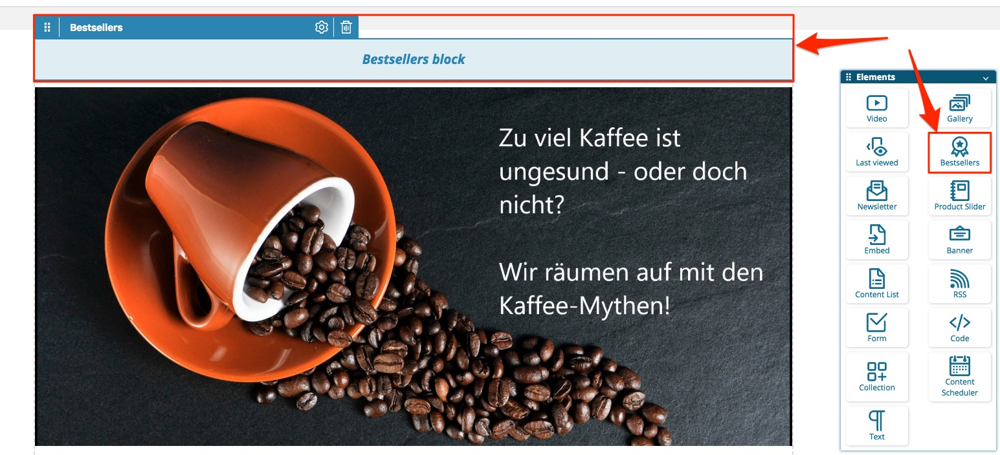
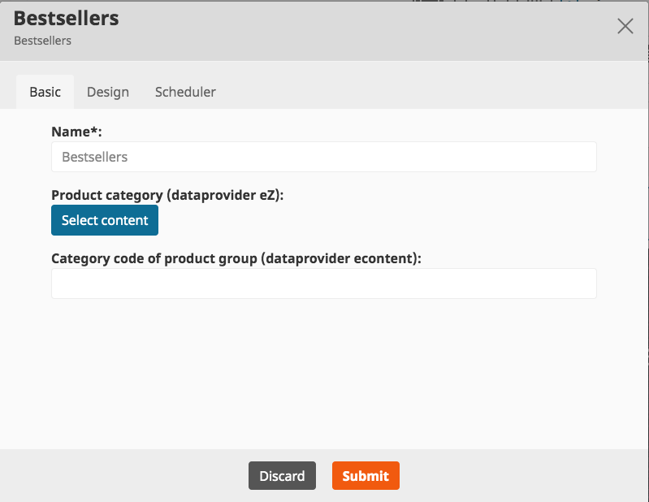

# Bestseller cookbook

## Add a bestseller slider to the Landing Page

Add bestseller block from the Elements overlay.
    
Drag the Bestseller block to the desired place and drop it.
    

    
Edit the added block: click the gear, then either select a category of eZ products or add the Category code of an eContent category:

Check which dataprovider is used in your project. Selected category/given category code for the inactive dataprovider is ignored.

Submit your changes and publish the page.
