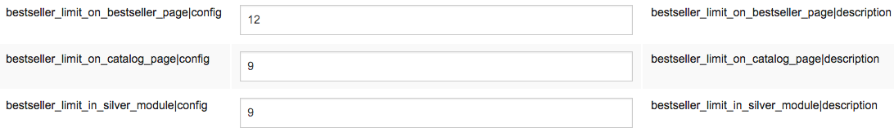
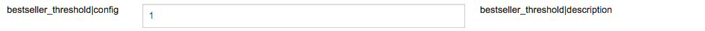

# Bestseller FAQ

## Can the amount of displayed bestsellers be changed?

The amount of displayed bestsellers can be configured in the eZ Commerce configuration (backend):

## How can the threshold, from which a product counts as a bestseller, be modified?

The threshold can be configured in the eZ Commerce configuration (backend):

## How are bestsellers determined?

Existing basket lines from confirmed baskets are counted for each bought product. This is done by the "BasketLineSumDeterminationService".

## Where is the bestseller data stored?

The EzBestsellerIndexerPlugin adds a Solr field with the sum of lines of a product. 

`ses_product_ses_sum_of_basket_lines_i`
