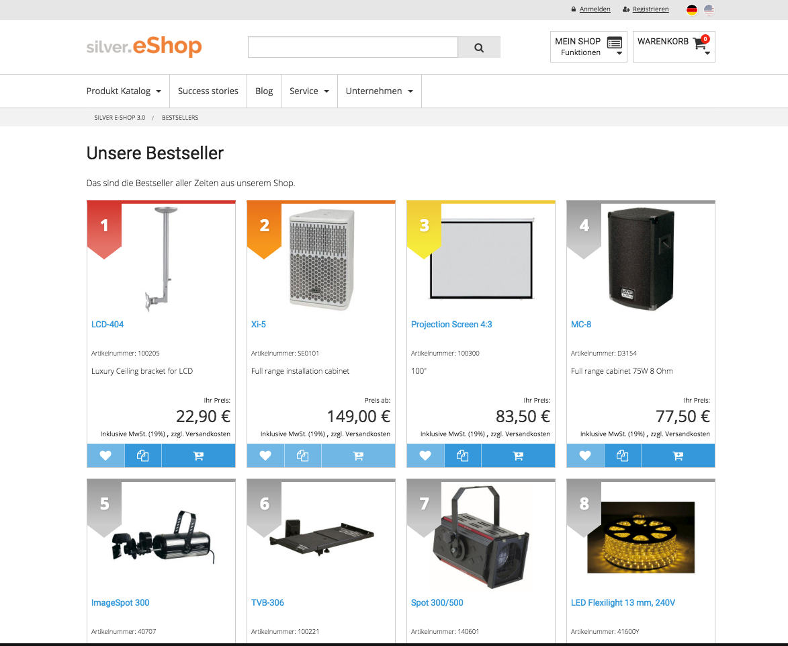

# Bestseller UI

## Templates list

- `EshopBundle/Resources/views/Bestsellers/bestsellers.html.twig` renders a bestseller page



- `EshopBundle/Resources/views/Bestsellers/bestsellers_box.html.twig` renders a slider for an `st_module` (100% or 50%)


- `EshopBundle/Resources/views/Bestsellers/bestsellers_catalog.html.twig` renders a slider for the catalog page


- `EshopBundle/Resources/views/Bestsellers/bestsellers_box_esi.html.twig` creates an Edge Side Includes tag and calls the controller for landing page bestsellers

!!! note "Category pages/Caching"

    Catalog bestsellers are cached independent of the rest of the page using ESI.

    `vendor/silversolutions/silver.e-shop/src/Silversolutions/Bundle/EshopBundle/Resources/views/Catalog/catalog.html.twig`:

    ``` html+twig
    {{ render_esi( controller( 'SilversolutionsEshopBundle:Bestsellers:getCategoryBestsellers',
    {
        'locationPath': catalogElement.path,
        'locationName': catalogElement.name,
    } )) }}
    ```

## Content and translations

- Textmodule: `bestsellers_intro_text`

## Related routes

``` yaml
silversolutions_bestsellers:
    path:      /bestsellers
    defaults:
        _controller: SilversolutionsEshopBundle:Bestsellers:getBestsellersList
        breadcrumb_path: silversolutions_bestsellers
        breadcrumb_names: Bestsellers
```
