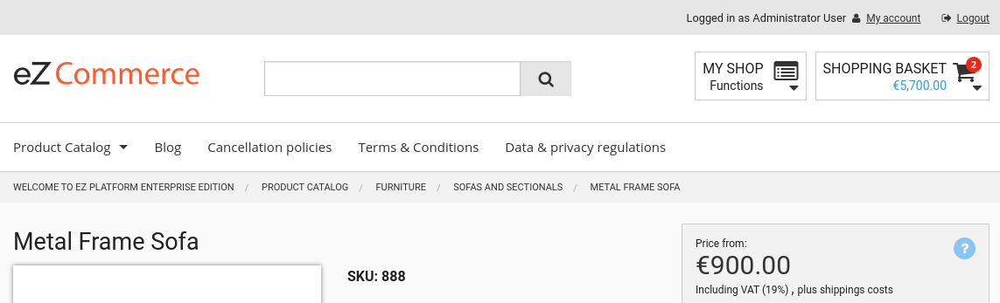

# Breadcrumbs

eZ Commerce supports generation of breadcrumbs throughout the shop.
In every part of the shop there is at least one generator that is responsible for creating breadcrumbs. 



Breadcrumbs are generated using a general template that is called from `pagelayout.html.twig`.
There is no need to define the HTML code in full templates:

``` html+twig

        <div class="crumb-wrap hide-for-print">
          <div class="row">
            <div class="columns">
              

 
```

Breadcrumbs use [schema.org markup](http://schema.org/BreadcrumbList) for generating the HTML tags. 

The breadcrumb system uses the [WhiteOctober breadcrumbs bundle](https://github.com/whiteoctober/BreadcrumbsBundle).

## Features

eZ Commerce breadcrumbs support:

- creation of breadcrumbs for catalog elements (e.g. products, categories)
- creation of breadcrumbs for internal shop routes (e.g. my profile, search)
- creation of breadcrumbs for eZ Platform content
- creation of breadcrumbs for special eZ Commerce forms (e.g. contact form)
- different data providers as products may come from different sources
- generation of breadcrumbs for multiple product catalogs
- storage of additional data in `translationParameters`
- configuration for content Fields that should be used as breadcrumb labels

## Configuration

You can configure the Fields that will be used as labels for breadcrumb nodes.
The first match wins.

``` yaml
parameters:
    siso_core.default.breadcrumb_content_label_fields: ['name', 'title']
```
