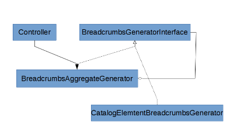

# Breadcrumbs API

## Page layout hook-in

`Silversolutions/Bundle/EshopBundle/Resources/views/pagelayout.html.twig` defines a block named `breadcrumb` in which the breadcrumbs are rendered as a sub-controller call.

FQN: `\Silversolutions\Bundle\EshopBundle\Controller\BreadcrumbsController::renderBreadcrumbsAction()`
Controller short name: `SilversolutionsEshopBundle:Breadcrumbs:renderBreadcrumbs`.

## Aggregation of generators

Breadcrumb logic uses an aggregate method for each generator interface:



The main gateway is a class `BreadcrumbsAggregateGenerator`. It collects all generators which can generate breadcrumbs. 

A compiler pass gets all services tagged with `siso_core.breadcrumbs_generator`.

``` 
<tag name="siso_core.breadcrumbs_generator" priority="20" />
```

## Rendering of breadcrumbs

The controller method `BreadcrumbsController::renderBreadcrumbsAction()` uses the `BreadcrumbsAggregateGenerator` to render the breadcrumbs from the controller.

The `AggregateGenerator` loops through all collected generators to check if this particular generator can render breadcrumbs.

The first generator that returns true from `canRenderBreadcrumbs()` wins and is used to render the breadcrumbs HTML code.
That's why it is important to set the priority of the generators properly.

Every generator must implement the `Silversolutions\Bundle\EshopBundle\Api\BreadcrumbsGeneratorInterface` interface.

|Method|Description|
|--- |--- |
|`public function canRenderBreadcrumbs(Request $request);`|Verifies if the generator should render breadcrumbs for current request.|
|`public function renderBreadcrumbs(Request $request);`|Is responsible for breadcrumb generation. It renders breadcrumbs for the current request.|

## List of generators

|Name|Description|
|--- |--- |
|[`RoutesBreadcrumbsGenerator`](routesbreadcrumbsgenerator.md)|Renders breadcrumbs if the route for the action contains information (in `routing.yml`):</br>`breadcrumb_path: silversolutions_stored_basket_show`</br>`breadcrumb_names: storedBasket`|
|[`PostSilverModuleBreadcrumbsGenerator`](postsilvermodulebreadcrumbsgenerator.md)|Renders breadcrumbs for a silver.module element|
|[`EzContentBreadcrumbsGenerator`](ezcontentbreadcrumbsgenerator.md)|Renders breadcrumbs for a Content item|
|[`CatalogBreadcrumbsGenerator`](catalogbreadcrumbsgenerator.md)|Renders breadcrumbs for an e-shop catalog element|
