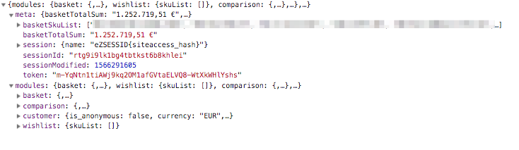
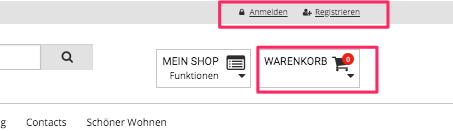

# Basketpreview cache and user-specific data

eZ Commerce uses a lot of dynamic data which has to be displayed in the shop:

- The basket preview showing the number of products and a list of products
- The name of the customer
- The number of items in the wishlist

In order to improve the caching and speed up page loading a special route is used to provide the dynamic data using a REST call. It would be possible to use ESI blocks to cache the user specific data inside a page but this concept has some restrictions since it is not very reliable (there is no cache by user/session but a cache by cookie hash which might cause issues when 3rd party software are changing the data stored in a cookie).

This concept allows to cache pages in a more effizient way and to place dynamic attributes using JavaScript. 

## The REST route

The route `silversolutions_session_data` is used to send a call to the server to get the updated data for the dynamic attributes.

By default the following attributes are returned:



The response is cached via the http cache. It is purged whenever an basket is updated or a customer logs in.
After page load a JS will fetch the current data from the server and updates

- the part showing who is logged in 
- the basket preview
      


### JS Event

An event will be trigged after the data has been received via REST:

```
new CustomEvent("ses:dynamic-data", { "detail": response.data });
```

You can subscribe to the event inside a vue app using this.$on:

```
document.addEventListener("ses:dynamic-data", function(e) {
    console.log("ses:dynamic-data");
    console.log(e.detail); // Prints "meta and modules data"
});
```

## Extending the REST call

The modules section can be used for project specific data using a tagged service which has to implement a service using a special service tag:

```
<tag name="siso_core.session_data" alias="mydata"/>
```

The alias "mydata" is used as a key in the modules section.

### Working with html fragments

Each service implementing the SessionDataInterface can return HTML fragments. The keys used should use the id of an container inside your site. eZ Commerce will replace this container automatically using the prepared HTML.

Example how to provide the data in a service:

``` php
/**
 * Get header login session data
 *
 * @return \Symfony\Component\HttpFoundation\Response
 */
public function getSessionData()
{
    return array(
        'loginHeader' => array(
            'html' => array(
                'headerLoginMobile' => $this->getLoginData(true),
                'headerLoginDesktop' => $this->getLoginData(false)
            )
          )
    );
}
```

The corresponding div in the website needs to use the key (headerLoginDesktop) e.g. as an id:

```
<ul class="inline-list c-nav-meta" id="headerLoginDesktop">
...
</ul>
```

## How to update existing projects

Allow to access cookie via JS:

``` 
ezpublish:
    system:
        my_siteaccess:
            session:
                cookie_httponly: false
```

Add vue.js in pagelayout.html.twig within header:

``` 
<script src="{{ asset("bundles/silversolutionseshop/js/vue/vue.js") }}"></script>
```

Add the routeconfig to the pagelayout.html.twig at the beginning of javascripts block:

``` html+twig


<script type="text/json" id="ses-url-config">
{
        "urlGetSessionData": "{{ path('silversolutions_session_data') }}",
        "session_name": "{{ ses_config_parameter('session', '').name }}"
}
</script>
```

Add 3 javascript files to pagelayout.html.twig:

``` html+twig
// If you plan to support the old IE as well:
<script src="https://cdn.jsdelivr.net/npm/es6-promise@4/dist/es6-promise.js"></script>
<script src="https://cdn.jsdelivr.net/npm/es6-promise@4/dist/es6-promise.auto.js"></script> 
{% javascripts
...
  'bundles/silversolutionseshop/js/vue/md5.js'
  'bundles/silversolutionseshop/js/vue/axios.min.js'
  'bundles/silversolutionseshop/js/dynamic-header.js'
....
```

The twig block `basket_preview` in pagelayout.html.twig has to be changed using a static HTML markup which will be replaced by JS after loading the session data:

``` html+twig

       {# This block is rendered via JS #}
       <div class="item c-icon-bar__item--fluid c-icon-bar__item--primary js-basket-flyout inactive">
          <a class="c-icon-bar__items-wrap"
             href=""
             data-dropdown="dropdown-basket">
            <div class="c-icon-bar__border">
              <div class="c-icon-bar__labels show-for-large-up">
                <h5 class="c-icon-bar__heading">{{ 'Shopping basket'|st_translate }}</h5>
                <span class="c-icon-bar__label" data-price-wrap="user">
              <div class="c-icon-bar__icons u-inline-block right">
                <i class="fa fa-shopping-cart c-icon-bar__icon-main">
                  <span class="label alert round c-icon-bar__counter">
                </i>
                <i class="fa fa-caret-down right c-icon-bar__icon-secondary"></i>
              
          </a>

```
