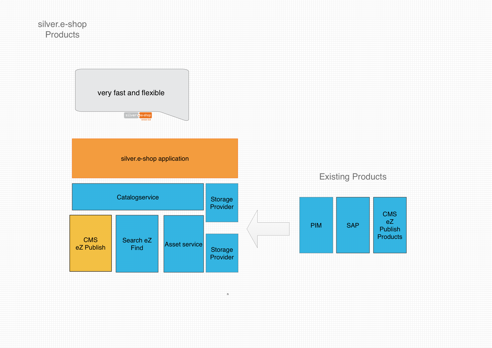

# Catalog

eZ Commerce provides a flexible way of storing product data and a flexible product data model.

This enables building ecommerce sites tailored to the needs of a project: from a limited number of products to a highly scalable shop with over a million of products. 

Depending on the use case, products can be stored in 

- the content model (when you are not using an ERP and PIM system)
- in an optimized eContent storage, which is able to store up to two million products  

A storage engine is responsible for handling products. It consists of:

- a catalog data provider which manages the access to the product data itself (e.g. access method using database queries)
- a catalog factory which is responsible for building `CatalogNodes` and `ProductNodes`

The storage engine can be configured in the service container definition. 

## Product catalog objects

- A `catalogElement` represents a product group/category. It has a name, a code and a place in the catalog tree. It also can have additional Fields.
- A `productType` represents a collection of similar products that differ only in some characteristics. It is used to show a list of products in a tabular way. Every product can be added to basket directly from this overview page.
- A `productNode` inherits from the `catalogElement` and offers additional attributes such as an SKU, images, price and other attributes and thus an element of the catalog tree composite pattern. `productNode` itself defines (together with `ProductNodeContainer`) an element of another composite pattern, which is used to model more complex products (e.g. products with variants).

!!! note

    You can access products which are stored as Content items using API provided by eZ Commerce.

    The API provides ecommerce-related features such as access to stock and prices.
    It offers an abstract product model which does not depend on the data source.

## Products and content

eZ Commerce is able to mix products and Content items in a common sitemap and tree.
A navigation service is used to build a common tree for the navigation.

In addition, a chain router is able to detect product URLs and invoke the controllers for products and catalog elements in order to display products or product categories.

## Using the catalog

eZ Commerce by default uses eZ Platform storage provider. 

When you start a project you may need to make small adaptations since new product Fields are used:

- Extend the Content Type in the CMS in order to add new Fields
- Extend the existing catalog factory in order to use the new Fields 

For more information on overriding the catalog factory, see [How to extend a CatalogFactory](catalog_cookbook/extending_a_catalogfactory.md)

## URL handling

The catalog uses URLs which are part of the website structure.
eZ Commerce offers a routing feature which determines whether a URL belongs to the Content Tree or is part of the Product Catalog.
