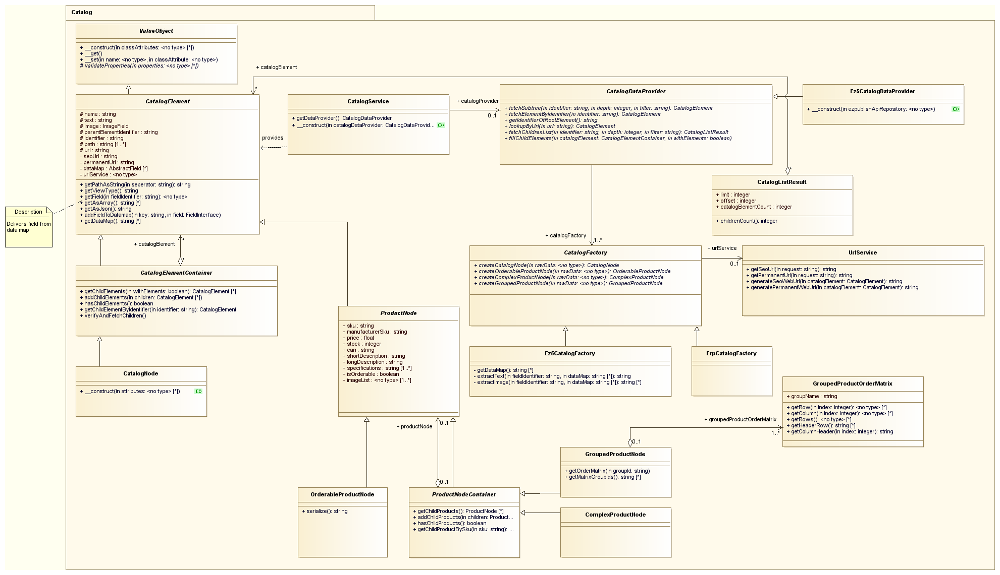

# Product category (CatalogElement)

The `CatalogElement` class defines the generic product and category model which is used in eZ Commerce. It inherits from the general class [ValueObject](../../../api/valueobject.md) which offers a convenient way of setting properties of instances via the constructor and makes these properties public readable.

The following subclasses inherit from `CatalogElement`:

- `CatalogElementContainer`
    - `CatalogNode`
- `ProductNode`
    - `OrderableProductNode`
    - `ProductNodeContainer`
        - `GroupedProductNode`
        - `ComplexProductNode`
- `ProductType`

## Predefined properties for `CatalogElement`

Each `CatalogElement` has predefined properties. These methods are validated automatically on constructor by the `validateProperties()` method.

||||
|--- |--- |--- |
|Identifier|Type|Description|
|name|string|The name of the catalog|
|text|string|A short introduction text for the catalog|
|image|ImageField (FieldInterface)|An image for the catalog|
|path|array|The path of the catalog (array of identifiers)|
|url|string|The internal URL of the catalog. This URL should not be used for generating links. Use `seoUrl` instead|
|seoUrl|string|The human-readable URL of the category|
|permanentUrl|string|The internal permanent URL|
|parentElementIdentifier|string|The unique identifier of the parent catalog|
|identifier|string|The unique identifier|
|dataMap|FieldInterface[]|A list of Fields|
|cacheIdentifier|int\|string|Cache identifier of the element to use as key in cache storage|

There are four public methods to set properties: 

- `setImage()`
- `setName()`
- `setText()`
- `setCacheIdentifier()`


### Validators for `CatalogElement`

The following validators can be used when attributes are set in `CatalogElement`:

|Name|Parameters|Description|
|--- |--- |--- |
|`validateStringAttribute`|`$value`,</br>`$attribute`|Checks if the value is a valid string|
|`validateBooleanAttribute`|`$value`,</br>`$attribute`|Checks if the value is a valid boolean|
|`validateFloatAttribute`|`$value`,</br>`$attribute`|Checks if the value is a valid float|
|`validateIntegerAttribute`|`$value`,</br>`$attribute`|Checks if the value is a valid integer|
|`validateFieldAttribute`|`$value`,</br>`$attribute`,</br>`$fieldType`|Checks if the value is of given Field Type|
|`validateArrayAttribute`|`$value`,</br>`$attribute`|Checks if the value is an array|
|`validateArrayOfAttribute`|`$value`,</br>`$attribute`,</br>`$class`|Checks if the value is an array of concrete class (interface)|

Concrete implementations of the `CatalogElement` class require you to extend `validateProperties()`.
This method validates all given properties in the constructor of the class.
As you do not want to overwrite the given implementation but extend it,
use `parent::validateProperties($properties)` in your implementation.

??? note "Example: Extending validateProperties()"

    ``` php
    /**
     * Simple class which extends OrderableProductNode (CatalogElement)
     */ 
    class MyOrderableProductNode extends OrderableProductNode
    {
        /**
         * An additional instance of a Field
         * @var FieldInterface
         */
        protected $myField;
        
        protected function validateProperties(array $properties = array())
        {
            // call validateProperties() from super class to validate default properties
            parent::validateProperties($properties);
            
            // ... now validate my specialized property "myField"
            if (
                isset($properties['myField'])
                && !($properties['myField'] instanceof FieldInterface)
            ) {
                $message = 'Attribute "myField" has wrong data type: '
                        . gettype($value)
                        . '. Instance of class FieldInterface expected.';
                throw new \InvalidArgumentException($message);
            }
        }
    }
    ```

## Class diagram



## Subclasses

- [ProductNode and OrderableProductNode](productnode_and_orderableproductnode.md)
- [ProductType](producttype.md)
