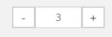

# Catalog - Configuration

## Configure templates to be used

The following configuration defines which template should be used when the CatalogController has to render:

- `CatalogNode` (category)
- `OrderableProductNode` (a product)
- `VariantProductNode` (a variant)
- `ProductType` (special kind of variant)

``` yaml
silver_eshop.default.catalog_template.CatalogNode: Catalog:catalog.html.twig
silver_eshop.default.catalog_template.OrderableProductNode: Catalog:product.html.twig
silver_eshop.default.catalog_template.VariantProductNode: Catalog:product_variants.html.twig
silver_eshop.default.catalog_template.ProductType: Catalog:productType.html.twig
```

## Configuring variants

See [VariantType](../../api/field_type_reference/varianttype.md).

## Configuring the data provider 

The following example shows a configuration for the data provider which uses the content model to store products. 

### `config_data_provider_ez.yml`

``` yaml
services:
    siso_search.search_service.product:
        alias: 'siso_search.ezsolr_search_service'
    siso_search.search_service.catalog:
        alias: 'siso_search.ezsolr_search_service'
parameters:
    silver_eshop.default.catalog_data_provider: ez5
```

- Defines the search service to use
- Defines the identifier for the data provider (here `ez5`)

### `/ez_navigation.yml`

``` yaml
siso_core.default.navigation.catalog:
    # the class ID has to be specified here
    types: ['ses_category']
    sections: [1, 2]
    enable_priority_zero: true
    label_fields: ['ses_category_ses_name_value_s','name_s']
    additional_fields: ['ses_category_ses_code_value_s', 'ses_category_ses_name_value_s' ]
 
# enable if the depth of the node itself has to be added to the depth of the product catalog
siso_core.default.navigation.enable_add_product_catalog_node_depth: true
```

The navigation settings are used to build the navigation tree.

For more details, see [Navigation](../navigation/navigation.md).

In addition, the parameters for search have to be defined depending on the data provider (see `econtent_search.yml` or [eContent configuration](../econtent/econtent_configuration.md)).

## Configuring the CatalogFactory

The following example shows the `CatalogFactory` configuration that determines which method creates the `catalogElements` depending on the Content Type:

``` yaml
silver_eshop.default.catalog_factory.ses_category: createCatalogNode
silver_eshop.default.catalog_factory.ses_productcatalog: createProductCatalogNode
silver_eshop.default.catalog_factory.ses_product: createOrderableProductNode
silver_eshop.default.catalog_factory.ses_product_type: createProductTypeNode
```

- `ses_category` up to `ses_product_type` are the identifiers used in the corresponding Content Types
- `createCatalogNode` defines for example that if a Content Type `ses_category` is provided, the method `createCatalogNode()` is used to create the catalog element.

## Configuring variants

See [VariantType](../../api/field_type_reference/varianttype.md).

## Filter for creating product lists

The following configuration is used to filter Content items.
The data provider uses these filters to determine which Content Types are used for example for:

- navigation (usually the `ses_category`)
- product list (display all products belonging to a category)

``` yaml
silver_eshop.default.ez5_catalog_data_provider.filter:
    navigation:
        contentTypes: [ "ses_category" ]
        sortClauses:
            -
                clause: "\\eZ\\Publish\\API\\Repository\\Values\\Content\\Query\\SortClause\\Location\\Priority"
                order: "\\eZ\\Publish\\API\\Repository\\Values\\Content\\Query::SORT_DESC"
            -
                clause: "\\eZ\\Publish\\API\\Repository\\Values\\Content\\Query\\SortClause\\DatePublished"
                order: "\\eZ\\Publish\\API\\Repository\\Values\\Content\\Query::SORT_ASC"
        limit: 20

    category_names:
        contentTypes: [ "ses_category", "ses_product_type" ]
        sortClauses:
            -
                clause: "\\eZ\\Publish\\API\\Repository\\Values\\Content\\Query\\SortClause\\Location\\Priority"
                order: "\\eZ\\Publish\\API\\Repository\\Values\\Content\\Query::SORT_DESC"
            -
                clause: "\\eZ\\Publish\\API\\Repository\\Values\\Content\\Query\\SortClause\\DatePublished"
                order: "\\eZ\\Publish\\API\\Repository\\Values\\Content\\Query::SORT_ASC"
        limit: 20
    navigation_incl_products:
        contentTypes: [ "ses_category", "ses_product" ]
        sortClauses:
            -
                clause: "\\eZ\\Publish\\API\\Repository\\Values\\Content\\Query\\SortClause\\Location\\Priority"
                order: "\\eZ\\Publish\\API\\Repository\\Values\\Content\\Query::SORT_DESC"
            -
                clause: "\\eZ\\Publish\\API\\Repository\\Values\\Content\\Query\\SortClause\\DatePublished"
                order: "\\eZ\\Publish\\API\\Repository\\Values\\Content\\Query::SORT_ASC"
        limit: 20
    catalogList:
        contentTypes: ["ses_category"]
        sortClauses:
            -
                clause: "\\eZ\\Publish\\API\\Repository\\Values\\Content\\Query\\SortClause\\Location\\Priority"
                order: "\\eZ\\Publish\\API\\Repository\\Values\\Content\\Query::SORT_DESC"
    productList:
        contentTypes: ["ses_product"]
        sortClauses:
            -
                clause: "\\eZ\\Publish\\API\\Repository\\Values\\Content\\Query\\SortClause\\Location\\Priority"
                order: "\\eZ\\Publish\\API\\Repository\\Values\\Content\\Query::SORT_DESC"
```

## Misc

``` yaml
# number of elements do be displayed when pagination is used
silver_eshop.default.catalog_product_list_limit: 6
# number of elements on category overview pages
silver_eshop.default.catalog_category_limit: 100
# number of elements for ajax calls
silver_eshop.default.catalog_product_list_limit_ajax: 3

# max. number of products stored in the last viewed cache
silver_eshop.default.last_viewed_products_in_session_limit: 10
# number of chars used for product descriptions on overview page
silver_eshop.default.catalog_description_limit: 50

# Enable +/- (plus/minus) button for quantity instead of single input field.
siso_core.default.quantity_change_button: false
```


