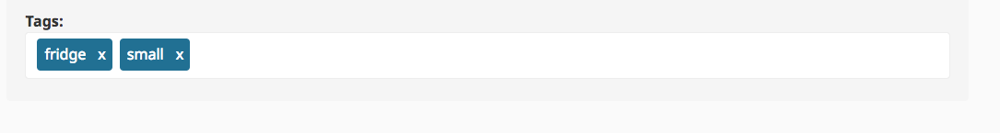

# Extending a CatalogFactory

If you need to prepare special fields for products or categories, or you need to do a mapping,
then the easiest way is to extend the CatalogFactory.

The factory maps the data from the provider to the standard `CatalogElements` or `ProductNodes`. It is called every time a product is provided by the data provider. For each provider a factory is defined. Some data providers could be Content items or eContent. The data provider is defined by the `silver_eshop.default.catalog_data_provider` parameter.

For more information about data providers, see [Catalog data provider](../catalog_features/catalog_data_providers.md).

The following example provides one more mapping for a complex Field Type Keyword.

It extends the Content Type `ses_product` by adding a new Field Tags (`ezkeyword`).
In the backend you can now add tags to your products:



## Override the CatalogFactory

### Step 1

Create a new class that extends the Catalog Factory:

``` php
namespace AppBundle\Services;
 
/**
 * ProjecteZCatalogFactory will use the data / objects of the econtent API.
 */
class ProjecteZCatalogFactory extends Ez5CatalogFactory
{

}
```

### Step 2

Define the new class as a service in your service definition file:

``` 
<parameter key="silver_catalog.ez5_catalog_factory.class">AppBundle\Services\ProjecteZCatalogFactory</parameter>
```

Or in YML format:

``` yaml
parameters:
    silver_catalog.ez5_catalog_factory.class: AppBundle\Services\ProjecteZCatalogFactory
```

If you need to inject additional services, the easiest way is to inject the new services using Symfony setter injection.
In this case you have to define the extended service just like the parent service and add the setter injection.

## Extend the service class

The extended service does the mapping for the Keyword Field Type. To simplify, in the example the Keyword Field always uses the name `tags`. An extended implementation could use the identifier of the Content item directly. 

``` php
<?php

namespace AppBundle\Services;

use Silversolutions\Bundle\EshopBundle\Services\Factory\Ez5CatalogFactory;
use Silversolutions\Bundle\EshopBundle\Catalog\CatalogElement;
use Silversolutions\Bundle\EshopBundle\Content\Fields\ArrayField;

class ProjecteZCatalogFactory extends Ez5CatalogFactory
{
    /**
     * Extends factory for Keyword Fieldtype
     *
     * @param CatalogElement $catalogElement
     * @param array $dataMap
     * @return CatalogElement
     *
     */

    protected function fillCatalogElementDataMap(CatalogElement $catalogElement, array $dataMap = array())
    {
        parent::fillCatalogElementDataMap($catalogElement, $dataMap);
        foreach ($dataMap as $ezFieldIdentifier => $ezField) {
            $identifiers = array_slice(explode('_', $ezFieldIdentifier), 1);
            $catalogElementFieldIdentifier = '';
            $identifiersCount = count($identifiers);
            for ($i = 0; $i < $identifiersCount; $i++) {
                $catalogElementFieldIdentifier .= $i == 0 ? strtolower($identifiers[$i])
                    : ucfirst(strtolower($identifiers[$i]));
            }

            if ($ezField instanceof \eZ\Publish\Core\FieldType\Keyword\Value) {
                $catalogElement->addFieldToDataMap('tags',
                    $this->extractKeywords($ezField)
                );
            }
        }
        return $catalogElement;
    }
    /**
     * Extracts Keyword
     *
     * @param  \eZ\Publish\Core\FieldType\Keyword\Value $keywordField
     * @return ArrayField
     *
     */
    protected function extractKeywords (\eZ\Publish\Core\FieldType\Keyword\Value $keywordField) {

        $keywordFields = array();
        $keywordData = $keywordField->values;

        foreach ($keywordData as $keyword) {
            $keywordFields[] = $keyword;
        }

        return new ArrayField(array('array' => $keywordFields));
    }
}
```

## Extend the template and display the keywords

You can extend the default template `SilversolutionsEshopBundle:Catalog:parts/productData.html.twig`.
The following example makes use of the theme option of the Template Resolver and requires some config settings:

``` yaml
siso_tools.default.template_resolver.enabled: true
siso_tools.site_group.template_resolver.bundles: [AppBundle]
siso_tools.site_group.template_resolver.designs: [site_group]
```

The new field `tags` will be available in the `dataMap` of the `CatalogElement`. 

``` html+twig

    <p class="u-no-margin">
        <strong>{{ 'Tags'|st_translate }}</strong>
        
                <span class="label">{{ tag }}
        
    </p>

```
