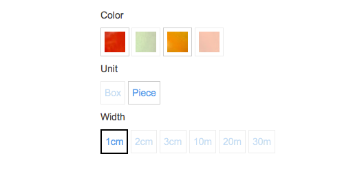

# Setting up variants from external source

The default data provider and `CatalogFactory` for eZ Platform ([Content model data provider](../catalog_api/content_model_dataprovider.md)) already support variants up to two levels which can be set up [using a special variant Field Type](../catalog_features/product_variants/product_variants.md) in the Back Office. 

You can also set up variants if you are not using the default Content Types
and don't want to set up variants manually in the Back Office. 

The main goal is to map your variant structure to the [`VariantProductNode`](../catalog_api/variantproductsnode_and_orderablevariantnode/variantproductnode_and_orderablevariantnode.md) structure.

## How to start

!!! tip
    
    The main job of every CatalogFactory is to fill the [`VariantProductNode`](../catalog_api/variantproductsnode_and_orderablevariantnode/variantproductnode_and_orderablevariantnode.md) attribute [`$variantCharacteristics`](../catalog_api/variantproductsnode_and_orderablevariantnode/simplevariantcharacteristics.md). The basic concept is to take information from provided `dataMap` (e.g. `dataMap` is coming from the data provider, either from the content model or from an external source) and create an attribute `$variantCharacteristic` for the `VariantProductNode`.

Example for `Ez5CatalogFactory`: `dataMap` from th data provider


Example for `Ez5CatalogFactory`: the information was already mapped in the `$variantCharacteristics` attribute in catalog element: 


## Mapping variant information

### 1. Create data provider and catalog factory

The first thing you need to do to create variants is to write your own data provider and factory for catalog elements. 

!!! tip

    It is good practice to define a configuration for templates.
    Depending on which type of catalog element the provider/factory creates, different template should be used.
    This is the default configuration:

    ```
    silver_eshop.default.catalog_template.CatalogNode: Catalog:catalog.html.twig
    silver_eshop.default.catalog_template.OrderableProductNode: Catalog:product.html.twig
    silver_eshop.default.catalog_template.VariantProductNode: Catalog:product_variants.html.twig
    ```

    You can find more information about this is [Catalog UI](../catalog_ui/catalog_ui.md).

If you are writing your own provider and factory from scratch, you have to implement all necessary methods.
This example only shows methods related to variants.

### 2. Implement a method for creating of VariantProductNode

#### Determine which method to call and when

The starting point is the `createCatalogElement()` method.
This is the place where the factory decides which function it internally uses to create the catalog element.

!!! tip

    It is good practice to define a configuration which method should be used depending on e.g. the class identifier (Content Type).
    This is the default configuration:

    ```
    silver_eshop.default.catalog_factory.ses_category: createCatalogNode
    silver_eshop.default.catalog_factory.ses_product: createOrderableProductNode
    ```

Because in this example (standard implementation), the variants are stored as Content items of the same Content Type as regular products (`ses_product`),
`createCatalogElement()` must do additional differentiation when to call the method `createOrderableProductNode()` and when `createVariantProductNode()` (see below).
In the default implementation the factory calls the `createVariantProductNode()` method whenever [EzMatrix with variants](../catalog_features/product_variants/product_variants.md) is filled.

You can adapt this behavior. For example, you can receive a special flag from ERP that tells you if the product is a variant.

??? note "Example"

    ``` 
    public function createCatalogElement(array $nodeInfo = array())
    {
        //get the class identifier
        $contentTypeIdentifier = $this->ezpublishApiRepository
            ->getContentTypeService()
            ->loadContentType($nodeInfo['contentInfo']->contentTypeId)
            ->identifier;

        //determine the factory method depending on the $contentTypeIdentifier
        $configParameter = sprintf('catalog_factory.%s', $contentTypeIdentifier);
        $factoryMethod = $this->configResolver->getParameter($configParameter, 'silver_eshop');

        // ******* if the product has variants, call createVariantProductNode ******* //
        if (isset($nodeInfo['dataMap']['ses_variants'])
            && $nodeInfo['dataMap']['ses_variants'] instanceof \EzSystems\MatrixBundle\FieldType\Matrix\Value
        ){
            /** @var \EzSystems\MatrixBundle\FieldType\Matrix\Value $matrix */
            $matrix = $nodeInfo['dataMap']['ses_variants'];
            $rows = $matrix->rows->toArray();
            if (!$this->hasEmptyRowsOnly($rows)) {
                $factoryMethod = 'createVariantProductNode';
            }
        }
        // check, if factory method is callable, otherwise throw exception
        if (!is_callable(array($this, $factoryMethod))) {
            throw new \BadMethodCallException('Method "'.$factoryMethod.'" is not callable by factory instance of "'
                .__CLASS__.'".');
        }

         return $this->$factoryMethod($nodeInfo);
    } 
    ```

#### Implement `createVariantProductNode()`

Next, you need to implement the `createVariantProductNode()` method from the abstract class `CatalogFactory`:

``` 
abstract public function createVariantProductNode($rawData = null);
```

Example from `Ez5CatalogFactory` (we use information stored in ez matrix (`ses_variants`) which is located in `dataMap` (provided by the data provider).

``` php
public function createVariantProductNode($rawData = null)
{
    if ($this->isValidRawData($rawData)) {

        $attributes = $this->getNodeAttributes($rawData);
        $dataMap    = $rawData['dataMap'];
 
        // this method extracts variant characteristics
        $variantAttributes = $this->extractVariants('ses_variants', $dataMap);

        // set variant characteristics into catalog element attributes
        foreach($variantAttributes as $index => $variantAttribute){
            $attributes[$index] = $variantAttribute;
        }

        $productNode = new VariantProductNode($attributes, $this->urlService);
        return $this->fillCatalogElementDataMap($productNode, $dataMap);
    }

    return null;
}
```

!!! tip

    `$this->extractVariants()` extracts the variant information from the `dataMap` and returns an array with a single element
    that is a [`SimpleVariantCharacteristics` object](../catalog_api/variantproductsnode_and_orderablevariantnode/simplevariantcharacteristics.md).

### 3. Fill VariantProductNode attribute $variantCharacteristics

In your factory you need to map your `dataMap` information into the `VariantProductNode` attribute [`$variantCharacteristics`](../catalog_api/variantproductsnode_and_orderablevariantnode/simplevariantcharacteristics.md). The structure is described below.

All information about variants is stored in this attribute (including prices and pictures). It contains three pieces of information:

- `characteristics` contains all information about characteristics (selectable options) like images or labels for displaying options in templates
- `variantCodes` is a set of all possible combinations of variant characteristics (variants). It contains a list of the respective variant codes, which store a particular combination of the characteristics. The record structure is:

```
- variantCode =>
    - characteristicIdentifier => characteristicCode
    - ...
- ...
```

In this example, the `characteristicIdentifier` is the index number of the variant level
which is provided by the structure of eZ Matrix.

- `variantAttributes` - contains all additional information for each variant (country, price, labels etc). Attributes that are displayed in B2B need to follow special rules:
    - `characteristicCode#`
    - `characteristicLabel#`

##### Example for one-level variant ("Color" only)

``` php
$variantAttributes = array(
    'variantCharacteristics' => new SimpleVariantCharacteristics(
        array(
            'characteristics' =>
                array(
                    '1' => array(
                        'label' => 'Color',
                        'type'  => 'dropdown',
                        'codes'  => array(
                            'grn' => 'Green',
                            'red' => 'Red',
                        ),
                        // optional images for variant display
                        'images' => array(
                            'grn' => new ImageField('image_for green'),
                            'red' => new ImageField('image_for red'),
                        ),
                    ),
                ),
            'variantCodes' => array(
                'VAR-GRN' => array(
                    '1' => 'grn',
                ),
                'VAR-RED' => array(
                    '1' => 'red',
                ),
            ),
            'variantAttributes' => array(
                'VAR-GRN' => array(
                    'characteristicCode1' => FieldInterface,
                    'characteristicLabel1' => FieldInterface,
                    'description' => FieldInterface,
                    'price' => FieldInterface,
                    'dataMap' => array(
                        'countryOfOrigin' => FieldInterface
                    )
                ),
                'VAR-RED' => array(
                    'characteristicCode1' => FieldInterface,
                    'characteristicLabel1' => FieldInterface,
                    'description' => FieldInterface,
                    'price' => FieldInterface,
                    'dataMap' => array(
                        'countryOfOrigin' => FieldInterface
                    )
                ),
            ),
        )
    ),
);
```

##### Example for three-level variant ("Color", "Unit", "Width")

``` php
$variantAttributes = array(
    'variantCharacteristics' => new SimpleVariantCharacteristics(
        array(
            'characteristics' =>
                array(
                    '1' => array(
                        'label' => 'Color',
                        'type'  => 'dropdown',
                        'codes'  => array(
                            'grn' => 'Green',
                            'red' => 'Red',
                        ),
                        'images' => array(
                            'grn' => new ImageField('image_for green'),
                            'red' => new ImageField('image_for red'),
                        ),
                    ),
                    '2' => array(
                        'label' => 'Unit',
                        'type'  => 'dropdown',
                        'codes'  => array(
                            'box' => 'Box',
                            'pcs' => 'Piece',
                        ),
                    ),
                    '3' => array(
                        'label' => 'Width',
                        'type'  => 'dropdown',
                        'codes'  => array(
                            '1' => '1cm',
                            '2' => '2cm',
                            '3' => '3cm',
                            '10' => '10cm',
                            '20' => '20cm',
                            '30' => '20cm',
                        ),
                    ),
                ),
            'variantCodes' => array(
                'VAR-GRN-BOX-20' => array(
                    '1' => 'grn',
                    '2' => 'box',
                    '3' => '20',
                ),
                'VAR-RED-PCS-1' => array(
                    '1' => 'red',
                    '2' => 'pcs',
                    '3' => '1',
                ),
            ),
            'variantAttributes' => array(
                'VAR-GRN-BOX-20' => array(
                    'characteristicCode1' => FieldInterface,
                    'characteristicCode2' => FieldInterface,
                    'characteristicCode3' => FieldInterface,
                    'characteristicLabel1' => FieldInterface,
                    'characteristicLabel2' => FieldInterface,
                    'characteristicLabel3' => FieldInterface,
                    'description' => FieldInterface,
                    'price' => FieldInterface,
                    'dataMap' => array(
                        'countryOfOrigin' => FieldInterface
                    )
                ),
                'VAR-RED-PCS-1' => array(
                    'characteristicCode1' => FieldInterface,
                    'characteristicCode2' => FieldInterface,
                    'characteristicCode3' => FieldInterface,
                    'characteristicLabel1' => FieldInterface,
                    'characteristicLabel2' => FieldInterface,
                    'characteristicLabel3' => FieldInterface,
                    'description' => FieldInterface,
                    'price' => FieldInterface,
                    'dataMap' => array(
                        'countryOfOrigin' => FieldInterface
                    )
                ),
            ),
        )
    ),
);
```

## Result

When your factory sets up the variants, you should see the characteristics on the product detail page.
This examples builds three-level variants and display variants for B2C shop (depending on the [configuration](../catalog_features/product_variants/product_variants.md)). 


