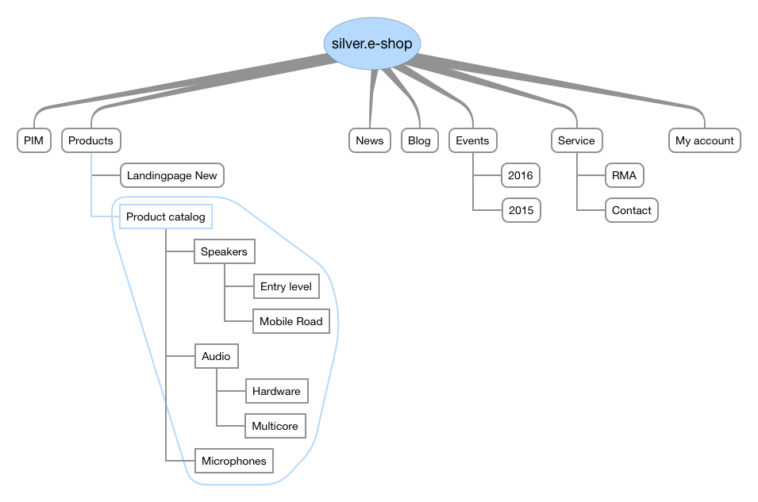

# Catalog data providers

eZ Commerce provides a flexible way to handle products and catalogs. The shop uses central data providers to fetch data for the shop (concrete implementations of `CatalogDataProvider`).

The products are dynamically injected into the Content Tree regardless of which source is used to provide the products.
