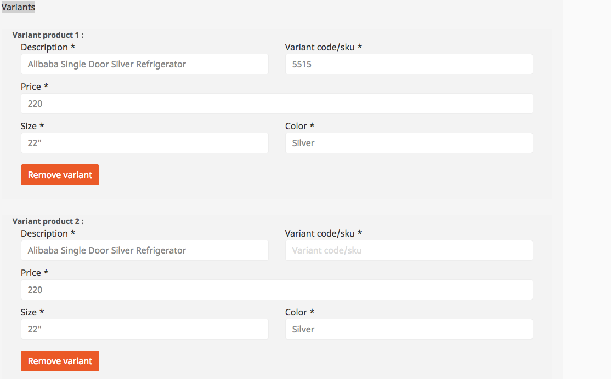
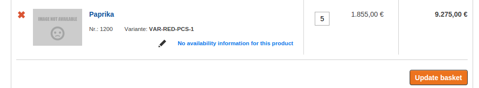
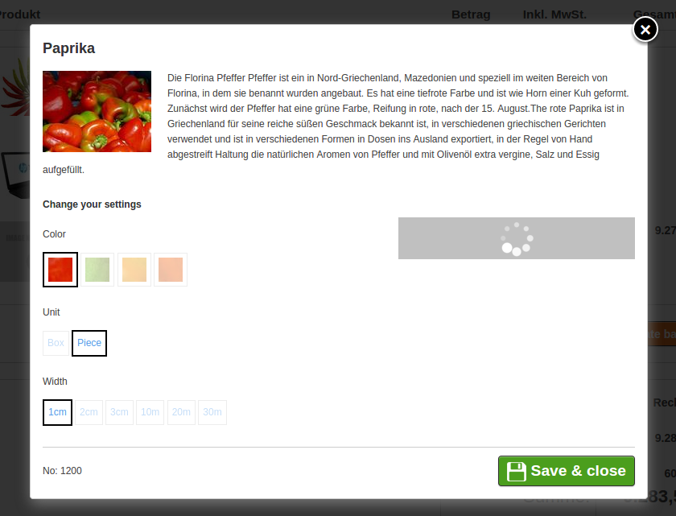
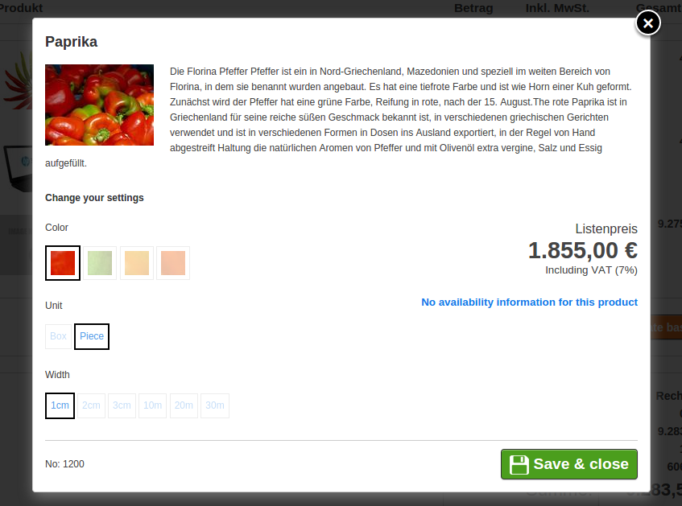

# Product variants

[Product variants](../../catalog_api/variantproductsnode_and_orderablevariantnode/variantproductnode_and_orderablevariantnode.md) are used if a product is available in different options. A product can have up to three levels of variant characteristics such as color or size. 

Variants are displayed differently for B2B and B2C shops on the product detail page.
For B2B the customer can set up multiple variants in one step.

The `variant_type` configuration parameter sets the type of variant per SiteAccess:

``` yaml
# allowed values: B2B, B2C
# B2C - variants are displayed showing all characteristics
# B2B - variants are grouped for 1-step ordering
silver_eshop.default.variant_type: B2C
```

## Variant structure

A product variant consists of:

|Term|Description|Example|
|--- |--- |--- |
|`VariantProduct(Node)`|The virtual product which contains the data for all variants that can be ordered. Since this product has no specific price or stock which is assigned to its SKU, it cannot be added to the basket directly.|SKU: 1234</br>ProductName: "RunnersX100"|
|`OrderableVariant(Node)`|Represents one specific, orderable variation. It is defined by its unique `VariantCode` or by the deterministic set of `VariantCharacteristics`. An `OrderableVariantNode` is intended to be added to a basket.|SKU: 1234</br>ProductName: "RunnersX100"</br>Size: "EU 43"</br>Color: "Blue"|
|`VariantCode`|Identifies an `OrderableVariant` within a `VariantProduct`. It must be unique in the scope of the `VariantProduct`.|VariantCode: 43_blu</br>Would have:</br>size: 43</br>color: blu|
|`VariantCharacteristic`|One `VariantCharacteristic` is a specific attribute of a `VariantProduct` which is distinctive and describes one aspect of the variant. A `VariantProduct` must have at least one `VariantCharacteristic`.|Color: "Blue", "Green", "Red"</br>Size: "EU 41", "EU 42", "EU 43"|
|`CharacteristicIdentifier`|Class unique string for a characteristic. It is equivalent to the identifier of an attribute.|1: color</br>2: size|
|`CharacteristicLabel`|A readable name for a characteristic. It it used for frontend output.|"Color" and "Size" are the labels in this example.|
|`CharacteristicType`|The code used to determine how the characteristic should be displayed / rendered.|'radio' could indicate, that all options should be put into a radiobox.|
|`CharacteristicCode` / `CharacteristicValue`|Each `VariantCharacteristic` can take several values. Like the `CharacteristicLabel`, the `CharacteristicValue` is a readable name for display purposes, but here for a single characteristic value. The `CharacteristicCode` is a unique string for that value which is used to identify the individual values.|Color:</br>Value: "Blue"</br>Code: blu</br>Size:</br>Value: "EU 43"</br>Code: 43|
|`VariantPriceRange`|A set of two prices which represent the lowest and the highest price of all variants.|43€ - 49€|

Complete example:

Product: "RunnersX100"

SKU: 1234

Characteristics:

|CharacteristicIdentifier|CharacteristicLabel|CharacteristicType|CharacteristicCode|CharacteristicValue|
|--- |--- |--- |--- |--- |
|color|Color|radio|blu|Blue|
|color|Color|radio|grn|Green|
|size|Size|dropdown|41|EU 41|
|size|Size|dropdown|42|EU 42|
|size|Size|dropdown|43|EU 43|

Variants:

|VariantCode|CharacteristicCode (CharacteristicIdentifier: 1)|CharacteristicCode (CharacteristicIdentifier: 2)|
|--- |--- |--- |
|blu_41|blu|41|
|blu_43|blu|43|
|grn_42|grn|42|
|grn_43|grn|43|

## Variant creation

The process of variant creation depends on the used data provider. If the content model is used as a data provider, the following standard way applies.

If the `ProductNode` contains information in the matrix (`ses_variants`), `Ez5CatalogFactory` creates a [`VariantProductNode`](../../catalog_api/variantproductsnode_and_orderablevariantnode/variantproductnode_and_orderablevariantnode.md) instead of an `OrderableProductNode`.

Because [`VariantProductNode`](../../catalog_api/variantproductsnode_and_orderablevariantnode/variantproductnode_and_orderablevariantnode.md) is not orderable, the [`VariantService`](../../catalog_api/variantproductsnode_and_orderablevariantnode/variant_services.md) is used to create an `OrderableVariantNode` when adding to basket.

In order to provide variants, the product class `ses_product` has to be extended with a new attribute with the `ses_variants` identifier using `uivarvarianttype` data type. 

By default eZ Commerce offers a set of variant types. The variant type defines which attributes such as size or/and color are used to identify a variant.

The variant types can be defined using a yml configuration, see [VariantType](../../../../api/additional_ez_fieldtypes/varianttype.md).



## Icons

The [factory](../../catalog_cookbook/setting_up_variants_from_external_source.md) that creates variants can also provide images for some characteristics.
In the following example the factory provides images for the 'Color' characteristic.
If no image is provided, only text is displayed in a box.

How the images should be stored in the variant characteristics:

``` 
array(
    'characteristic_identifier_1' => array(
        'label' => 'Label Value 1',
        'type'  => 'radio',
        'images' => array(
            'code_1' => 'Value 1',
            'code_2' => 'Value 2',
         ),
        'codes'  => array(
            'code_1' => 'Value 1',
            'code_2' => 'Value 2',
        ),
    ),
    'characteristic_identifier_2' => array(
        'label' => 'Label Value 2',
        'type'  => 'dropdown',
        'images' => array(
            'code_3' => 'Value 3',
        ),
        'codes'  => array(
            'code_3' => 'Value 3',
        ),
    ),
);
```

!!! tip

    If you only want to edit the images or add new ones, see [Adapting the frontend](#adapting-the-frontend).

## Editing variants in the basket

In the basket the customer has the possibility to change a variant.  



When the customer clicks the pen icon, the popup shows up with option to change the variant.
After saving, a new variant is stored in the basket and the basket is recalculated.




## Adapting the frontend

### Templates used in product detail

The default templates used for rendering product details are stored in
`/vendor/silversolutions/silver.e-shop/src/Silversolutions/Bundle/EshopBundle/Resources/views/Catalog/parts/`:

|||
|----|----|
|productBasketVariant.html.twig| Price block for the variant|
|productData.html.twig| Product information (for a variant it can be additional information like country)|
|productDetailVariantB2B.html.twig| Variant options for B2B|
|productDetailVariantB2C.html.twig| Variant options for B2C|
|productVariantBlock.html.twig| All logic for B2C display|

### Changing images for variant characteristics

To change images used for variant's characteristics, place them under `bundles/silversolutionseshop/img/variants/`

For example, if a variant's "Color" characteristic has codes like: `grn`, `red`, `blu`, etc.,
in the folder you need to create the following images: `grn.jpg`, `red.jpg`, `blu.jpg`, etc.

## Variant sorting

To learn how to configure sorting of variant characteristics, see [VariantSortService](../../catalog_api/variantproductsnode_and_orderablevariantnode/variant_services.md).

## Price calculation

If a variant is fully specified (all options are selected and `variantCode` is in place) there is an additional Ajax call using Phalanx to fetch real prices.

| Controller            | Method                      |
| --------------------- | --------------------------- |
| AjaxCatalogController | getPriceAction |
