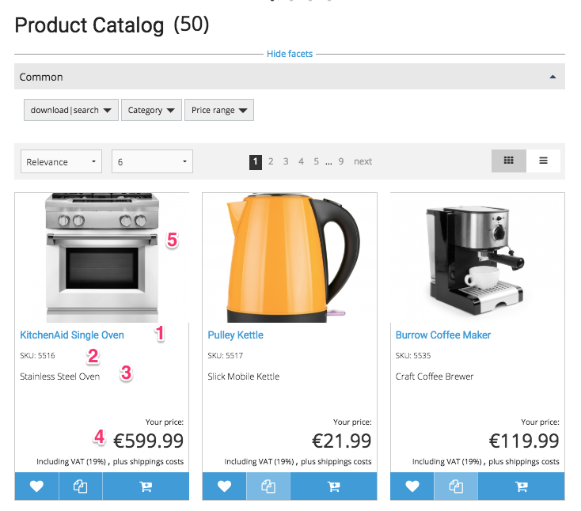
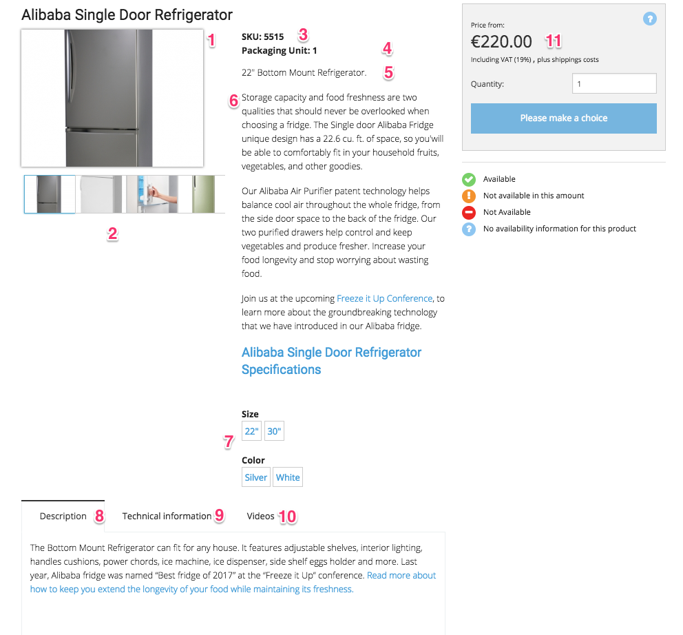

# Catalog UI

## Fields used in rendering

### Product list



|No|Attribute ProductNode|
|--- |--- |
|1|`catalogElement.name`|
|2|`catalogElement.sku`|
|3|`catalogElement.text`|
|4|Price from price engine|
|5|`catalogElement.mainImage`|

### Product detailpage



|No|Attribute ProductNode|Note|
|--- |--- |--- |
|1|`catalogElement.mainImage`|The main image or the `imageList` can come from the filesystem directly|
|2|`catalogElement.imageList`||
|3|`catalogElement.sku`||
|4|`catalogElement.unit`||
|4a|`catalogElement.packagingUnit`|If not present, the label is hidden|
|4b|Country of Origin|If not present, the label is hidden|
|5|`catalogElement.text`||
|6|`catalogElement.shortDescription`||
|7|variants||
|8|`catalogElement.longDescription`|If not present, the tab is hidden|
|9|`catalogElement.manufacturer`</br>`catalogElement.manufacturerSku`</br>`catalogElement.specification`</br>`catalogElement.dataMap.color`|This tab contains several attributes from the product. If an attribute is not present it is not displayed (inc. the label)|
|10|`catalogElement.dataMap.video`||

## Template list

The templates for the catalog have to be located in the `views/Catalog` folder. Depending on the view type different templates have to be provided (for configuration see [Templates for catalog](templates_for_catalog.md)):

- `product.html.twig`
- `catalog.html.twig`
- `productType.html.twig`

The templates have access to the catalog node provided by the controller.

URLs are provided by special methods:

- SEO URL: `{{ catalogElement.seoUrl }}`
- permanent URL: `{{ catalogElement.permanentUrl }}`

Since these URLs contain the prefix defined in the routing table as well, the `path()` function of Twig cannot be used.

The `ses_render_field` rendering function for Twig templates and data from the catalog, for example:

``` html+twig
{{ ses_render_field(catalogElement, 'longDescription') }}
```

The renderer uses predefined templates for each [Field](../../../api/fields_for_ecommerce_data/fields_for_ecommerce_data.md). The templates are located in the `FieldTypes` folder.

## Configuration for templates

The configuration for choosing templates is stored in `silver.eshop.yml`:

``` yaml
parameters:
    silver_eshop.default.catalog_factory.sis_category: createCatalogNode
    silver_eshop.default.catalog_factory.sis_product: createOrderableProductNode
    silver_eshop.default.catalog_template.CatalogNode: Catalog:catalog.html.twig
    silver_eshop.default.catalog_template.OrderableProductNode: Catalog:product.html.twig
```

## Show all attributes of a CatalogElement

To show all available attributes use `getAttributeNames()`.

``` 
{{ catalogElement.attributeNames|json_encode }}
# returns a JSON (because of Twig filter "json_encode"):
{
    "propertyName": {
        "name": "propertyName",
        "fromDataMap": false,
        "hasValue": bool,
        "type": <type>
    },
    ...
    "dataMap": {
        "dataMapAttributeName": {
            "name": "dataMapAttributeName",
            "type": <realisation of FieldInterface>,
            "fromDataMap": true,
            "hasValue": bool
        },
    }
}
```

### Number of loaded products

You can define the number of products that are loaded at one time:

``` 
# the number of products loaded when the page is rendered for the first time
silver_eshop.default.catalog_product_list_limit: 6
# the number of products loaded dynamically via Ajax later on
silver_eshop.default.catalog_product_list_limit_ajax: 3 
```
