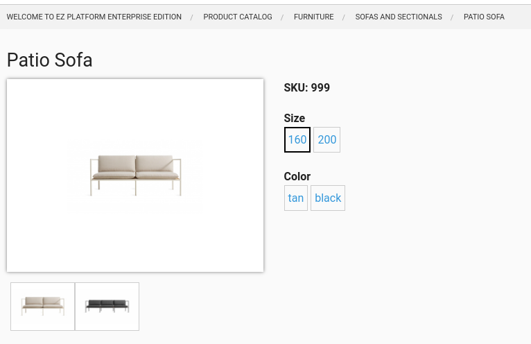
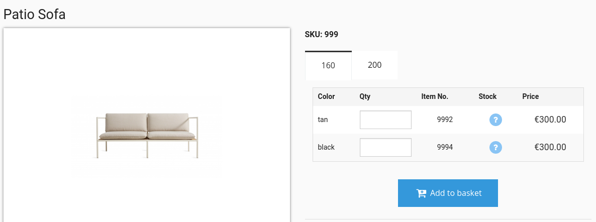
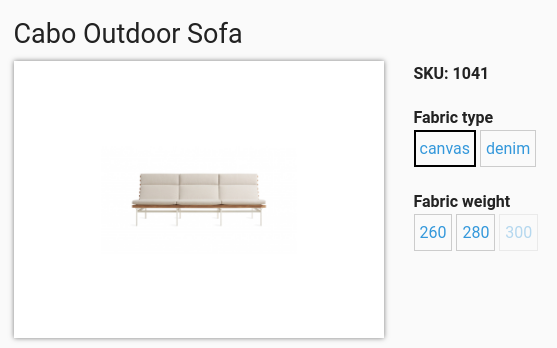
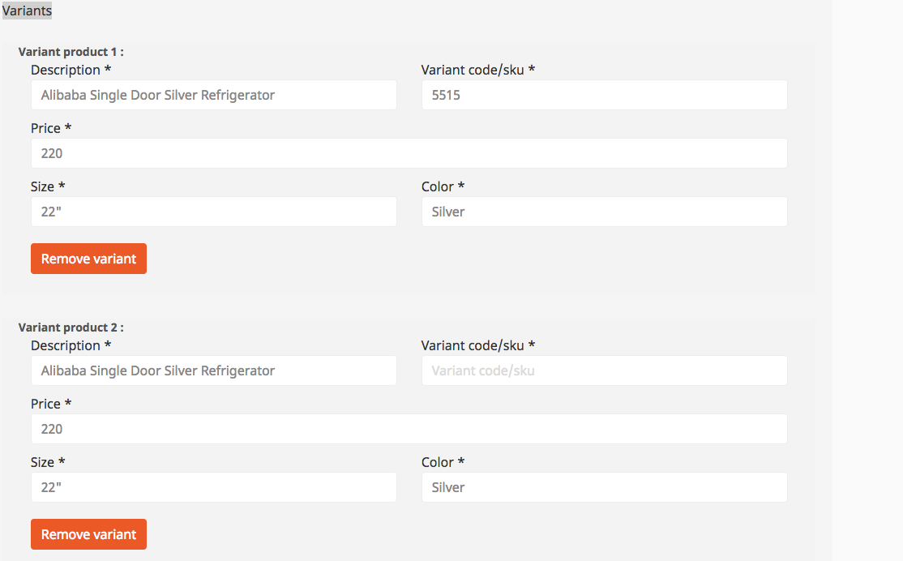

# Product variants

Product variants define different versions of a product.
Variants can, for example, define product color or size.

Built-in variants enable you to offer Size, Color, Package, or Size and Color variants.



To have variants, the product Content Type must have a Field with the `ses_variants` identifier belonging to the `uivarvarianttype` Field Type. 

## Variant display

In the configuration you can select one of two interfaces for displaying variants:
**B2C** (default) and **B2B**.
Choose the interface in **eCommerce**->**Configuration Settings**->**Advanced catalog features**->**User interface for ordering variants**.

The setting is stored in:

``` yaml
parameters:
    silver_eshop.default.variant_type: B2C
```



## Adding new variants

To configure new variants, overwrite the existing configuration:

``` yaml
parameters:
    siso_core.default.variant_types:
        # existing variants
        -   id: fabric
            type_label: "Fabric"
            variant_levels: 1
            variant_level_label_1: "Fabric type"
            variant_level_code_1: "fabrictype"
```

You can also specify a two-level variant:

``` yaml
parameters:
    siso_core.default.variant_types:
        # existing variants
        -   id: fabric
            type_label: "Fabric"
            variant_levels: 2
            variant_level_label_1: "Fabric type"
            variant_level_code_1: "fabrictype"
            variant_level_label_2: "Fabric weight"
            variant_level_code_2: "weight"
```




### Rendering PriceRange

To render the price range for a product with variant, access the `catalogElement.priceRange` property:

``` html+twig
{# render min price #}

{{ ses_render_price(catalogElement, minPrice,
      {'outputPrice': {'cssClass': 'price price_med'}})
}}

{# render max price #}

{{ ses_render_price(catalogElement, maxPrice,
      {'outputPrice': {'cssClass': 'price price_med'}})
}}
```



## Variant templates

The default templates used for rendering product details are stored in
`EshopBundle/Resources/views/Catalog/parts/`:

|||
|----|----|
|`productBasketVariant.html.twig`| Price block for the variant|
|`productData.html.twig`| Product information (for a variant it can be additional information like country)|
|`productDetailVariantB2B.html.twig`| Variant options for B2B|
|`productDetailVariantB2C.html.twig`| Variant options for B2C|
|`productVariantBlock.html.twig`| All logic for B2C display|

## Defining sorting for variants

You can configure sorting of variant characteristics and sorting within one characteristic.

### Sorting characteristics

If you want to change the order for a specific product element type (e.g. `sofa`),
so that for example "Color" is displayed as the first option, use the following configuration:

``` yaml
silver_eshop.default.catalog_type:
    sofa:
        characteristics_order: ["3","1","2"],
```

### Sorting characteristic values

By default all characteristics are sorted in ascending order. 

You can configure other sort orders using `silver_eshop.default.sort_variant_codes`.

In the following example, using the "Size and Color" variants,
size is not sorted (default order from the Field is used)
and color is sorted in descending order:

``` yaml
silver_eshop.default.sort_variant_codes:
    0:
        sort: false
    1:
        sort: true
        order: DESC
```

Use the custom `sort_characteristics` and `sort_characteristic_codes` Twig filters
to display sorted variant characteristics.

### `sort_characteristics()`

`sort_characteristics()` sorts characteristics for a catalog element type (like unit, color, weight etc.):

``` html+twig

```

If you want to change the order of characteristics manually (e.g. unit first and then color) you can pass the order in the template as well:

``` html+twig


```

### `sort_characteristic_codes()`

`sort_characteristic_codes()` sorts specific characteristic codes (for codes like green, red, blue etc.):

``` html+twig
// variantIndex, e.g. 1

```

## Variants from ERP

There are two ways in which ERP systems handle variants:

- The ERP system can use an SKU and offer a list of variant codes for each individual product (e.g. a bed in size 160 and in white). In this case the product is identified by the SKU and the `variantCode`: `SKU_AND_VARIANT`
- Often the ERP system doesn't store variants as "real" variants but uses a unique SKU for each variant. Often these "variants" are grouped by a PIM system or a special field in the ERP system. In this case, the `variantCode` from the catalog is the actual SKU that is sent to the ERP: `SKU_ONLY`

eZ Commerce supports both methods. To select a method, use the following configuration:

``` yaml
parameters: 
    # possible values: SKU_ONLY (default), SKU_AND_VARIANT
    silver_eshop.default.erp.variant_handling: "SKU_ONLY"
```

### Price requests from ERP

When a price is requested from the ERP, the shop sends the SKU and optionally a variant code as well.

If `SKU_AND_VARIANT` is used then the UBL request contains the SKU (ID) and the variant code (`ExtendedID`):

``` xml
<Item>
    <Name/>
    <SellersItemIdentification>
        <ID>1000</ID>
        <ExtendedID>VAR-GRN</ExtendedID>
    </SellersItemIdentification>
    <BuyersItemIdentification>
        <ID/>
    </BuyersItemIdentification>
</Item>
```

If `SKU_ONLY` is used, the shop sends the variant code in both fields to the ERP. The variant code contains the SKU in this case. 
