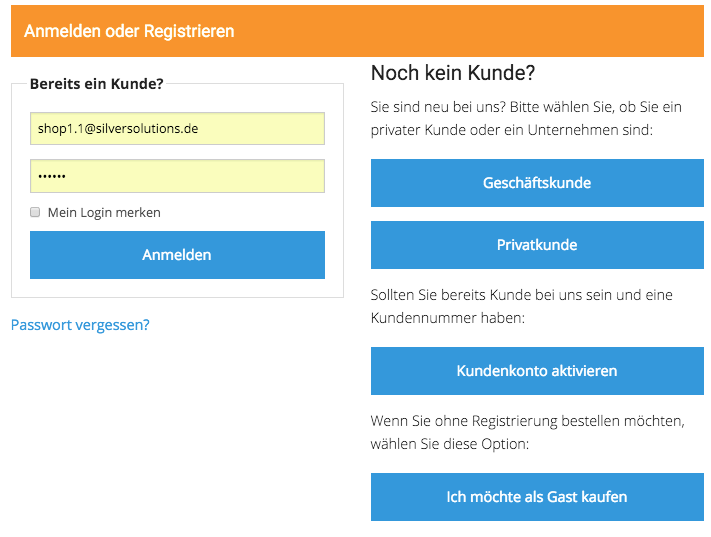
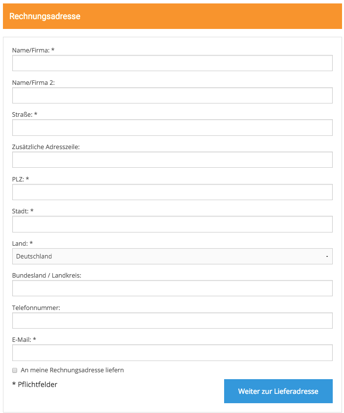
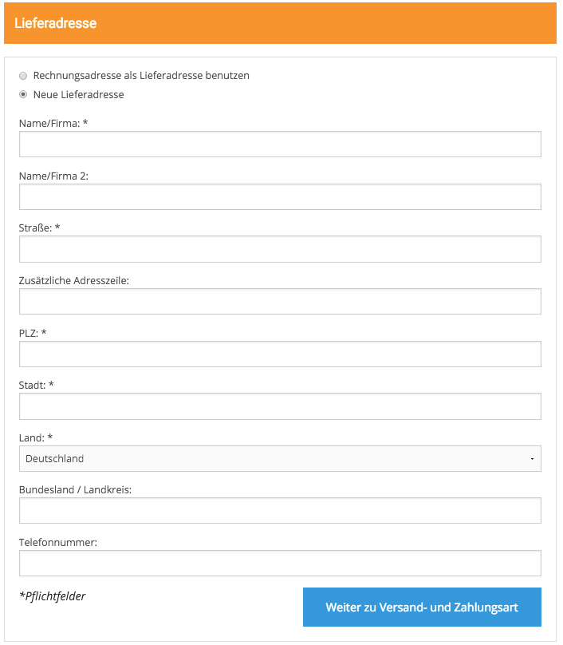
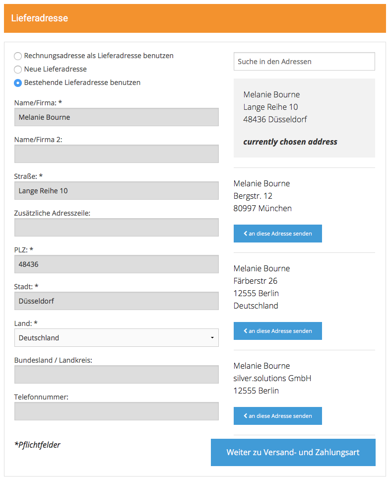
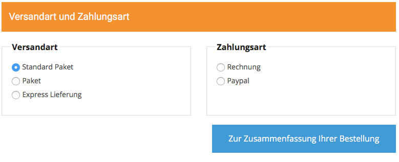
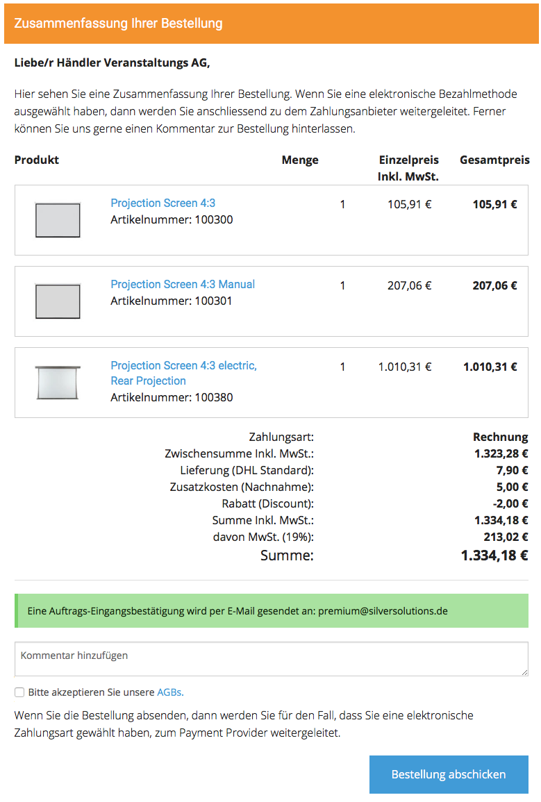

# Checkout

## Introduction

eZ Commerce provides a one page checkout. The number of steps varies.

If a user is not logged in he will see 2 more steps: one with a login form and a second one for the invoice address. Customers having a customer number will already foreared to the step 3. 

### Step 1 - Login form



### Step 2 - Invoice form

A customer not having a customer number or a anoymous user will have to add the invoice address first:



### Step 3 - Delivery address

A user without delivery address wir see an empty delivery form. He can also chose the invoice address.



A customer with addresses can choose an address from a list:



### Step 4 - Delivery and payment



### Step 5 - Order summary



## Before you start 

Please keep in mind that Checkout is really connected with a lot of different modules in our shop. You will find more about the chekcout in these documents:

- [General logic in checkout](checkout_features/general_logic_in_checkout.md)
- Used forms in the checkout:  [Forms](checkout_api/forms/configuration_for_checkout_forms.md)
- How are orders send to the ERP: [Order Submission](../integrate_erp_systems/checkout_order/erp_order_synchronisation/order_submission/order_submission.md)

## How to do things after an order has been placed

you can define an EventListener which is triggered when an order has been placed.

``` 
<service id="ezcommerce_demo.confirmation_listener" class="%ezcommerce_demo.confirmation_listener.class%">
    <argument type="service" id="silver_basket.basket_repository" />
    <argument type="service" id="silver_trans.translator" />
    <argument type="service" id="siso_tools.mailer_helper" />
    <argument type="service" id="silver_catalog.data_provider_service" />
    <argument type="collection">
        <argument key="addresses">$siso_core.default.ses_swiftmailer$</argument>
        <argument key="subject">$order_confirmation.subject;siso_checkout$</argument>
    </argument>

    <tag name="kernel.event_listener" event="silver_eshop.response_message" method="onOrderResponse" priority="-10" />
    <tag name="kernel.event_listener"  event="silver_eshop.exception_message" method="onExceptionMessage" />

</service>
```

There are 2 tags involved: one for eZ Commerce which does not have an ERP system connected and one for the Advanced version with ERP

``` php
/**
 * Listens to the MessageExceptionEvent event.
 * The appropriate exception was thrown by the previous listener ("sendMessage" of the "AbstractMessageTransport")
 * This function:
 * - checks for downloads and send an email to the customer 
 *
 * @param MessageExceptionEvent $messageExceptionEvent
 * @return void
 *
 */
public function onExceptionMessage(MessageExceptionEvent $messageExceptionEvent)
{
    $message = $messageExceptionEvent->getMessage();
    $exception = $messageExceptionEvent->getException();
    if ($message instanceof CreateSalesOrderMessage && $exception instanceof LocalOrderRequiredException) {
        /** @var Order $requestDocument */
        $requestDocument = $message->getRequestDocument();

        /** @var Basket $basket */
        $basket = $this->basketRepository->findOneBy(array('guid' => $requestDocument->UUID->value));

        $this->checkForDownloads($basket);
    }
}
/**
 * This method must registered as a listener to the
 * 'silver_eshop.response_message' event. It will act in case an ERP is in place
 *
 * @param MessageResponseEvent $event
 */
public function onOrderResponse(MessageResponseEvent $event)
{
    $message = $event->getMessage();
    if ($message instanceof CreateSalesOrderMessage) {

        /** @var Order $requestDoc */
        $requestDoc = $message->getRequestDocument();

        $basket = $this->basketRepository->findOneBy(array('guid' => $requestDoc->UUID->value));
        $this->checkForDownloads($basket);
    }
}
```
