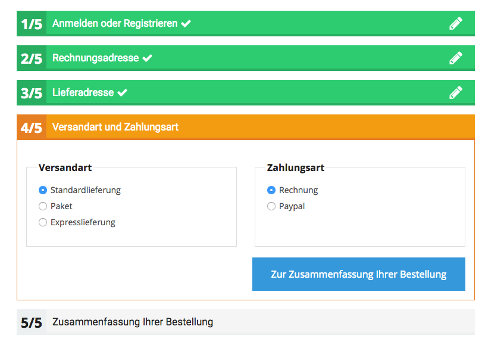
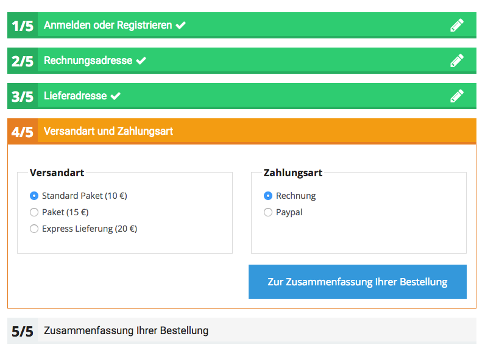

# Checkout events

## General

There are 3 kinds of events that can be thrown during checkout process:

- [Pre Checkout Event](#PreCheckoutEvent)
    - [ValidBasketListener](#ValidBasketListener)
    - [MinOrderAmountListener](#MinOrderAmountListener)
- [Pre Form Checkout Event](#PreFormCheckoutEvent)
    - [PriceShippingListener](#PriceShippingListener)
- [Post Form Checkout Event](#PostFormCheckoutEvent)
    - [ValidAddressListener](#ValidAddressListener)

| Event                                  | Description                                                                   |
| -------------------------------------- | ----------------------------------------------------------------------------- |
| `siso_checkout.pre_checkout`         | This event must be dispatched before user enters the checkout process         |
| `siso_checkout.pre_form_checkout`   | This event must be dispatched before form preparation in the checkout process |
| `siso_checkout.post_form_checkout`  | This event must be dispatched after form preparation in the checkout process  |

## Pre Checkout Event

Before the user enters the checkout process  the shop throws an event - *siso_checkout.pre_checkout* - to allow you to check the basket. So it would be possible for example to check if there are some ilegal items in the basket.

If the event listener wants to interupt the checkout process, it might set the event status to failed and set custom error message in the basket. In that case user will be redirected back to basket and will see the error message.

### ValidBasketListener

There is already Event Listener, that checks if the basket is empty and the prices are valid.

Customer can not order in this case, however there is a configuration, where you can enable customer to order even if the prices are invalid. This can be enabled for B2B, for example:

``` yaml
parameters:
    #here you can enable/disable the values for ValidBasketListener
    #could be enabled for B2B for example
    #values: true or false
    siso_checkout.default.invalid_prices_allowed: false
```

Service ID:

``` 
siso_checkout.empty_basket_listener
```

### MinOrderAmountListener

There is already Event Listener that checks if the min order amount was reached. This is set in the configuration. You can also enable/disalbe the listener here.

`checkout.yml`:

``` 
parameters:
    siso_checkout.default.min_order_amount_listener_active: true
    siso_eshop.min_order_amount: 0.01
```

Service ID:

``` 
siso_checkout.min_order_amount_listener
```

!!! tip

    If you want to implement your custom event listener, you can do this and then tag it.

    ```
    //set your own method name

    <tag name="kernel.event_listener" event="siso_checkout.pre_checkout" method="onPreCheckout" />
    ```

## Pre Form Checkout Event

Before the form is rendered in the checkout, the shop throws an event - `siso_checkout.pre_form_checkout` - to allow you to modify the form. So it would be possible for example to modify payment or shipping options.

### Change the shipping or payment options

If you want to change the shipping or payment options (e.g. you need to set them dynamically depending on the basket data), you can implement a listener like described here (see below) and store the options in the basket dataMap. Then they will automatically apper in the checkout process.

``` php
public function onPreFormCheckout(PreFormCheckoutEvent $event)
{
    /**
     * code that will be send to NAV => value/translation key for the user
     */
    $shippingMethods = array(
        'LIEFERUNG' => 'standard_mail'
    );       

    $paymentMethods = array('invoice' => 'invoice');
    
    $basket = $event->getBasket();
    $dataMap = $basket->getDataMap();
    if(!array_key_exists('shippingMethods',$dataMap)) {
        $basket->addToDataMap($shippingMethods, 'shippingMethods');
    }

    if(!array_key_exists('paymentMethods',$dataMap)) {
        $basket->addToDataMap($paymentMethods, 'paymentMethods');
    }
}
```

### PriceShippingListener

There is already an Event Listener for testing, that adds information about prices to shipping options.

``` yaml
parameters:
    #here you can enable/disable the PriceShippingListener
    #values: true or false
    siso_checkout.default.tests.price_shipping_listener_active: false
```

Service ID:

``` yaml
siso_checkout.tests.price_shipping_listener
```





## Post Form Checkout Event

After form is submitted in the checkout the shop throws an event -* siso_checkout.*post_form_checkout** - to allow you to modify the submitted values and check them. So it would be possible for example to validate the address. To ensure the functionality, every checkout form must implement the *CheckoutFormInterface*.

Validation has 3 options:

1. status success - go to the next step
2. status error - stay in the current step, display error message and display rendered html in the template above current form
3. status notice - stay in the current step, display notice message and display rendered html in the template above current form  
    It adds checkbox to force next step in every checkout form. User has to check this checkbox if he wants to continue

### ValidAddressListener

There is already an Event Listener for testing, that checks if address is valid. 

``` yaml
parameters:
    #here you can enable/disable the ValidAddressListener
    #values: true or false
    siso_checkout.default.tests.valid_address_listener_active: false
```

Service ID:

``` 
siso_checkout.tests.valid_address_listener
```
