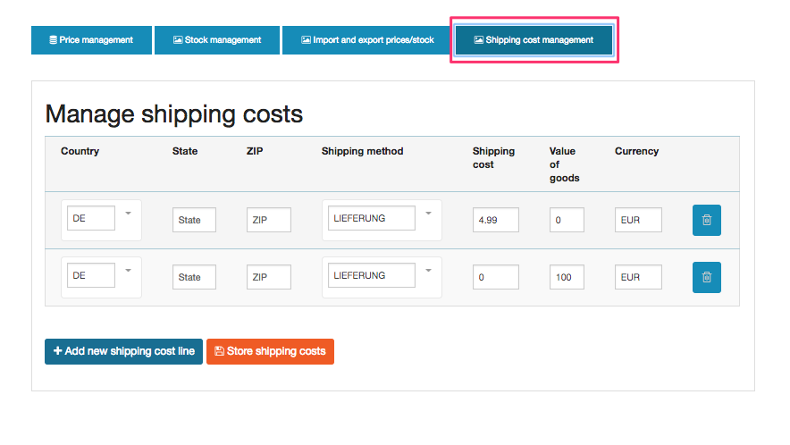

# Base configuration

A base configuration for eZ Commerce will be provided by eZ Commerce in app/config. These files are loaded from the `config.yml` file. 

## System specific settings - `ezcommerce_parameters.yml`

This file contains specific settings for your installation. It is generated/updated by the installer. 

### Settings for eMails

``` 
parameters:
    siso_core.default.ses_swiftmailer:
        mailSender: shop@silversolutions.de
        mailReceiver: shop@silversolutions.de
        lostOrderEmailReceiver: shop@silversolutions.de
        contactMailReceiver: shop@silversolutions.de
        cancellationMailReceiver: shop@silversolutions.de
        shopOwnerMailReceiver: shop@silversolutions.de
    ses_eshop.forms.business.default_contact_recipient: shop@silversolutions.de
    ses_eshop.order.sales_contact: shop@silversolutions.de
    ses_eshop.lostorder_email: shop@silversolutions.de
    siso_paypal_payment.receiver_email: shop@silversolutions.de
    silver_tools.default.translationFolderId: 112
    
    siso_core.default.product_catalog_content_type_id: 46

    ezcommerce.installer.migration_files_path: %kernel.project_dir%/sql
```

### Configure your domain names and languages

eZ Commerce comes with a configuration for two countries/siteaccesses for the shop frontend

- de - German language using EUR as currency 
- en - English language using USD as currency

You can change the settings in `ezplatform.yml `if required:

``` yaml
ezpublish:
    siteaccess:
        list:
          - de
          - en
          - admin
        groups:
            site_group: [de,en]

            # WARNING: Do not remove or rename this group.
            # It's used to distinguish common siteaccesses from admin ones.
            # In case of multisite with multiple admin panels, remember to add any additional admin siteaccess to this group.
            admin_group: [admin]
        default_siteaccess: en
        match:
            Map\URI:
                de: de
                en: en
                admin: admin
             
```

## General settings - ecommerce.yml

### General shop settings prices

**Currencies used per country**

``` yaml
siso_core.de.standard_price_factory.fallback_currency: EUR
siso_core.en.standard_price_factory.fallback_currency: GBP
```

**Shipping costs**

If you want to setup special rules for shipping costs you can achieve this in the backend:

Navigate to `/admin/eshop/price-and-stock`

and click on "Shipping cost management"



**Settings for VAT:**

The settings can be done for each delivery country you want to support in your shop. 

``` yaml
siso_core.default.vat:
    DE:
        VATREDUCED: 7
        VATNORMAL: 19
    US: 
        VATREDUCED: 4
        VATNORMAL: 4   
    default:
        VATREDUCED: 7
        VATNORMAL: 19
        
```

### Payment 

If you want to enable Paypal as a payment provider you need to generate and configure 

``` yaml
jms_payment_core:
    encryption:
        provider: defuse_php_encryption
        secret: 'de---xxxxxxxxxxx'
        enabled: true

siso_paypal_api.user: 'my-api-user'
```

Important: The secret has to be created by a command:

``` 
php vendor/defuse/php-encryption/bin/generate-defuse-key
```

Please configure the Paypal parameters in your `parameters.yml`:

``` yaml
siso_paypal_api.user: 'my-api-use'
siso_paypal_api.password: 'paypal api password'
siso_paypal_api.signature: 'paypal-api-signature'
```

## Changing the logo for eZ Commerce

If you want to change the logos you need to provide a link to the assets located in the `web/*` folder:

``` yaml
# Logo for the shop
siso_core.default.logo_image: /bundles/silversolutionseshop/img/logo-advanced.png
# Logo used for invoices
siso_core.default.invoice_logo: /bundles/silversolutionseshop/img/invoice_logo.png
# Logo used for the email header 
siso_core.default.email_header: /bundles/silversolutionseshop/img/email-header.png
```
