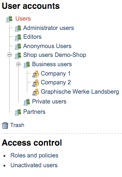

# Customers

Customers are stored as User Content items in the database.
eZ Commerce uses all features connected to users such as:

- Roles and Policies
- extensible User model
- User Groups
- password management
- activation of accounts
- session handling

In addition, eZ Commerce supports multiple user accounts with the same email address (e.g. for a multi-shop setup).

eZ Commerce adds new Fields to the User Content Type which are required for the shop:

- first name, last name
- salutation
- customer profile data
- customer number, contact number
- budget per order and per month (used by the Customer Center plugin)

### User Groups

Each shop stores private and business customers in different User Groups. If required, shops can also share one common User Group.



### ERP system as the master

The customers are directly connected to the ERP system if they have a customer number or/and a contact number. 

The customer number is usually the main reference to the ERP system and it is stored as a read-only Field in the User Content item. 

The shop automatically gets the information from the ERP the first time the user information (customer profile data) is requested.

The information is stored in the session to reduce the number of calls to ERP.

The ERP system provides:

- invoice address
- buyer address
- a list of delivery addresses
- contact information if the user has a contact number
- further information depending on the ERP system

### Accessing customer data in a template

The template offers a global Twig variable which contains the main information about the current user,
their addresses and data from the ERP.

``` html+twig
Current customer number: {{ ses.profile.sesUser.customerNumber }}
All delivery addresses:  
E-Mail address:          {{ ses.profile.sesUser.email }}
  
{# check, if user is logged in and blocked: #}

    Hello customer #{{ ses.profile.sesUser.customerNumber }}.
  
    
        Sorry, but you are blocked!
    

  
{# check, if user is logged in as anonymous user: #}

    <p>Anonymous user</p>

```

!!! caution

    Do not use methods of the customer service inside a constructor of a service.
    The constructor is built at a very early stage of the process and the system may not have the information that a user is already logged in.

    Do not use the [customer service](customers_api/customer_profile_data_components/customer_profile_data_services.md) in any place that cannot access the session.
    An example would be a CLI tool, or processes that happen in background,
    like sending out the order if a customer paid via a payment service provider.

eZ Commerce uses the UBL standard to model customer data. The most important type is the Party which describes an address. 

For each user the following information is stored. If a user has a customer number this information is updated from the ERP after login: 

- Buyer Party
- Invoice Party
- DeliveryParties - a list of addresses using the Party format 

``` xml
<Party>
    <PartyIdentification>
        <ID>10000</ID>
    </PartyIdentification>
    <PartyName>
        <Name>Möbel-Meller KG</Name>
    </PartyName>
    <PostalAddress ses_unbounded="AddressLine" ses_tree="SesExtension">
        <StreetName>Tischlerstr. 4-10</StreetName>
        <AdditionalStreetName />
        <BuildingNumber>4-10</BuildingNumber>
        <CityName>Berlin</CityName>
        <PostalZone>12555</PostalZone>
        <CountrySubentity>Berlin</CountrySubentity>
        <CountrySubentityCode>BER</CountrySubentityCode>
        <AddressLine>
            <Line>Gartenhaus</Line>
        </AddressLine>
        <Country>
            <IdentificationCode>DE</IdentificationCode>
            <Name>Deutschland</Name>
        </Country>
        <Department>Development</Department>
        <SesExtension />
    </PostalAddress>
    <Contact>
       <ID>KT1001</ID>
       <Name>Mr Fred Churchill</Name>
       <Telephone>+44 127 2653214</Telephone>
       <Telefax>+44 127 2653215</Telefax>
       <ElectronicMail>fred@iytcorporation.gov.uk</ElectronicMail>
       <OtherCommunication></OtherCommunication>
       <Note></Note>
       <SesExtension>
           <LanguageCode></LanguageCode>
           <IsMain></IsMain>
       </SesExtension>
    </Contact>
    <Person ses_tree="SesExtension">
        <FirstName>Frank</FirstName>
        <FamilyName>Dege</FamilyName>
        <Title>Herr</Title>
        <MiddleName />
        <SesExtension />
    </Person>
    <SesExtension />
</Party>
```
