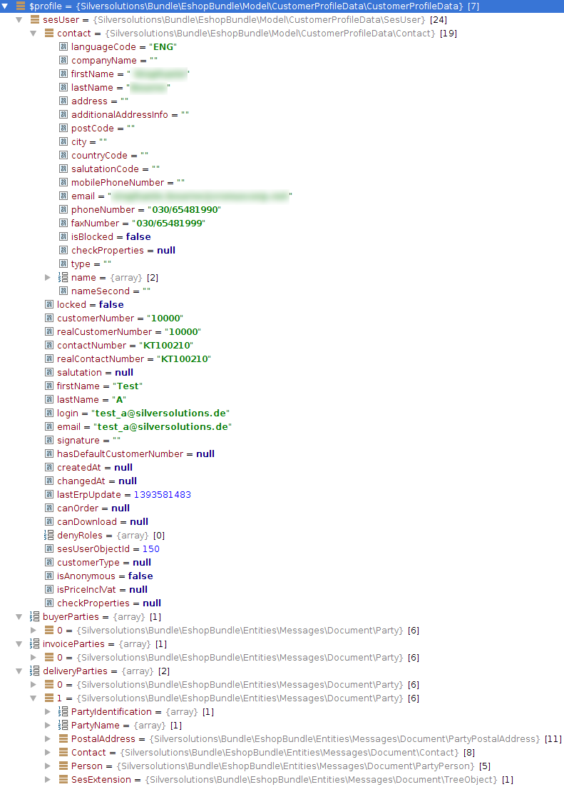

# Customer profile data model

## CustomerProfileData

`\Silversolutions\Bundle\EshopBundle\Model\CustomerProfileData\CustomerProfileData`

Main class for the customer profile data entity, will hold addresses, SesUser and optional data within a Cus`tomerProfileDataMap.

Addresses are stored in party objects. These Party classes are generated by the message generator.

It extends a ValueObject therefore any data is public readable.

## `\Silversolutions\Bundle\EshopBundle\Model\CustomerProfileData\SesUser`

Is located under a `CustomerProfileData` and holds information about the user account like customer number, login name, email address.

It extends a  ValueObject therefore any data is public readable.

## Contact

`\Silversolutions\Bundle\EshopBundle\Model\CustomerProfileData\Contact`

Is located under a SesUser and holds information about the contact.

It extends a  ValueObject therefore any data is public readable.

## DeprecatedCustomer

`\Silversolutions\Bundle\EshopBundle\Model\CustomerProfileData\DeprecatedCustomer`

Provides a mapping class which implements the deprecated `CustomerInterface`. It is used for components depending on the old model within the system and built by the `DeprecatedCustomerMappingService`.

## Example

The following image shows an example of a filled `CustomerProfileData` entity.

