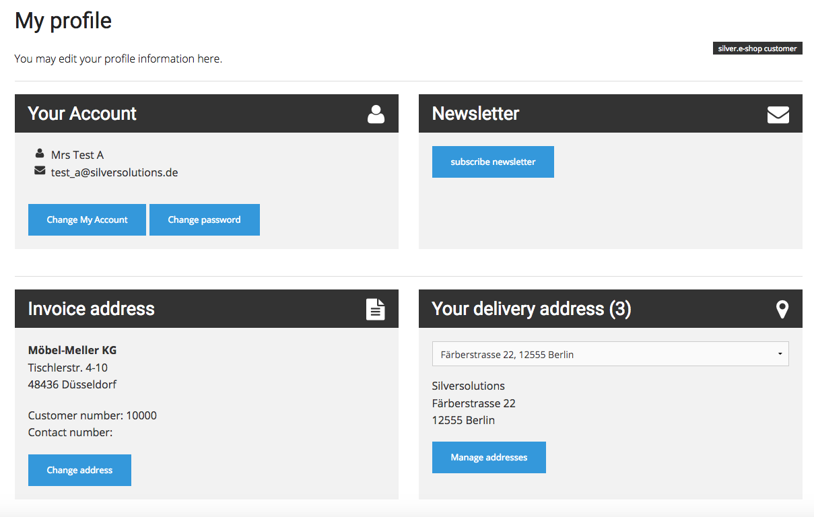

# Customer profile data controller

## Actions

`\Silversolutions\Bundle\EshopBundle\Controller\CustomerProfileDataController`

|Action|Route|Description|
|--- |--- |--- |
|showDetailAction()|silversolutionsCustomerDetail|Renders the profile detail page|
|addressBookAction()|silversolutions_address_book_list|Renders the address book (list with delivery addresses coming from ERP)|
|addressBookDeleteAction()|silversolutions_address_book_delete|Removes given delivery address from ERP and customer pofile data|
|logoutAction()|silversolutionsCustomerLogout|Unsets all profile data within the session, logs out the user and redirects to previous page|

## Profile detail page

User can manage his data profile data in this page.

In the address list user can

- update existing delivery address
- create a new delivery address
- remove one existing delivery address

All changes in the delivery addresses will be send to the ERP.
