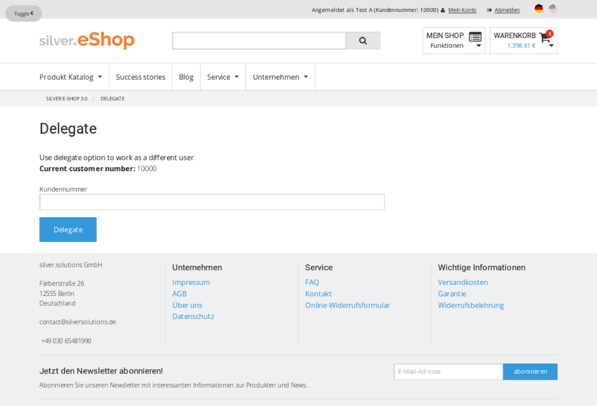
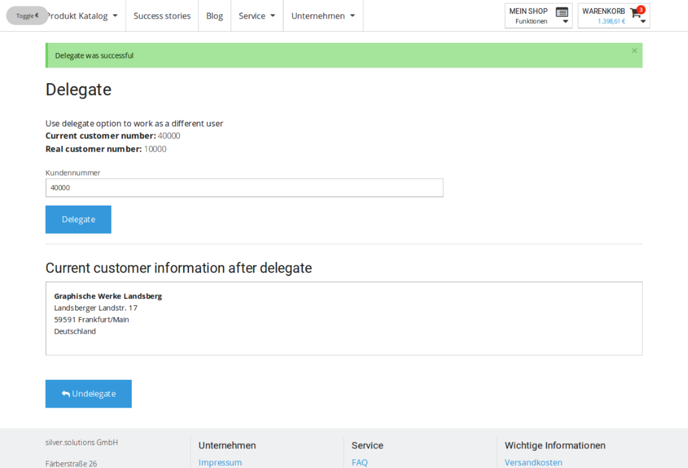
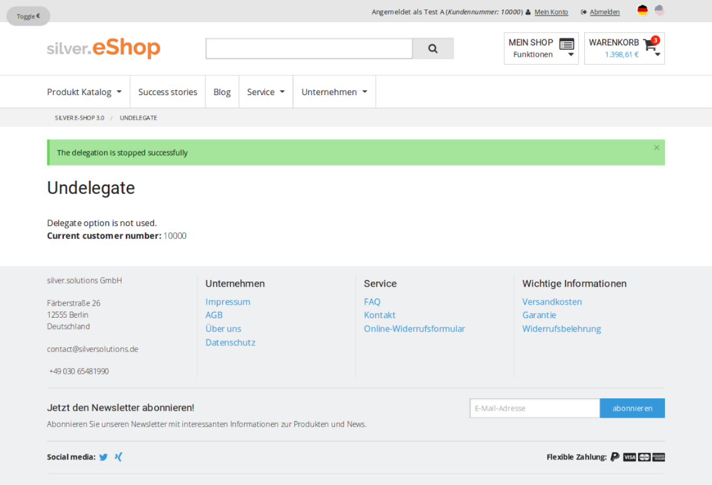
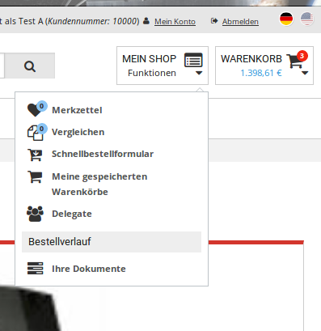

# Delegate Function

## Introduction

The goal of the delegate function is that a special user can delegate to another user, means that he can handle in the shop as he would be a different user with a different customer number.

## Details

User who has a special policy in the backend have this function 'delegate'. He can enter this function via his shop functions in the header. On the delegate page user can enter a customer number of a known customer and click on delegate.

Then in the background the user data with the given customer number from ERP will be fetched. If customer number is valid the customer number will be assigned to the current user. So the user handles as a different customer with a different customer number and can even create an order with the given customer number. But he will only get the ERP profile data from the different customer, not other things, like e.g. basket. He will always keep his basket.

The user stays as long in this delegated role, as he clicks on the function 'undelegate'.

### Delegate Roles and Policies in BackEnd

- New policy for delegate should be created in the backend "Delegate [Role]"
  - Module: `siso_policy`
  - Function: delegate
  - Limitation: No limitations
- Add this role to the delegate users the new role. Another option is to create an user group "Delegate" and add to it the roles: "Anonymous", "Member", "Delegate"

### Configuration

The delegate function is disabled by default. The configuration has to be changed

``` yaml
silver_eshop.default.enable_delegate: false    
```

??? note "EshopBundle/Resources/config/ses_routing.yml"

    ``` yaml
    # Delegate function
    silversolutions_delegate:
     path: /delegate
        defaults: { _controller: SilversolutionsEshopBundle:DelegateCustomer:delegate }

    silversolutions_undelegate:
     path: /undelegate
        defaults: { _controller: SilversolutionsEshopBundle:DelegateCustomer:undelegate }

    ```

### Delegate and undelegate Logic

We offer just an input field, where user can enter a customer number directly and then directly call the delegate function.

If no user is found with this customer number, an error message is display.

If the delegate is successful we display the new user data. In the top right corner in the header we see a new customer number.

Function "Undelegate" is also offer in the shop functions, so the user can return to his own profile.

Delegate:



Delegate successful



Undelegate:



Access to the Delegate from the Menu:



### Routing / Controller (New actions) and logic

There is a new controller for the ***delegate*** and ***undelegate*** actions:

??? note "EshopBundle/Controller/DelegateCustomerController.php"

    ``` php
    /**
     * The goal of the delegate function is that a special user can delegate to another user,
     * this means that he can handle in the shop as he would be a different user with a different customer number.
     *
     * The users with this possibility have a special policy in the backend with this function 'delegate'.
     *
     * Class DelegateCustomerController
     */
    class DelegateCustomerController extends BaseController
    {
        /**
         * On the delegate page user can enter a customer number of a known customer and click on delegate.
         * Then in the background we
         *  1- Fetch the user data with the given customer number from ERP
         *  2- Assign the fetch "user data" to the "current user".
         *
         * So the "current user" handles as a different customer with a different customer number
         * and can even create an order with the given customer number.
         *
         * But he will only get the ERP profile data from the different customer,
         * not other things, like e.g. basket. He will always keep his basket.
         *
         * @param Request $request
         * @return Response
         *
         */
        public function delegateAction(Request $request)
        {
            ...
        }
        /**
         * Undelegate function
         *
         * @return Response
         *
         */
        public function undelegateAction()
        {
            ...
        }
    }
    ```

EshopBundle/Resources/config/ses_routing.yml:

``` yaml
# Delegate function
silversolutions_delegate:
    path:  /delegate
    defaults: { _controller: SilversolutionsEshopBundle:DelegateCustomer:delegate }

silversolutions_undelegate:
    path:  /undelegate
    defaults: { _controller: SilversolutionsEshopBundle:DelegateCustomer:undelegate }
```

Delegate function is not always allow, is that why there is also a method that returns true or false if the use is allow to delegate in another one:

??? note "EshopBundle/Controller/DelegateCustomerController.php"

    ``` php
    /**
     * Returns true if the delegate function is enabled and user has the delegate role
     *
     * @return bool
     *
     */
    protected function isDelegateAllowed()
    {
        /** @var \eZ\Publish\Core\MVC\ConfigResolverInterface $configResolver */
        $configResolver = $this->get('ezpublish.config.resolver');
        $enableDelegate = $configResolver->getParameter('enable_delegate', 'silver_eshop');

        if ($enableDelegate && $this->isGranted(new AuthorizationAttribute('siso_policy', 'delegate'))){
            return true;
        } else {
            return false;
        }
    }
    ```

## New form and entity

??? note "src/Silversolutions/Bundle/EshopBundle/Controller/DelegateCustomerController.php"

    ``` php
     * Delegate Page, where user can enter a customer number of a known customer and click on delegate.
     * A list of users that match with the given criteria will ve shown.
     *
     * @param Request $request
     * @return Response
     */
    protected function buildDelegateForm(Request $request)
    {
        /** @var TransService $translatorService */
        $translatorService = $this->getTranslatorService();

        /** @var Delegate $delegate */
        $delegate = new Delegate();

        $form = $this->createFormBuilder($delegate)
            ->add('customer_number', 'text', array('label' =>  $translatorService->translate('Customer Number')))
            ->add('save', 'submit', array('label' => $translatorService->translate('label.delegate')))
            ->getForm();

        $form->handleRequest($request);

        return $form;
    }
    ```

For the form implementation is required to have a new entity

??? note "EshopBundle/Entity/Delegate.php"

    ``` 
    <?php

    /**
     * The delegate Entity is used in the "form" of Delegate list
     *
     * Class Delegate
     */
    class Delegate
    {
        /**
         * String, text field used for "customer number" or "name"
         * @var $customerNumber
         */
        protected $customerNumber;

        /**
         * @return mixed
         */
        public function getCustomerNumber()
        {
            return $this->customerNumber;
        }

        /**
         * @param mixed $customerNumber
         */
        public function setCustomerNumber($customerNumber)
        {
            $this->customerNumber = $customerNumber;
        }
    }
    ```

There are also two new templates to show the delegate forms and information

## Customer profile data

The information if the user is delegate or not is stored in the customer profile data. For that the class that defines de customer profile data is changed.

??? note "EshopBundle/Model/CustomerProfileData/CustomerProfileData.php"

    ``` 
    /**
     * Return true if user is in the delegate mode
     *
     * @param $userId
     * @return bool
     *
     */
    public function isDelegated()
    {
        $dataMap = $this->getDataMap();
        $delegated = $dataMap->getAttribute('delegated');

        return (bool) $delegated;
    }
    ```

And also the data of the DataProcessor is adapted to the new implementation.

??? note "EshopBundle/Services/Forms/DataProcessor/UpdateCustomerProfileDataProcessor.php"

    ``` 
    /**
     * @param NormalizedEntity $formEntity
     * @param array|null $lastResult
     * @param Response $response
     * @return mixed|null
     * @throws \Silversolutions\Bundle\EshopBundle\Exceptions\FormDataProcessorException
     */
    public function execute(NormalizedEntity $formEntity, $lastResult = null, Response $response = null)
    {
        $customerProfileData = $this->customerProfileDataService->getCustomerProfileData();

        //only call the fetch method if user is not in the delegate mode
        if ($customerProfileData->isDelegated()) {
            $this->customerProfileDataService->updateRemoteDataForDelegateUser(
                $customerProfileData->sesUser->customerNumber,
                $customerProfileData,
                true
            );
        } else {
            $customerProfileData->sesUser->setLastErpUpdate(null);
            $this->customerProfileDataService->fetchProfileData();
        }

        $lastResult[self::SUCCESSFUL_LAST_RESULT_KEY] = true;

        return $lastResult;
    }
    ```
