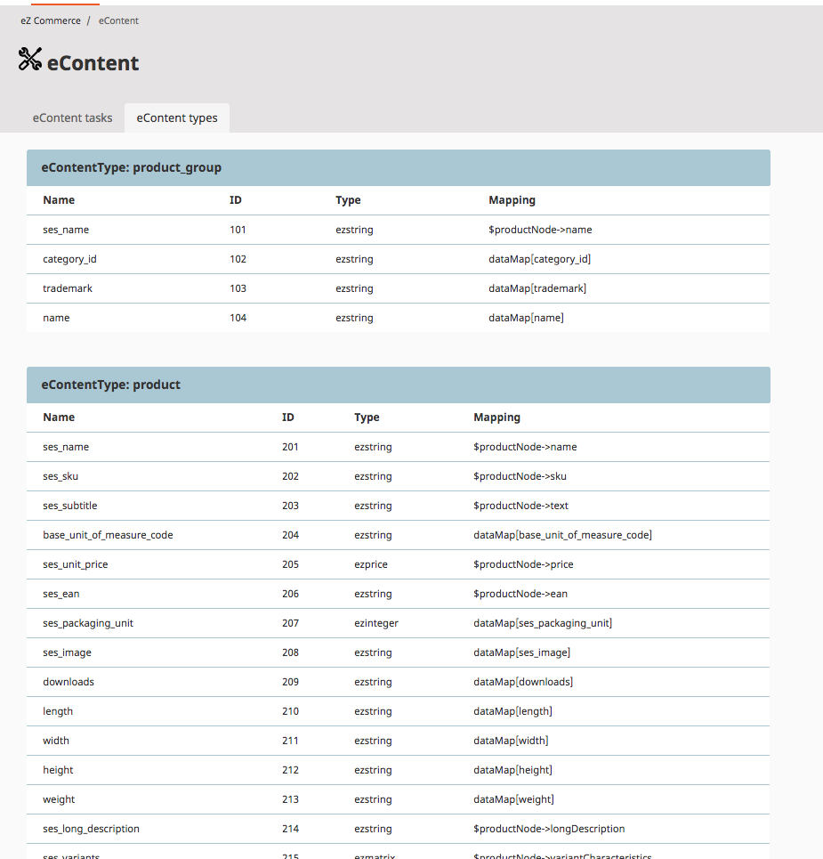

# econtent - backend features

The menu Control-Center -> eContent offers an overview about the datamodel. 

The model itself has to be defined by a developer (using SQL). The tab "eContent types" shows an overview about

- defined eContent Types (e.g. product_group, product)
- the list of attributes per eContent Type

Foreach eContent Fieldtype the list of attributes will be displayed:

- Name: the identifier of this attribute
- ID: the internal unique id
- Type
- Mapping:  shows where the field can be found when using the CatalogElement (the mapping is defined in a yml file: silver_econtent.default.mapping.product, for more details see [econtent - Configuration](../econtent_configuration.md))

