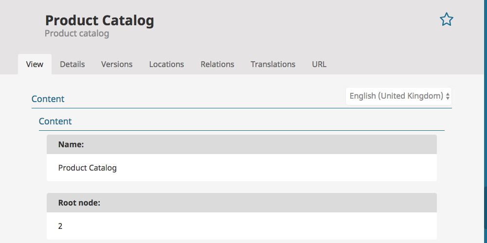
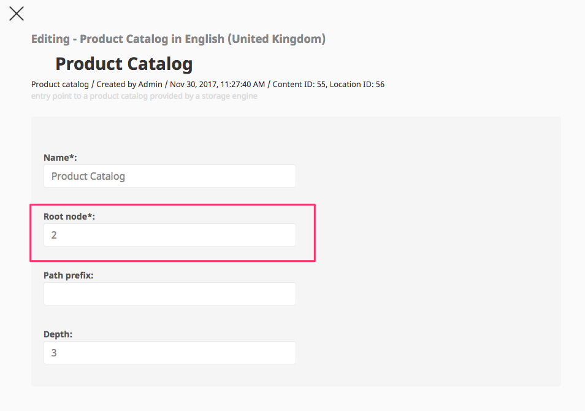

# Switching the data provider

!!! caution

    Currently only one provider can be activated per installation.

## Switching using a command line

Especially for testing purposes eZ Commerce provides a command line tool which switches between eZ and econtent.

Commandline (silversolutions:switchdataprovider) options:

|Option|Notes|
|--- |--- |
|--new-root-node|By default (eZ Commerce demo data) for eZ:56, econtent:2|
|--location-id|By default 56. This is the location id of the "Product catalog" object in eZ Platform
If you are using another location id please use this parameter|

``` bash
# switch to econtent 
php bin/console silversolutions:switchdataprovider econtent --location-id=56 --new-root-node=2
php bin/console silversolutions:indexecontent --no-debug
php bin/console silversolutions:indexecontent swap --no-debug
 
# switch to ez 
php bin/console silversolutions:switchdataprovider ez

# Important
php bin/console cache:clear --env=prod
```

## Details about switching the dataproviders

It will change some settings and data in as as well:

- Changes the yml files:  app/config/ecommerce.yml is changed.  

``` 
# dataprovider econtent
resource: '../../vendor/silversolutions/silver.e-shop/src/Silversolutions/Bundle/EshopBundle/Resources/config/config_data_provider_econtent.yml' or 
 
# dataprovider eZ
resource: '../../vendor/silversolutions/silver.e-shop/src/Silversolutions/Bundle/EshopBundle/Resources/config/config_data_provider_ez.yml'
```

- Changes the eZ object "Product catalog" and sets the root node accordingly



- for econtent the root node will be set to "2" by default, for eZ it will be 56 (in case the Demo data is used) 
- The location id for the Product catalog can be set to a different value using the --location-id parameter 

## Manual switching

Switching providers means in general. 

### 1. First ensure that you are loading the correct  root element for your provider.



### 2. Change the config

The following settings are already setup in the config files econtent_search.yml or ez_search.yml

``` yaml
silver_eshop.default.catalog_data_provider: ez5
# or for econtent
silver_eshop.default.catalog_data_provider: econtent 
```

### 3. Change alias for search services for every type (product, catalog, content)

```
# set up alias for product search 
# for eZ dataprovider 
 <service id="siso_search.search_service.product" alias="siso_search.ezsolr_search_service">
 </service>
 
# for econtent
 <service id="siso_search.search_service.product" alias="siso_search.econtentsolr_search_service">
 </service>

# set up alias for catalog search 
<service id="siso_search.search_service.catalog" alias="siso_search.econtentsolr_search_service">
</service>

# set up alias for content search 
<service id="siso_search.search_service.content" alias="siso_search.ezsolr_search_service">
</service>
```

### 4. Setup search groups and config accordingly

Check the complete  configuration from the vendor as well:

- vendor/silversolutions/silver.e-shop/src/Siso/Bundle/SearchBundle/Resources/config/econtent_search.yml
- vendor/silversolutions/silver.e-shop/src/Siso/Bundle/SearchBundle/Resources/config/ez_search.yml

The path for products in econtent e.g. is "/2/" and for eZ "/1/2"

``` yaml
 siso_search.default.groups.search:
        product:
            types:
                - ses_product
            path: '/1/2/'
            section: 1
            visibility: true
        content:
            types:
                - st_module
                - folder
                - article
                - landing_page
                - blog_post
                - event
            path: '/1/2/'
            section: 1
            visibility: true
        files:
            types:
                - file
                - video
            path: '/1/43/'
            section: 3
            visibility: true
```
