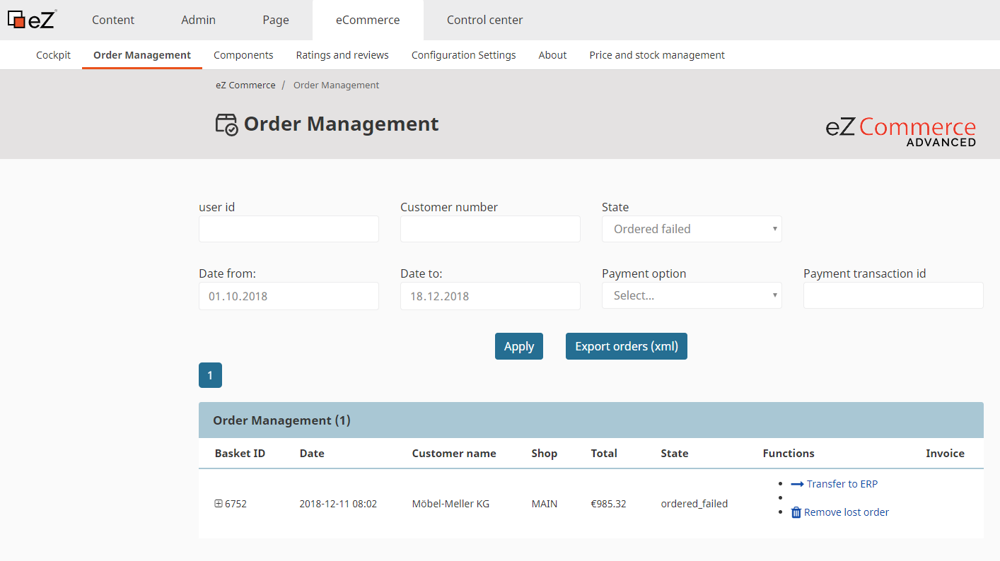

# Lost orders

## Sending lost orders from Backend

If sending of an order to ERP fails, order is still stored in a database with a special state: *ordered\_failed*.  In the admin user interface the Lost Orders can be found in the tab eCommerce/Order Management. Filter by "Order failed".



### There are several actions, that can be executed with lost orders:

|action|meaning|result|
|--- |--- |--- |
|transfer to ERP|lost order will be resend to ERP|user see error or success message depending if the lost order could be resend to ERP or not</br>if the sending of lost order failed, admin will get an email</br>if the sending of lost order was successfull customer who released this order will get an confirmation email|
|remove lost order|the lost order will be not removed, just the state of lost order will be changed to 'confirmed'|the lost order does not appear in the list anymore|

## Technical implementation

### LostOrderService

This service is responsible to handle all lost order features

LostOrderService.php

    namespace: Siso\Bundle\CheckoutBundle\Service

    service id: siso_checkout.lost_order_service

#### Service methods:

|method|meaning|parameters|returns|
|--- |--- |--- |--- |
|createFailedOrderList|creates a list of lost orders||Basket[]|

### LostOrderController

This controller handles all lost order actions

|action|parameters|meaning|policy|
|--- |--- |--- |--- |
|processLostOrderAction|$basketId|send lost order to ERP|siso_policy/lostorder_process|
|deleteLostOrderAction|$basketId|set the state of lost order to 'confirmed'|siso_policy/lostorder_process|


### Email notifications

Every time and order cannot be placed shop administrator will get an email. The email can be defined in the configuration:

``` yaml
parameters:
    siso_core.default.ses_swiftmailer:
        .....
        lostOrderEmailReceiver: %ses_eshop.lostorder_email%
```

Here is how the email looks like:


Templates are located here:

``` 
vendor/silversolutions/silver.e-shop/src/Silversolutions/Bundle/EshopBundle/Resources/views/Emails/NotificationMail_FailedOrder.html.twig
vendor/silversolutions/silver.e-shop/src/Silversolutions/Bundle/EshopBundle/Resources/views/Emails/NotificationMail_FailedOrder.txt.twig
```

## Lost Order Command

!!! note

    Important! For the CLI the host must be set, otherwise the urls and assets are not correct. Please make sure, you have this in your configuration.

    ``` 
    # Please make sure, that you have this parameter set in your project configuration
    # Set the host for your project here - depending on siteaccess

    parameters:
        siso_core.default.host: localhost
    ```

Another possibility is to resend the lost orders via comman line tool:

silversolutions:lostorder:process [id]:

``` bash
php bin/console silversolutions:lostorder:process --help

Usage:
 silversolutions:lostorder:process [id]

Arguments:
 id                    basket id of the lost order

Options:
 --help (-h)           Display this help message.
 --quiet (-q)          Do not output any message.
 --verbose (-v|vv|vvv) Increase the verbosity of messages: 1 for normal output, 2 for more verbose output and 3 for debug
 --version (-V)        Display this application version.
 --ansi                Force ANSI output.
 --no-ansi             Disable ANSI output.
 --no-interaction (-n) Do not ask any interactive question.
 --shell (-s)          Launch the shell.
 --process-isolation   Launch commands from shell as a separate process.
 --env (-e)            The Environment name. (default: "dev")
 --no-debug            Switches off debug mode.
 --siteaccess          SiteAccess to use for operations. If not provided, default siteaccess will be used

Help:
 The siso_checkout:lostorder:process command sends all lost orders to ERP one after each other.
 You can specify the basket id of the lost order by yourself if you want to send only one lost order.
```

!!! note 

    The behavior is the same as if sending lost orders via backend. If the sending of lost order fails, admin will get an email. If the sending was succesfull, customer who released this order will get an confirmation email.

    Please notice, that in this context (command line tool) there is no request. Because of this no images embedded in email will be send, because it is not possible to generate the img path.
