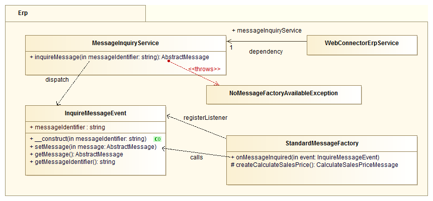

# ERP Component: Messages

Communication is depicted using specific messages classes. Each message class has to derive from AbstractMessage. These messages are entities used system wide to store data in a defined structured way within eZ Commerce (Advanced version only). The abstract base class defines three properties:

``` php
/**
 * Object for requests, generated from UBL definitions
 *
 * @var object
 */
private $requestDocument;

/**
 * Object for responses, generated from UBL definitions
 *
 * @var object
 */
private $responseDocument;

/**
 * @var int
 */
private $responseStatus = self::RESPONSE_STATUS_NOT_SENT;

/**
 * @var string
 */
private $responseError = '';
```

These properties are publicly accessible by respective getter and setter methods. Since the properties could be changed anywhere, it is necessary to validate the value of the getter methods before further accessing (e.g. access to supposed members of a response object).

Derived and non abstract message classes may provide methods for data feeding into the requests and response members or retrieving specific data from them, respectively (e.g. address records in customer data messages). But the classes may also just be empty stubs and leave data handling to other parts of the application.

The response status is set by the transport service according to the result of the ERP communication. Follow statuses are defined:

``` php
/**
 * The message was not sent, yet. This status is the initial value after
 * instantiation.
 */
const RESPONSE_STATUS_NOT_SENT = -1;

/**
 * The message was successfully sent and a valid response was received.
 */
const RESPONSE_STATUS_OK = 0;

/**
 * The message was processed by the remote service, but the ERP responded
 * with an error.
 */
const RESPONSE_STATUS_ERP_ERROR = 11;

/**
 * The message was processed by the remote service, but the ERP was busy
 * and the request timed out.
 */
const RESPONSE_STATUS_ERP_TIMEOUT = 12;

/**
 * The message was processed by the remote service, but the service itself
 * caused an error or the ERP was not reachable.
 */
const RESPONSE_STATUS_SERVICE_ERROR = 21;

/**
 * The message could not be sent to the remote service.
 */
const RESPONSE_STATUS_CONNECTION_ERROR = 22; 
```

The implementation of the [transport service](../erp_component_transport.md) is responsible for the evaluation of the result of the communication and MUST set the response status accordingly.  

## Documents

Message documents, as been seen in above, should be just plain PHP objects. These classes are intended to store the actual structured data, which is mentioned above. Currently all document classes are created mechanically by the XSD2PHP tool. This tool creates PHP classes out of XML Schema Definitions, which may provide the opportunity to validate created data against that definitions. The created classes define solely public member attributes thus accessing the data is quite straight forward: `$object->memberVar->subMember->value = 'value';`

## Instantiation of message classes

The message creation uses the mechanics of the Symfony EventDispatcher system. http://symfony.com/doc/current/components/event_dispatcher/introduction.html.

When a new message object is required, a specific service is inquired to deliver a message object of specific type (e.g. calculate\_sales\_order). eZ Commerce will then dispatch a InquireMessageEvent within that service, containing the wanted message type and a reference to an AbstractMessage object. Specific listeners, which are capable to create messages, can register/subscribe to that event and check if they are capable to create that type of message. In Symfony new listeners can be easily registered to events as services via (yaml-)configuration. This enables a flexible way to add new "custom" messages and their factories per module *and* the possibility to overwrite the creation of certain messages (by simply overriding the service definition).

The workflow of the message creation:

- For example a catalog data provider want to create a new message. Thus it calls MessageInquiryService::inquireMessage('MessageIdentifer')
    - The service should be injected as a dependency and not instantiated directly.
- The new event object will be instantiated with the respective message identifier attribute ('MessageIdentifier' in this case) and a null reference to its AbstractMessage attribute.
- The event will be dispatched via the EventDispatcher.
- All registered listeners are called with the event object.
- The listeners check for their responsibility to the respective message type, and:
    - If responsible, create the message, append the message object to the event object and stop further event propagation via $eventstopPropagation();
    - If not responsible, they will do nothing.
- After the event processing is done, the MessageInquiryService will check if the message was created, and:
    - If created, returns the message object
    - If not created, will throw an NoMessageFactoryAvailableException

Example code of how to get a message instance in a Symfony controller class:

``` php
$messageInquiry = $this->get('silver_erp.message_inquiry_service');
try {
    $exampleRequestMessage = $messageInquiry->inquireMessage(
        ExampleMessageFactoryListener::EXAMPLEREQUEST
    );
} catch (NoMessageFactoryAvailableException $e) {
    // Do exception handling
}
```

## Creating a new listener

Create a new class and add a method, that accepts a InquireMessageEvent:

``` php
class ExampleMessageFactoryListener {

    const EXAMPLEREQUEST = 'ExampleRequestMessage';

    public function onMessageInquired(InquireMessageEvent $event)
    {
        $messageIdentifier  = $event->getMessageIdentifier();
        $messageObject      = null;

        if ($messageIdentifier === self::EXAMPLEREQUEST) {
            $messageObject = new ExampleMessage();
        }

        if ($messageObject != null) {
            $event->setMessage($messageObject);
                $event->stopPropagation();
        }
    }
}
```

Register the new listener to the inquire message event.

``` yaml
services:
    example.message_inquiry_listener:
        class: "\Example\MessageInquiryListener"
        tags:
            - {name: kernel.event_listener, event: silver_erp.inquire_message, method: onMessageInquired}
```

As you can see, event listeners are defined as tagged services. The *name* and the *event* parameter of the tag must be `kernel.event_listener` and `silver_erp.inquire_message` respectively. The *method* parameter must be the name of the method of the specified class, which is called, if the event is dispatched. This method must define a parameter of type InquireMessageEvent in order to retreive the event object.

## Class model


