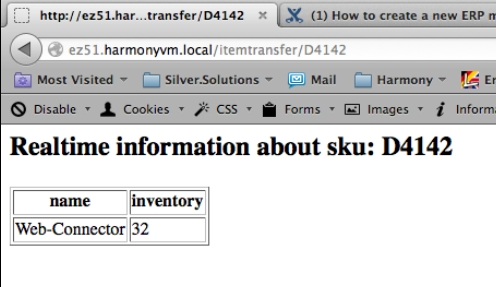

# How to create a new ERP message (example: ItemTransfer)

## ERP messages for beginners

Here you can find a much more detailed tutorial to create new messages which is very useful if you do this for the first time.

If you want to create a new message, first think about if you want to create a standard message for [eZ Commerce (Advanced version only)](http://confluence.ng.silverproducts.de/display/EX/Create+a+standard+message+%28UpdateCustomer%29+for+silver.e-shop) or a specific message in a [project](http://confluence.ng.silverproducts.de/pages/viewpage.action?pageId=3408170).

Standard messages have to meet stricter conventions like the UBL message standard whereas project specific messages can be added in a more simple way with less effort.

- [create a standard ERP message](create_a_standard_message_updatecustomer.md)
- [create a project specific ERP message](create_a_project_specific_message_selectmodified_data)

## Use case: ERP message ItemTransfer

This document describes how to setup and use a new ERP message using the eZ Commerce (Advanced version only). The example will use a message which will request product data from the ERP system often required in online shops.

The example is using the Web-Connector and the standard message SV\_ITEM\_TRANSFER and will fetch data about a given SKU in realtime. The name of the product and the inventory will be displayed on a webpage.



Here you can find more existing ERP messages (sub-articles in the navigation): [ERP Component: Messages](../../../erp_communication/erp_components/erp_component_messages/erp_component_messages.md)

## Fetch Products from ERP 

The Web-Connector provides the Web-Service operation SV\_ITEM\_TRANSFER. This method will fetch data for a given SKU and return some data about this product. The SKU value may also be a filter such as "1.." (this is a NAV notation and will list all products where the SKU starts with "1"). 

The ERP expects following XML as a request:

``` xml
<ITEMTRANSFER>
  <ITEM_NO>1..</ITEM_NO>
  <ITEM_MAXCOUNT>10</ITEM_MAXCOUNT>
</ITEMTRANSFER>
```

The ERP responds with following XML. The tag "ITEM" may be repeated for each product returned by the ERP. 

``` xml
<?xml version="1.0" encoding="UTF-8"?>
<ItemTransfer>
        <ITEM>
            <ITEM_NO>D4142</ITEM_NO>
            <DESCRIPTION>Web-Connector</DESCRIPTION>
            <DESCRIPTION_2/>
            <VENDOR_NO/><VENDOR_ITEM_NO/>
            <BLOCKED>0</BLOCKED>
            <INVENTORY>32</INVENTORY>
            <BASE_UNIT_OF_MEASURE_CODE>STÜCK</BASE_UNIT_OF_MEASURE_CODE>
            <UNIT_LIST_PRICE>349</UNIT_LIST_PRICE>
            <SEARCH_DESCRIPTION/>
            <ITEM_CATEGORY/>
            <PRODUCT_GROUP/>
        </ITEM>
 </ItemTransfer>
```

We want to send the request as its expected by the ERP but map the response if required.

### Create the Request and Response XML

We agreed to use UBL 2.0 as base for our XML structure and to customize it when nesessary. (see [Usage of UBL](../usage_of_ubl))

Here you can find the documentation of UBL 2.0 messages: <http://www.datypic.com/sc/ubl20/ss.html>

We create the request and response XML to generate message objects from as expected by our shop.

Please take care that the Root tags are not using the same name\! Its a good practice to name the Tag of the response adding a suffix such as "Response".

These two xml files have to be stored in the subdirectory "Resources/specifications/xml/" of your project:

- request.itemtransfer.xml - containing the specification for the request
- response.itemtransfer.xml - containing the specification for the response

src/Demo/TestBundle/Resources/xml/request.itemtransfer.xml:

``` xml
<?xml version="1.0" encoding="UTF-8"?>
<ItemTransfer>
  <ITEM_NO>1..</ITEM_NO>
  <ITEM_MAXCOUNT>10</ITEM_MAXCOUNT>
</ItemTransfer>
```

This is the expected response of the ERP answer. Since the tag "ITEM" will be provided for each product the attribute 'ses\_unbounded="ITEM"' will inform the eZ Commerce (Advanced version only) that it should handle this element as an array. 

src/Demo/TestBundle/Resources/xml/response.itemtransfer.xml:

``` xml
<?xml version="1.0" encoding="UTF-8"?>
<ItemTransferResponse ses_unbounded="ITEM">
        <ITEM>
            <ITEM_NO>D4142</ITEM_NO>
            <DESCRIPTION>VPA-150</DESCRIPTION>
            <DESCRIPTION_2/>
            <VENDOR_NO/><VENDOR_ITEM_NO/>
            <BLOCKED>0</BLOCKED>
            <INVENTORY>20</INVENTORY>
            <BASE_UNIT_OF_MEASURE_CODE>STÜCK</BASE_UNIT_OF_MEASURE_CODE>
            <UNIT_LIST_PRICE>349</UNIT_LIST_PRICE>
            <SEARCH_DESCRIPTION/>
            <ITEM_CATEGORY/>
            <PRODUCT_GROUP/>
        </ITEM>
 </ItemTransferResponse>
```

!!! tip

    There are several XML attributes (ses_unbounded, ses_type), that can/shall be used. Please see: [XML format (necessary additional attributes)](../../erp_components/erp_component_messages/erp_message_class_generator.md) to read more.

### Create XSL mapping

To send and retrieve the XML in the proper format, we create a mapping. (for more information see [ERP Component: Mapping](../../erp_components/erp_component_mapping.md))

Two mappings have to be defined (please note that the file ending is now `*.xsl`):

- request.itemtransfer.xsl - this will map the request as modeled before into the format the ERP expects
- response.itemtransfer.xsl  - this will map the response from the ERP as modeled before into the format the shop expects  

src/Demo/TestBundle/Resources/xslbase/request.itemtransfer.xsl:

``` xml
<?xml version="1.0" encoding="UTF-8"?>
<xsl:stylesheet version="1.0" xmlns:xsl="http://www.w3.org/1999/XSL/Transform">
    <xsl:template match="/*">
        <xsl:copy-of select="." />
    </xsl:template>
</xsl:stylesheet>
```

src/Demo/TestBundle/Resources/xslbase/response.itemtransfer.xsl:

``` xml
<?xml version="1.0" encoding="UTF-8"?>
<xsl:stylesheet version="1.0" xmlns:xsl="http://www.w3.org/1999/XSL/Transform">
    <xsl:template match="/ItemTransferResponse">
        <ItemTransfer>
            <xsl:copy-of select="*" />
        </ItemTransfer>
    </xsl:template>
</xsl:stylesheet>
```

### Generate request/response message classes

Now that we have the XML as expected from the shop and the mapping to/from the ERP system, we are ready to generate the PHP objects. (For details see [ERP Message-Class-Generator](../../erp_components/erp_component_messages/erp_message_class_generator.md))

``` bash
php bin/console silversolutions:generatemessages --message itemtransfer --sourceDir src/Demo/TestBundle/Resources/xml --targetDir src/Demo/TestBundle --force
```

!!! caution

    If you recreate the PHP objects, you have to delete the old objects first. The "–force" parameter will fullfill this task automatically. These includes all classes from the order: Entities/Messages/Document and the ItemtransferMessage.php from Entities/Messages

    Also the .yml files from the config order: itemtransferfactorylistener.service.yml and itemtransfermessage.message.yml

### Include configuration to parameters.yml

When all PHP objects are generated, we have to configure the messages, so that they are accessible by the shop.

src/Demo/TestBundle/Resources/config/parameters.yml:

``` yaml
imports:
    - { resource: "@DemoTestBundle/Resources/config/itemtransferfactorylistener.service.yml" }

parameters:
    silver_erp.config.messages:
        itemtransfer:
            message_class: "Demo\\TestBundle\\Entities\\Messages\\ItemtransferMessage"
            response_document_class: "\\Demo\\TestBundle\\Entities\\Messages\\Document\\ItemTransferResponse"
            webservice_operation: "SV_ITEM_TRANSFER"
            mapping_identifier: "itemtransfer"
```

**Important**:

- Define the Web-Service method which shall be used in the ERP-system or Web-Connector. For the given example the operation "SV\_ITEM\_TRANSFER" is used. 

### Using request and response

When everything is set up, we are able to use the request and response objects within the shop. 

To complete this tutorial, we implement a controller which will get the SKU using the URL (e.g. /itemtransfer/1000), establish the connection to the ERP and will load a template.

!!! caution

    Please keep in mind, that setting / getting content to / from elements **always** requires accessing the value attribute: For example:

    `$itemtransferRequest ->ITEM_MAXCOUNT->value =  '1';`

Controller:

``` php
/**
* @Route("/itemtransfer/{sku}")
* 
*/
public function indexAction($sku)
{

    /** @var \Silversolutions\Bundle\EshopBundle\Services\MessageInquiryService $inquiryService */
    $inquiryService = $this->get('silver_erp.message_inquiry_service');

    /** @var \Demo\TestBundle\Entities\Messages\ItemtransferMessage $itemtransferMessage */
    $itemtransferMessage = $inquiryService->inquireMessage(\Demo\TestBundle\Services\Factory\ItemtransferFactoryListener::ITEMTRANSFER);

    /** @var \Demo\TestBundle\Entities\Messages\Document\ITEMTRANSFER $itemtransferRequest */
    $itemtransferRequest = $itemtransferMessage->getRequestDocument();
    $itemtransferRequest->ITEM_NO->value = $sku; // some item number
    $itemtransferRequest->ITEM_MAXCOUNT->value = '1'; 

    /** @var \Silversolutions\Bundle\EshopBundle\Services\Transport\CurlMessageTransport $erpTransport */
    $erpTransport = $this->get('silver_erp.message_transport');
    /** @var \Demo\TestBundle\Entities\Messages\Document\ITEMTRANSFER_RESPONSE $itemtransferResponse */
    $itemtransferResponse = $erpTransport->sendMessage($itemtransferMessage)->getResponseDocument();   //item.ITEM[0].DESCRIPTION.value

    return $this->render(
        'DemoTestBundle:Default:index.html.twig',
        array(
            'sku' => $sku, 
            'itemDescription' => $itemtransferResponse->ITEM[0]->DESCRIPTION->value, 
            'itemInventory' => $itemtransferResponse->ITEM[0]->INVENTORY->value,
        )
    );
}
```

Template (index.html.twig):

``` html+twig
<h2>Realtime information about sku: {{ sku }}</h2> 

<table border="1">
     <tr>
        <th>name</th>
        <th>inventory</th>
    </tr>
    <tr>
        <td>{{ itemDescription }}</td>
        <td>{{ itemInventory }}</td>
    </tr>
</table>
```
