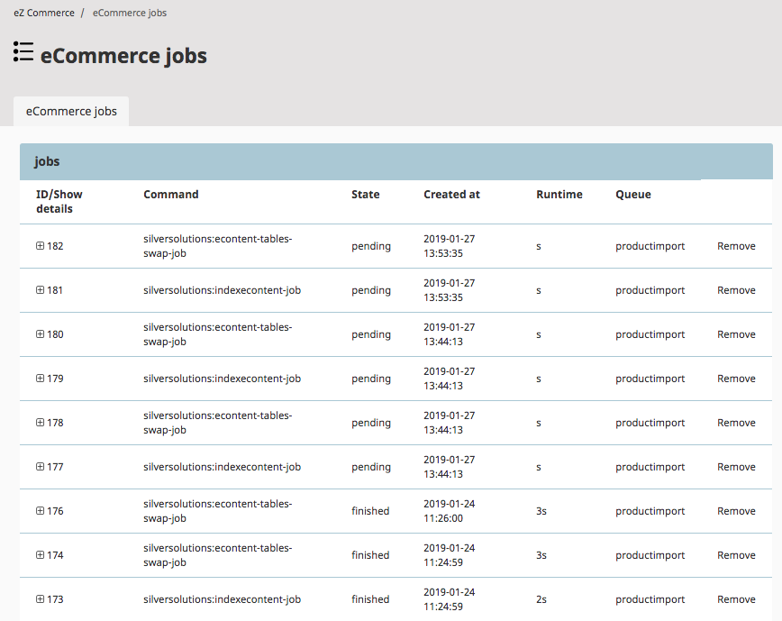
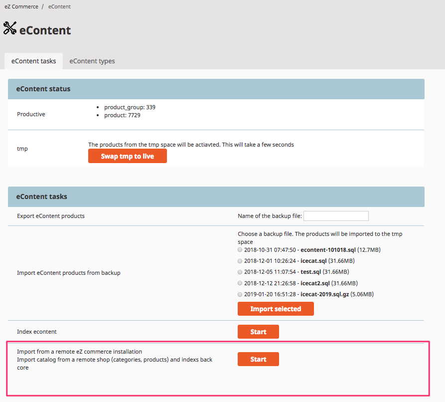

# Job system

The job system allows to automate tasks implemented as a command.

It is based on the JMSJobQueueBundle. Please check the documentation of the Bundle in case you want to implement own jobs: https://github.com/schmittjoh/JMSJobQueueBundle.

## Job overview

eZ Commerce offers an overview about the last jobs. 

You can display more about the state of a running of finished job by pressing the plus sign. 

It will display the output of the command.

The list is automatically updated every 10 seconds. 



You can add own jobs (see chapter "Configure jobs") to the eContent menu. A customer can press "Start" and the job will be executed. 



## How to start jobs

### Requirements

The Job system requires that a command has to be executed (how to setup this command see [Required crontab tasks](../guide/configuration/required_crontab_tasks.md)).

``` bash
php bin/console jms-job-queue:run --env=prod
```

A job can be started 

- using the backend (and a configuration of tasks offered)
- using the PHP Api

Please check the documentation of the Bundle for more details about the PHP Api: <http://jmsyst.com/bundles/JMSJobQueueBundle>

## Configure jobs for the backend

You can configure project specific jobs which will be displayed in the backend.

You can define the symfony command (parameter "command") and the parameters. If your job requires additional tasks you can add these tasks in the section "depending_jobs". 

These jobs will be started after the main job has been executed successfully.

``` yaml
parameters:
    siso_control_center.default.add_jobs:
        import_solr:
            label: "Import from eZ"
            desc: "Starts import from a remote system"
            command: "silver:import"
            params:
                - tmp
            depending_jobs:
                index_solr:
                    label: "Index econtent tmp cores"
                    command: "silversolutions:indexecontent-job"
```

## Remove old jobs 

``` bash
bin/console jms-job-queue:clean-up --env=prod --per-call=10 --max-retention="1 min"
```
