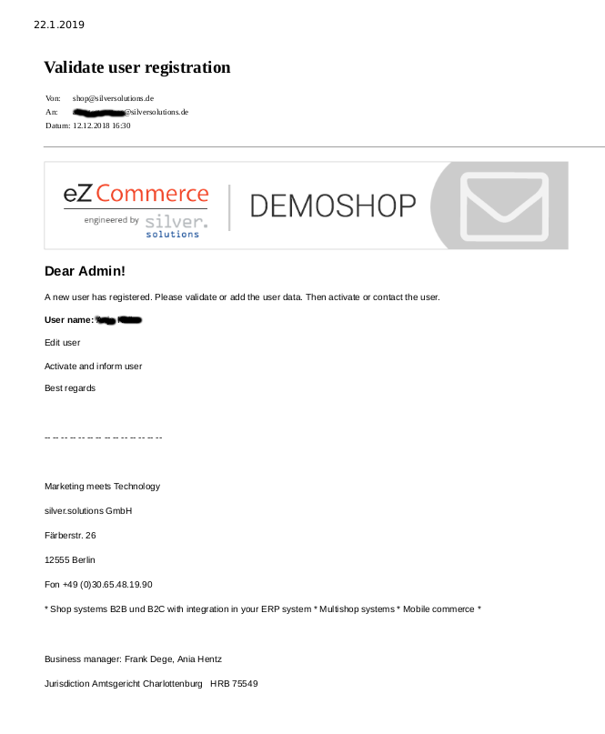

# Login and registration configuration

## General Yaml configurations

When this parameter is enabled, the shop can login users also with customer number.

`vendor/silversolutions/silver.e-shop/src/Silversolutions/Bundle/EshopBundle/Resources/config/silver.eshop.yml`:

``` yaml
# possible values: true, false
siso_core.default.enable_customer_number_login: true
```

There is a need to specify location id for users by siteaccess:

``` yaml
siso_core.default.user_group_location: 106
siso_core.default.user_group_location.business: 106
siso_core.default.user_group_location.private: 106
siso_core.default.user_group_location.editor: 14
```

Default list of url's from which user will be redirected after login.

``` yaml
siso_core.default.redirect_homepage:
    - /login
    - /register
    - /registration
    - /password
    - /token
    - /change_password
```

## Configuration options for Private customer registration

### Send email with activation link to configured email address

This is an optional configuration, that has to be set, when the emails with activation link should not be send to the customer, but to a defined email address.

The email will contain these additional information:

- name of the user
- link to the user in backend

Optional config:

``` 
siso_core.default.user_activation_receiver: <email>
```

To use this feature it is neccessary to also configure this parameter corectly.

Default value in `EshopBundle/Resources/config/ses_parameters.yml`:

``` 
siso_core.default.related_admin_site_access: 'admin'
```

It is needed to build the link to the backend.

You have to adapt the success message of the private registration. The standard uses a textmodule with the identifier 'success\_register\_private'.

### Email example



## Send info email to customer after successfull activation of account via activation link

When this parameter is set to true, the customer will receive an email when the account was enabled, using the activation link.

Default value in `EshopBundle/Resources/config/emails.yml`:

``` 
siso_core.default.info_email_after_user_activation: false
```

### Email example


