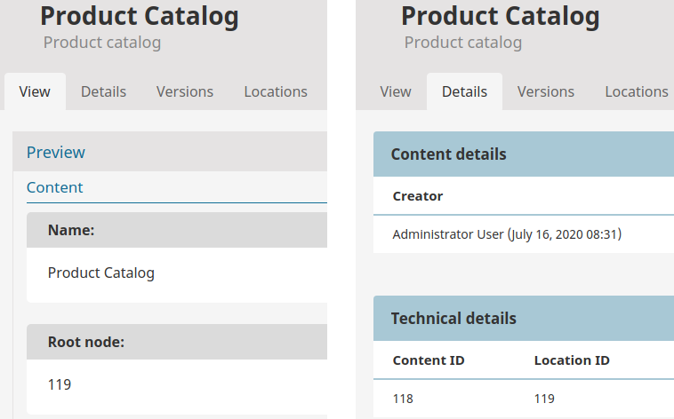

# Navigation

eZ Commerce supports mixing of catalog elements (products) provided by a storage engine and content from the content model.

As long as a product is stored in the content model, the menu could be built by the built-in Twig functions and controllers. 
But because eZ Commerce offers storing products using different data providers,
a universal `NavigationService` ensures that the data providers are used to load the categories for the menu. 

### Using a product catalog

A product catalog has to be set up in the Back Office using a Product Catalog Content item
which introduces the products for the shop, for example: 


eZ Commerce supports different ways of constructing the navigation:

- with one or more catalog trees inside the Content Tree
- without a catalog
- with the root element as the product catalog
- with the root element as the product catalog, but displaying only part of a catalog (displaying only sub-elements that belongs to one category)

The navigation can also store any additional data in the navigation node.

You can set up a different Location depth for content from the content model and from catalog.

!!! caution "Catalogs with multiple Locations"

    The navigation does not support product catalogs and categories with multiple Locations.
    If you want to have the same categories on several places, you need to copy the content.
    Products can be assigned to one or more categories.

## Fetching the data

Navigation uses the built-in search to fetch the content and a custom search service to fetch to catalog data directly from Solr.
Every data provider must ensure that the data is indexed in the correct format.
The following data must at least be indexed:

``` 
document_type_id: [content/econtent]
type_id: [class id]
main_location_visible_b: [true/false]
section_id: [section id]
main_location_depth_i: [depth]
main_location_path_id: [path]
main_location_priority_i: [priority]
```

Additionally, every data provider can extend the search query before the catalog data is fetched from Solr.
See the [Cookbook](modifying_the_search_query.md) for more information.

### Fields used for navigation

``` yaml
siso_core.default.navigation.catalog:
    #the class id has to be specified here
    types: ['38']
    sections: [1, 2]
    enable_priority_zero: true
    label_fields: ['ses_category_ses_name_value_s','name_s']
    additional_fields: ['ses_category_ses_code_value_s', 'ses_category_ses_name_value_s' ]
```

You can define the name used for navigation in configuration. The `label_fields` parameter contains a list of attribute names (Solr names) which are used as the name in the menu. The first available attribute is used. 

!!! caution

    The standard attribute `name_s` does not always contain the correct translation. 
    When `name_s` is used in `label_fields`, navigation may not be translated.
    To resolve this, configure the ID of the attribute directly e.g. `ses_category_ses_name_value_s`.

### Sorting

The navigation elements are sorted by Location priority and you can enable or disable fetching of nodes where the priority is 0.
The active node is highlighted in the navigation.

### Caching

The navigation is cached in two different ways:

The top navigation and the left menu are cached using HTTP cache. The caching strategy is defined by `navigation`.
It uses one cache per SiteAccess.

By default navigation is cached by `user-hash` for 10 hours.

``` yaml
silver_eshop.default.http_cache:
    navigation:
        max_age: 36000
        vary: user-hash
```

When a Content item which is included in the navigation is modified, a content modfication handler is triggered.
Make sure that a cron job is activated to refresh the cache if required:

`php bin/console silversolutions:cache:refresh --env=prod`

### Injecting catalog data

When the product catalog is accessible and the navigation is built, catalog elements of the special Content Type `ses_productcatalog` are injected.
Content of this type is the root node for the catalog. You can place as many product catalogs (on any level) as you wish. 

You can also create a new product catalog and assign it to the Content Tree using the `ses_productcatalog` Content Type.

If you are using the content model data provider, you have to place categories and products directly under `ses_productcatalog`
and then configure the `root_node` ID so it points to itself.



If you are using the eContent data provider, configure the `root_node` ID so it matches the Location ID of the root element in the `sve_object` table.


The following Fields are defined in the `ses_productcatalog` Content Type:

|Attribute name|Attribute identifier|Description|
|--- |--- |--- |
|Name|`name`|Name of the product catalog used for navigation|
|Root node|`root_node`|Root Location of the product catalog in the storage engine|
|Depth|`depth`|The depth of the product catalog. The navigation is built using this parameter. A depth of 1 means that there is just one level starting at "Root node"|
