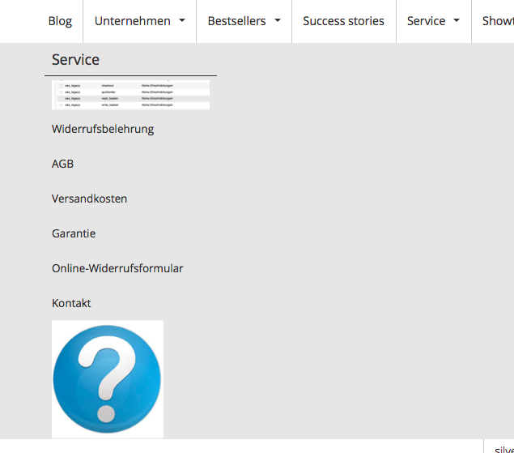

# Navigation configuration

``` yaml
parameters:    
    siso_core.default.product_catalog_enabled: true
    siso_core.default.product_catalog_identifier: "ses_productcatalog"
    siso_core.default.product_catalog_content_type_id: 44
    siso_core.default.router_cache_ttl: 86400    

    siso_core.default.navigation_ez_location_root: 2
    siso_core.default.navigation_ez_depth: 3
    siso_core.default.navigation_sort_order: 'asc'

    siso_core.default.navigation.content:
        types: ["st_module", "folder", "article", "landing_page", "ses_productcatalog"]
        sections: [1, 2]
        enable_priority_zero: true
        label_fields: ['name']
        additional_fields: ['name', 'short_description', 'show_children', 'image']

    siso_core.default.navigation.catalog:
        types: ['38']
        sections: [1, 2]
        enable_priority_zero: true
        label_fields: ['name_s']
        additional_fields: ['ses_category_ses_code_value_s', 'ses_category_ses_name_value_s' ]
```

## Disable the product catalog

If you want to hide the whole catalog from the navigation, set the `product_catalog_enabled` parameter to `false`:

``` yaml
siso_core.default.product_catalog_enabled: false
```

## Change caching time

To change the navigation cache time, set the `router_cache_ttl` parameter (in seconds):

``` yaml
siso_core.default.router_cache_ttl: 86400
```

## Modify the main navigation Location

The `navigation_ez_location_root` parameter is the entry root Location point for the whole navigation in the Back Office.
This value is usually set to `2`, the Location of the content structure.

``` yaml
siso_core.default.navigation_ez_location_root: 2
```

## Modify main navigation depth

The `navigation_ez_depth` parameter is responsible for the main navigation depth.
Content from the Back Office is fetched only up to this depth.
This does not include the product catalog, which has its own depth specified.

``` yaml
siso_core.default.navigation_ez_depth: 3
```

## Change navigation sorting

Use `navigation_sort_order` to set the order or sorting by priority to ascending or descending:

``` yaml
siso_core.default.navigation_sort_order: 'asc'
```

## Fetching content

### Change Content Types in navigation

If you need to fetch an additional Content Type (e.g. a blog) and place it in navigation,
extend the `types` parameter:

``` yaml
siso_core.default.navigation.catalog:
    types: ["st_module", "folder", "article", "landing_page", "ses_productcatalog", "blog"]
```

### Fetch additional Sections

To fetch content from different Sections, provide the Section IDs in configuration:

``` yaml
siso_core.default.navigation.catalog:
    sections: [1, 2]
```

### Modify fetching by priority

If you want to fetch all Content Types, even those with priority 0, use the `enable_priority_zero` parameter:

``` yaml
siso_core.default.navigation.catalog:
    enable_priority_zero: false
```

### Modify name of a navigation node

To use a different field as the navigation node label, change the `label_fields` parameter.
The field has to exist in Solr indexed data.

``` yaml
siso_core.default.navigation.catalog:
    label_fields: ['name_s']
```

### Get additional information about a navigation node

You can also add additional information about the navigation node with `additional_fields`.
The fields have to exist in Solr indexed data.

``` yaml
siso_core.default.navigation.catalog:
    additional_fields: ['ses_category_ses_code_value_s', 'ses_category_ses_name_value_s']
```

#### Display images instead of labels in navigation

You can use additional field for example to display an image instead of the node label
if you have the image stored in the content model.
Then you can additionally store the image in the navigation node and display it on the site:

``` yaml
parameters:   
    siso_core.default.navigation.content:
        ...
        additional_fields: ['name', 'short_description', 'show_children', 'image']
```

You need to adapt the template to render the image instead of the label, for example:

``` html+twig


  
    
  
    {{ item.label|raw }}
  


```




## NavigationHelper

You can use `NavigationHelper` to build a navigation:

``` php
public function buildSubnavigationAction(CatalogElement $catalogElement)
{
    $productCatalogLocationId = 65;

    /** @var NavigationHelper $menuBuilder */
    $navigationHelper = $this->get('siso_core.navigation_helper');

    //build navigation for the productCatalog but display only the subcategories of the current catalogElement
    $menu = $navigationHelper->createMenu($productCatalogLocationId, $catalogElement->id);

    // render menu
}

public function buildNavigationAction($locationId)
{
    /** @var NavigationHelper $menuBuilder */
    $navigationHelper = $this->get('siso_core.navigation_helper');

    //build navigation for the given location id
    $menu = $navigationHelper->createMenu($locationId);

    // render menu
}
```
