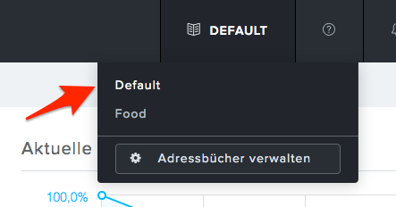
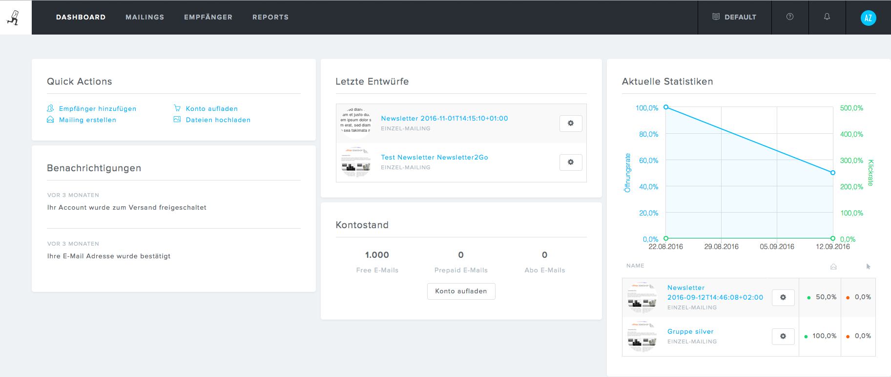
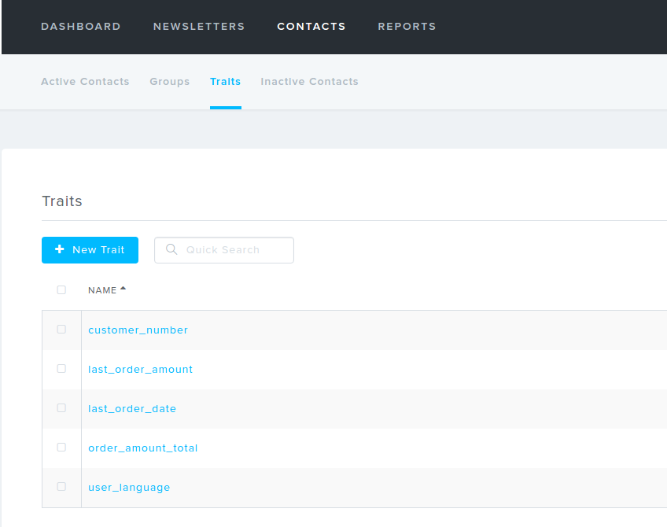

# Newsletter2Go

Welcome to Newsletter2Go plugin documentation.

|||
|--- |--- |
|Name|SisoNewsletter2GoPluginBundle|
|Motivation|Provide a working implementation for the eShop's newsletter API.|
|Target group|Shop owners|
|Short description|eZ Commerce provides an API to enable customers to register their e-mail addresses to a newsletter. This bundle integrates the newsletter service https://www.newsletter2go.de into this API.|
|compatible to eZ Commerce version|4.0|
|Demo available|demo.silver-eshop.de|
|Change history|11 Apr 2018|
|Contact persons||
|Source (git)|http://gitlab.silversolutions.de:8081/silver.eshop-plugins/Newsletter2GoPluginBundle|

## Introduction

silver.e-shop offers a newsletter interface. This allows user to un/subscribe from/to newsletters and see the newsletter status or update newsletter details information in his profile.

Newsletter2Go offers several address books. The reason is, that user can be stored in one, or several address books. One address books equals one newsletter topic, so user can choose, if he wants to subscribe e.g. on food, clothes and technique separately.

Usage of several address books is optional and by default there is the default address book.

silver.e-shop in standard works with default address book only. See [FAQ](newsletter2go_faq.md), if you want to support several address books in your project.

In Newsletter2Go backend the address book can be choosen in the header menu. Every address book has a different dashboard with different mailings, receivers and reports.

#### Additional attributes

Attributes, that do not exist in the newsletter provider has to be created first.

## Before you start

Please keep in mind that this plugin is really connected with a lot of different modules in our shop. Be sure to check these out:

- [CustomerProfileData](../../customers/customers.md)

## Installation and Configuration

Read the manual for installation and configuration of the Newsletter2GoPlugin.

[README.md](http://gitlab.silversolutions.de:8081/silver.eshop-plugins/Newsletter2GoPluginBundle/blob/master/README.md)

## Cookbook

Check our recipies to learn more about the eZ Commerce newsletter implementation:

- [How to send additional data to Newsletter2Go](newsletter2go_cookbook/how_to_send_additional_data_to_newsletter2go.md)
- [How to use the Newsletter2Go API to implement custom functions](newsletter2go_cookbook/how_to_use_the_newsletter2go_api_to_implement_custom_functions.md)
