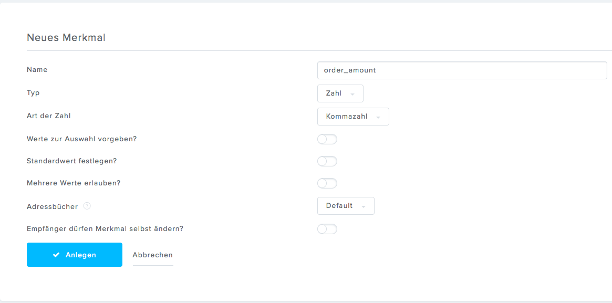
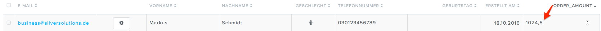

# Sending additional data to Newsletter2Go

Before a user is created in the Newsletter2Go address book,
an [event is dispatched](../newsletter2go_service.md) that enables you to send some additional data.
To send additional data to Newsletter2Go, you have to also create custom attributes in the Newsletter2Go backend.

To send the amount of products in a user's order to Newsletter2Go:

1. Add a new property

2. Implement [an event listener](../../additional_newsletter_data.md)

The amount of products in a user's order is stored in Newsletter2Go when the user is created.

