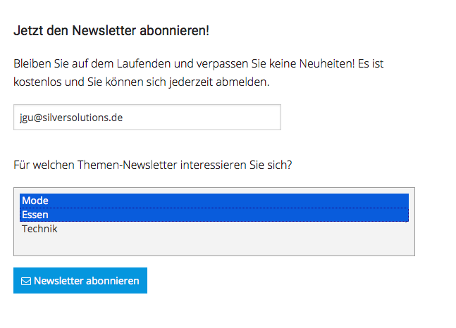
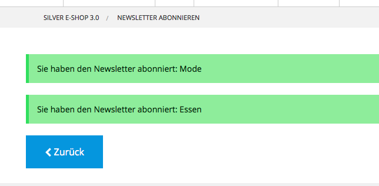

# Working with several newsletters (address books)

eZ Commerce works with the default Newseletter2Go address book only.
If you want to offer several newsletter topics in your project, follow these steps:

1\. Provide a user interface where the user can choose one or several newsletter topics.
In Newsletter2Go you need to provide an address book per newsletter topic.



2\. Configure the address book ID for every newsletter topic.

3\. When submitting the newsletter form data, you also submit a list of all subscribed newsletter address books:

``` html+twig
<form method="post" action="{{ path('siso_newsletter_subscribe') }}">
  <input name="email" type="text" placeholder="{{ 'Email address'|st_translate }}" class="float-left" required="">
  <select name="list_ids[]" multiple="multiple">
    <option value="oty804fn">Mode</option>
    <option value="ws2uc1v7">Essen</option>
    <option value="hu51kis">Technik</option>
  </select>
  <button type="submit" name="subscribe_newsletter_submit_button" class="button"><i class="fa fa-envelope-o" aria-hidden="true"></i> {{ 'subscribe newsletter'|st_translate() }}</button>
</form>
```

4\. Change the configuration to enable working with several address books:

``` yaml
parameters:
  siso_newsletter.default.support_several_newsletters: true
```

5\. Create a user in the selected address books:


