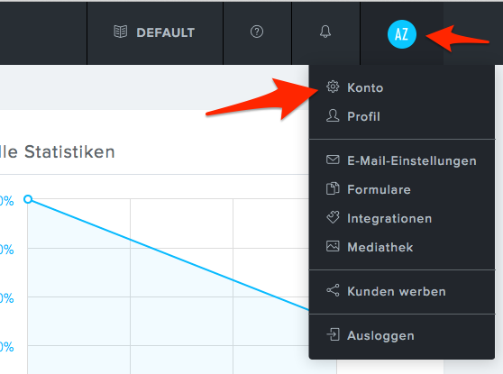
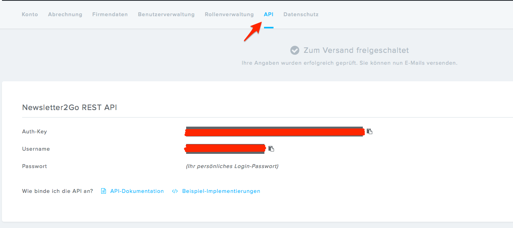

# Newsletter2Go service

This is the concrete implementation of `NewsletterInterface` for the Newsletter2Go provider.  
Newsletter2Go uses REST to connect to the API.

See [Newsletter2Go API documentation](https://docs.newsletter2go.com/?_ga=1.186190697.1183183675.1471410241#/) for more information.

Service ID

`siso_newsletter.newsletter.newsletter2go_service`

## Configuration

The following attributes have to be configured in order to connect to Newsletter2Go via API  

``` yaml
siso_newsletter.default.newsletter2go_username: '%newsletter2go_username%'
siso_newsletter.default.newsletter2go_password: '%newsletter2go_password%'
siso_newsletter.default.newsletter2go_auth_key: '%newsletter2go_auth_key%'
siso_newsletter.default.newsletter2go_ssl_verification: false
```

You can find the authentication data in the Newsletter2Go backend:





## API service

Internally `Newsletter2GoService` uses the `Newsletter2GoApiService`.
You can use this service if you need to implement new methods to communicate with the Newsletter2Go provider through the API:

``` php
public function connectApi($path, $method, $data = array());
public function getApiFormattedDate(\DateTime $dateTime);
public function getApiGenderCode($genderCode);
```

## Sending additional data to Newsletter2Go

### SubscribeNewsletterEvent

`Newsletter2GoService` dispatches an event before a user is created in the address book.

``` php
...
//dispatch event before new recipient is created
$event = new SubscribeNewsletterEvent(
    self::RECIPIENT_PATH,
    NewsletterConstants::METHOD_POST,
    $params,
    $customerProfileData
);
$this->eventDispatcher->dispatch(
    NewsletterEvents::SUBSCRIBE_NEWSLETTER_EVENT,
    $event
);

$response = $this->newsletter2GoApiService->connectApi(
    self::RECIPIENT_PATH,
    NewsletterConstants::METHOD_POST,
    $event->getParams()
);
...
```

### SubscribeNewsletterEvent listener

Every listener that listens to this event can add additional data that is sent to the Newsletter2Go provider.
However, if the attribute does not exist in the provider yet, it has to be created first.

``` php
public function setCustomParameters(SubscribeNewsletterEvent $event)
{
    $params = $event->getParams();
    $customerProfileData = $event->getCustomerProfileData();
 
    if (!array_key_exists('blocked', $params)) {
        $params['blocked'] = $customerProfileData->sesUser->contact->isBlocked;
    }

    $event->setParams($params);
}
```

``` xml
<service id="custom_listener" class="%custom_listener.class%">
    <tag name="kernel.event_listener" event="subscribe_newsletter_event" method="setCustomParameters" />
</service>
```

### UpdateNewsletterEvent

Newsletter2GoService dispatches an event before the user is updated.

``` php
...
//dispatch event before recipient is updated
$event = new UpdateNewsletterEvent(
    self::RECIPIENT_PATH,
    NewsletterConstants::METHOD_POST,
    $params,
    $customerProfileData
);
$this->eventDispatcher->dispatch(
    NewsletterEvents::UPDATE_NEWSLETTER_EVENT,
    $event
);

$response = $this->newsletter2GoApiService->connectApi(
    self::RECIPIENT_PATH,
    NewsletterConstants::METHOD_POST,
    $event->getParams()
);
...
```

### UpdateNewsletterEvent listener

Every listener that listens to this event can add additional data that is sent to the Newsletter2Go provider.
However, if the attribute does not exist in the provider yet, it has to be created first.

``` php
public function setCustomParameters(UpdateNewsletterEvent $event)
{
    $params = $event->getParams();
    $customerProfileData = $event->getCustomerProfileData();

    // sets customer number for logged user
    if ($customerProfileData instanceof CustomerProfileData) {
        $customerNumber = $customerProfileData->sesUser->customerNumber;
        if (isset($customerNumber) && !empty($customerNumber)) {
            $params['customer_number'] = $customerNumber;
        }
    }

    $event->setParams($params);
}
```

``` xml
<service id="custom_listener" class="%custom_listener.class%">
    <tag name="kernel.event_listener" event="update_newsletter_event" method="setCustomParameters" />
</service>
```
