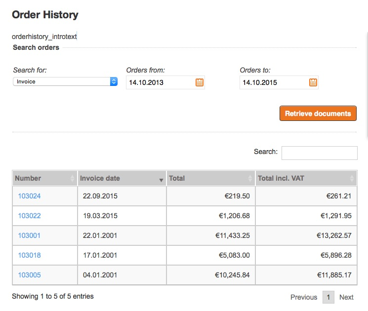
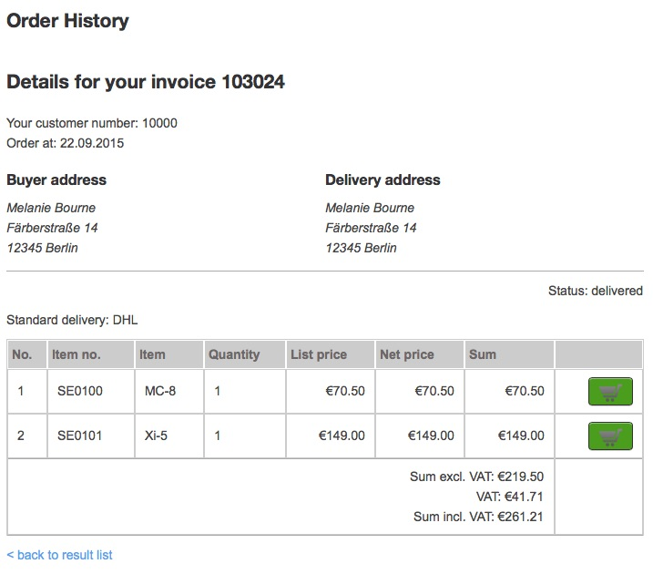

# Orderhistory functions

The order history module is available for customers having a login and a customer number.  Usually a user gets a customer number right after placing the first order.

The module offers a search functionality which allows to search for invoices, delivery notes, orders or credit memos in a given time. It can be configured which documents shall be shown first. 

The user can search inside the list or sort the list by all columns b clicking in the arrow in the table header.

For each document a detail page is offered as well:

If a product is still available in the shop a basket button will be provided. 
