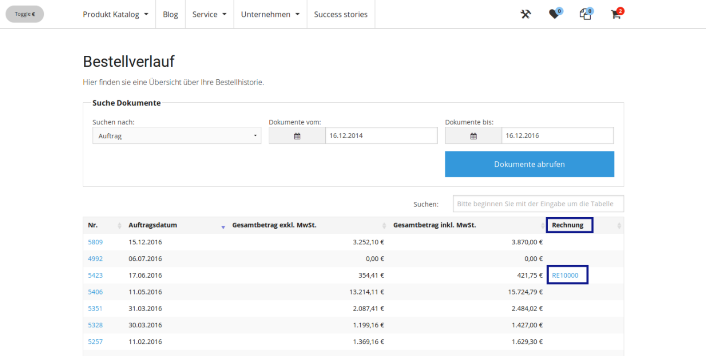
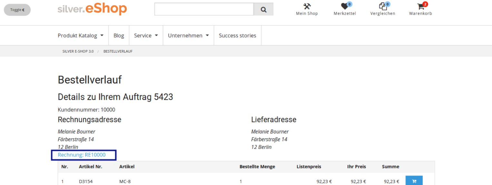
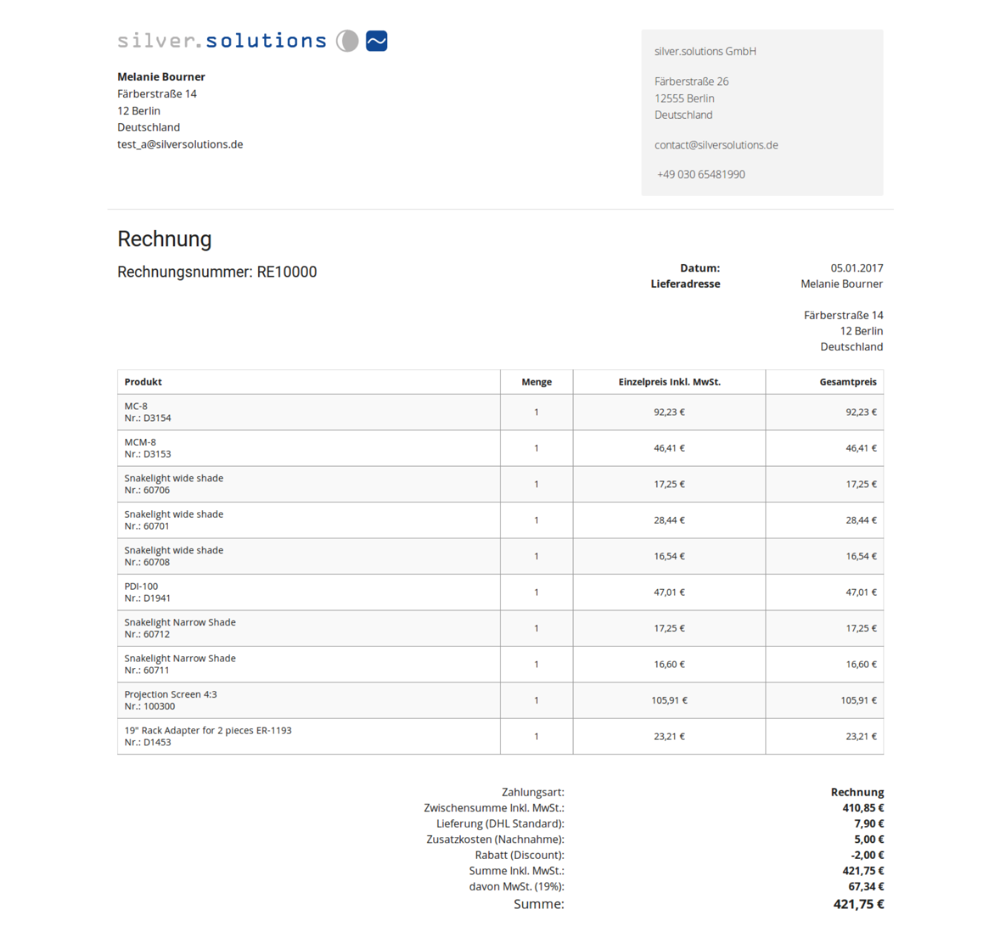

# Local orders when ERP not available

If the shop is not connected to an ERP system, eZ Commerce offers a possibility to still display user orders.

The user will see the orders stored locally in the shop, in other words, the order history will show only documents of type orders and no other documents.

## Offer only orders as document types

Since the shop only has local data for orders, the available document types will be different (invoices, delivery notes...).

Therefore eZ Commerce offers an event listener already, that makes usage of the `ConfigurationEvents::READ_CONFIGURATION` event. By default this listener is deactivated, so you need to activate it in your project:

`silver.orderhistory/src/Siso/Bundle/OrderHistoryBundle/Resources/config/parameters.yml`:

``` yaml
# enable/disable the configuration listener
siso_order_history.default.read_configuration_listener_active: false
```

## Get Local Orders

The local orders are shown in the Order History in case there the connexion with ERP is not available.

By default this behaviour is disabled and the shop will fetch the documents from ERP. To learn more about the standard implementation go to [Addon - Orderhistory.](../orderhistory.md)

The use of the local documents are enabled or disabled from the configuration (`use_local_documents` parameter)

``` yaml
# enable/disable usage of local documents (if ERP communication is not desired)
siso_order_history.default.use_local_documents: false
```

The logic is done using event listeners, so the standard logic does not change if this value is set to false.

### UseLocalDocumentsListener

#### Listener `onRequestEvent`

In case there is no connection with ERP and the local documents should be used (see configuration above), it will throw an exception, that will avoid sending the message to ERP. Then when the exception is catch, another event (MessageExceptionEvent) is dispatched and the `onExceptionMessage` listener executed.

``` xml
<service id="siso_order_history.use_local_documents_listener" class="%siso_order_history.use_local_documents_listener.class%">
   ...
    <tag name="kernel.event_listener"  event="silver_eshop.request_message" method="onRequestEvent" />
   ...
</service>
```

#### Listener `onExceptionMessage`

Checks the exception, that was thrown by the previous listener and creates a [ResponseDocument](../../erp_integration/erp_communication/erp_components/erp_component_messages/erp_component_messages.md) filled with local data (orders). The response will have the same structure as if it was returned from ERP, so no additional changes in the template are required.

``` xml
<service id="siso_order_history.use_local_documents_listener" class="%siso_order_history.use_local_documents_listener.class%">
   ...
    <tag name="kernel.event_listener"  event="silver_eshop.exception_message" method="onExceptionMessage" />
   ...
</service>
```

So the logic from the previous templates is:

1. It checks if local documents should be use (parameter `use_local_documents == true`)
2. Check if the requested message is `OrderListMessage` or `OrderListMessage`
3. If the previous conditions are correct then it throw an exception `UseLocalDocumentsException` that is caught by the `Exception Event`
4. It creates the same response as it is send by ERP (So the response contains the same information as if it were using ERP.)

`silver.orderhistory/src/Siso/Bundle/OrderHistoryBundle/EventListener/UseLocalDocumentsListener.php`

``` php
protected function createOrderListResponseDocument(OrderListRequest $requestDocument)
{
    .... 
    /** @var OrderListResponse $orderListResponse */
    $orderListResponse = new OrderListResponse();
    //These values are same as in the ERP order
    $orderListResponse->OrderTypeCode->value = 'SalesOrderList';
    $orderListResponse->SesExtension->Status->value = 0;
    .....
}
protected function createOrderDetailResponseDocument(OrderDetailRequest $requestDocument)
{
    ....
    $responseDocument = new OrderDetailResponse();
    $responseDocument->ID->value = $basket->getBasketId();
    $issueDate = $this->dateTimeService->defaultToErpDate(
        $basket->getDateLastModified()->format(\DateTime::ISO8601),
        \DateTime::ISO8601
    );
    ...
}
```

## Generate invoice

Generate the invoice information: new entity and PDF[: Order process for multi-shops (with invoice in PDF)](../../../guide/checkout/checkout_features/order/local_order_process_with_invoice_in_pdf.md)

The implementation related with the orders without ERP is inside the bundle: `SisoLocalOrderManagementBundle`

The bundle offers:

1. Generate Local orders with invoice.
1. Generate invoice entity (special implementation to generate the invoice number)
1. Generate invoice view
1. Generate invoice PDF and attach it to the mail.

### Show the invoice in the "order history"

Once the local order with the invoice was generated it is possible to show it in the "order history" as it is shown in the attached image.

Local invoices will be available only for the current user (So no other has access to the invoice page)

Order History list - New column with the link to the invoice page



Order History Details - Link in the header to the invoice page:



#### Order History list

To show the invoice link in a new column of the table the configuration should be override. for that a new parameter inside order should be add (see code).

**silver.orderhistory/src/Siso/Bundle/OrderHistoryBundle/Resources/config/parameters.yml**

``` 
# Order list: Override the parameter by siteaccess and add the invoice
siso_order_history.default.default_list_fields:
    order:  
        ....
        - SesExtension_Invoice  
```

There is a new twig block that shows the new link to the invoice in case the invoice number is set.

``` 
{# Order history list #}

    
        
            <a target="_blank" href="{{ path( 'siso_local_order_management_show_invoice', { 'invoiceNumber': obj.SesExtension.value.InvoiceNumber }, false) }}">{{ obj.SesExtension.value.InvoicePrefix }}{{ obj.SesExtension.value.InvoiceNumber }}</a>
        
    

```

#### Order History Detail

To show the link invoice in the detail page only the twig template will be modified.

#### Order History page

There is a new controller to show the invoice... Only the owner of the basket will be able to access to that controller. 

The controller will render the invoice/show.html.twig (This template is used also to generate the PDF)

`silver.e-shop/src/Siso/Bundle/LocalOrderManagementBundle/Controller/InvoiceController.php`:

``` php
if ($basket instanceof Basket) {
    $userId = $basket->getUserId();
    $customerProfileData = $this->getCustomerProfileDataService()->getCustomerProfileData();
    //only display invoice if the invoice belongs to user
    if ($userId == $customerProfileData->sesUser->sesUserObjectId) {
        $parameters['basket'] = $basket;

        $userInvoiceNumber = $invoiceService->getUserInvoiceNumber($invoice);
        $parameters['user_invoice_number'] = $userInvoiceNumber;

        return $this->render('SilversolutionsEshopBundle:Invoice:show.html.twig', $parameters);
    } else {
        throw new AccessDeniedException();
    }
}
```

### Template information

The template used to generated the invoice view and the invoice PDF is inside EshopBundle (`EshopBundle/Resources/views/Invoice/show.html.twig`)

This template does not extend from any other template, so it generates also the `<html>` and `<head>` tags.

``` html+twig
<!doctype html>
<html>
<head>
    <meta charset="utf-8">
    
        
            <link rel="stylesheet" href="{{ asset_url }}"/>
        
    
</head>

<body>
    ....
</body>
</html>
```

e.g: Invoice Page:


