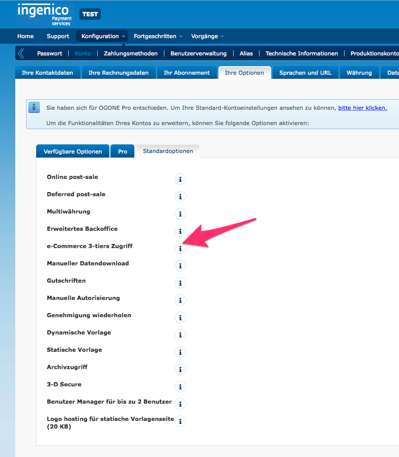
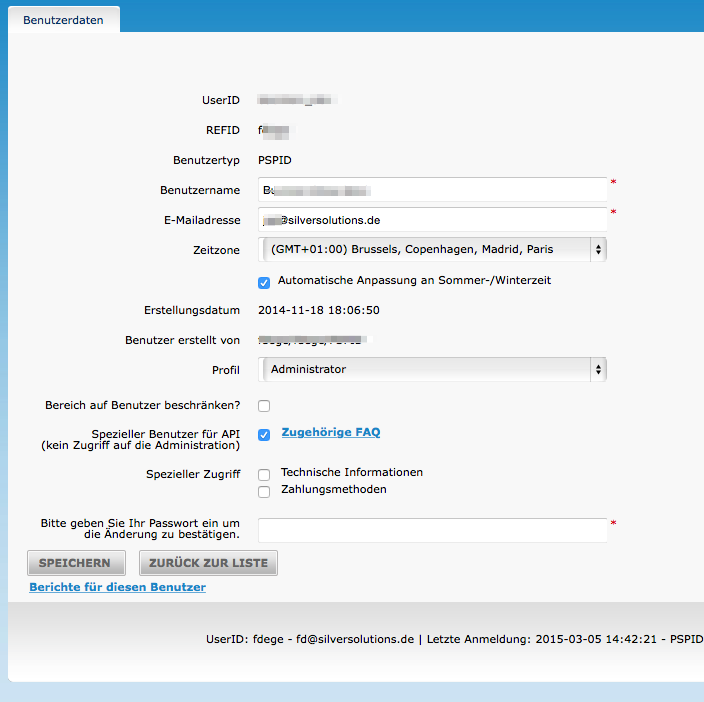
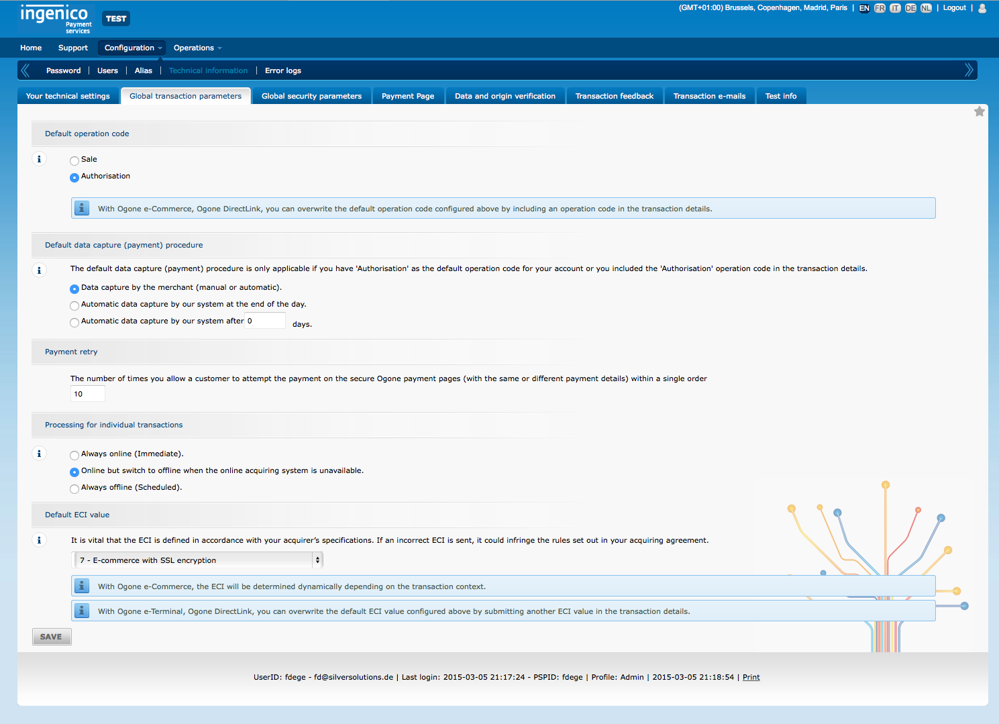
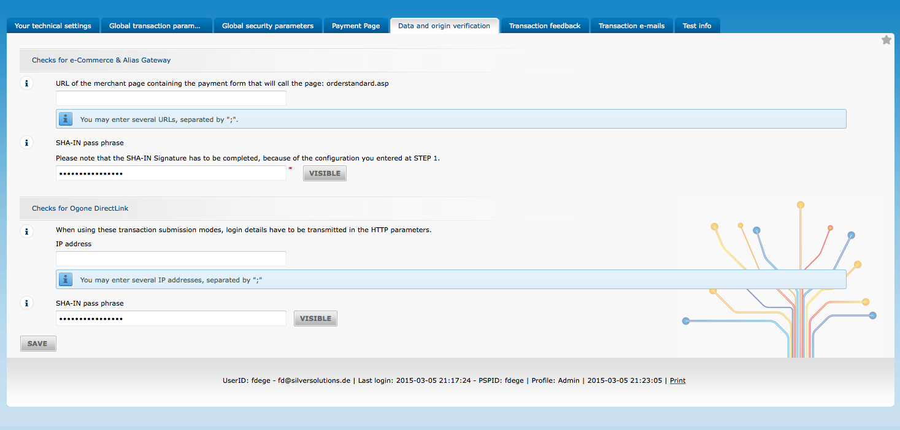
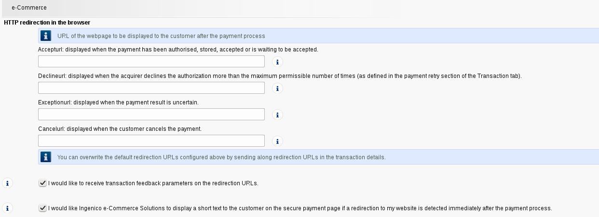
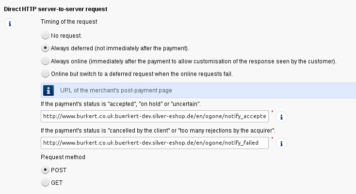
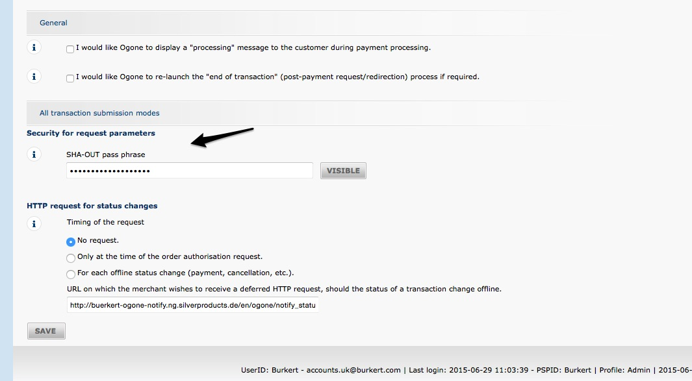

# Ogone

Ogone is a payment system offered by Ingenico e-Commerce Solutions: <http://payment-services.ingenico.com/gb/en/about-ingenico-payment-services>

## Important links

Backend: https://secure.ogone.com/Ncol/Test/backoffice/container/index?branding=OGONE

Error codes / messages: https://payment-services.ingenico.com/int/en/ogone/support/guides/integration%20guides/possible-errors

## Configuration parameters

``` yaml
ets_payment_ogone:
    pspid: my psid
    shain: "<shain defined in ogone backend>"
    shaout: "<shaout defined in ogone backend>"
    debug: true
    utf8: true
    api:
        user: shop_user_id
        password: "<password defined for user in ogone backend>"
```

|Parameter|Details|
|--- |--- |
|pspid|The psid used for log in in the ogone backend.|
|shain|has to be defined in the ogone backend/administration|
|shaout|has to be defined in the ogone backend/administration|
|api/user|The user (see "Create a user for the shop")|
|api/password|The password set for this user|

!!! note

    This configuration is not site-access aware. For the case that multiple Ogone accounts must be configured, depending on the site-access, the token service must be redefined in order to get site-access aware parameters injected:

    Example:

    ``` xml
    <!-- Overridden token service for Ogone -->
    <service id="payment.ogone.client.token" class="%payment.ogone.client.token.class%">
        <argument>$payment_ogone_pspid;project_domain$</argument>
        <argument>$payment_ogone_api_username;project_domain$</argument>
        <argument>$payment_ogone_api_password;project_domain$</argument>
        <argument>$payment_ogone_shain;project_domain$</argument>
        <argument>$payment_ogone_shaout;project_domain$</argument>
    </service>
    ```

    Fortunately, only this single service relies on the account parameters. In order to configure the values effectively, the ets\_payment\_ogone configuration can't be used any longer. The configuration above would now look like:

    ``` 
    project_domain.site_access_name.payment_ogone_pspid: my psid
    project_domain.site_access_name.payment_ogone_shain: "<shain defined in ogone backend>"
    project_domain.site_access_name.payment_ogone_shaout: "<shaout defined in ogone backend>"
    project_domain.site_access_name.payment_ogone_api_username: shop_user_id
    project_domain.site_access_name.payment_ogone_api_password: "<password defined for user in ogone backend>"
    ```

    Debug and utf8 must still be configured for the config namespace `ets_payment_ogone` are NOT site-access aware.

## How to setup the account in Ogone

### 1. Activate necessary 3-tiers option

It is important to activate the Option "e-Commerce 3-tiers access" (or in German: e-Commerce 3-tiers Zugriff).

Click on Configuration->Account->Your Options



### 2. Activate a payment such as VISA

Click on Configuration-\>Payment methods


### 3. Create a user for the shop

Click on Configuration-\>Users

Important: Please activate the option "API user".



### 4\) Configure Global transaction parameters

If the shop shall just authorize the transaction and the ERP will finalize the transaction then the option "Authorization" has to be set. 



### 5\) Global security parameters

Please choose SHA-1 as has algorithm and UTF-8 as encoding standard. 


### 6\) Data and origin verification

Please type in a secure SHA-in pass phrase and add the SHA-in pass phrase in the settings of the shop 



### 7\) Set ShaOut Password and notification URLs

Go to link Configuration -\>Technical information -\>Transaction Feedback






