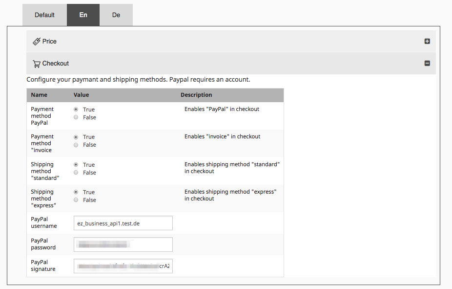
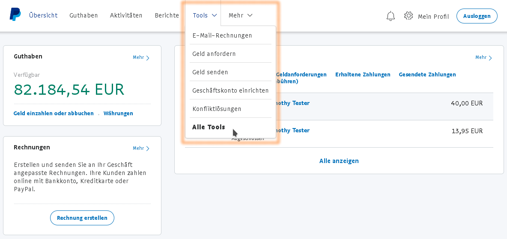
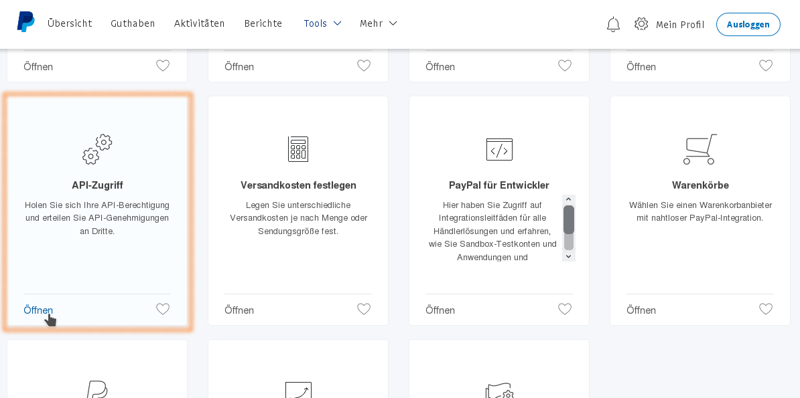
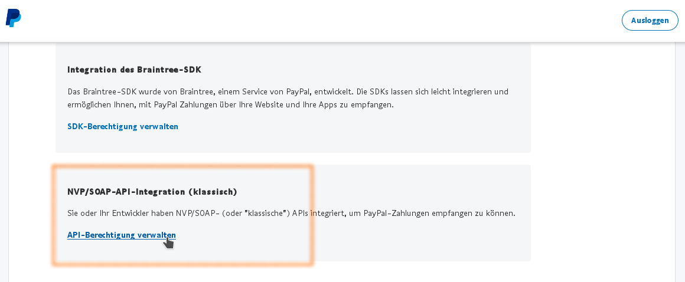
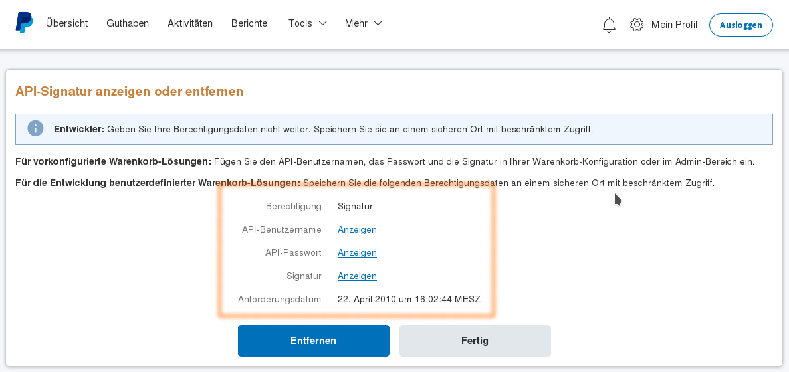

# PayPal

## Express Checkout

## Installation and configuration

For Express Checkout payments a third party library (JMSPaymentPaypalBundle) is necessary. For installation and setup please look at: <http://jmspaymentpaypalbundle.readthedocs.io/en/stable/setup.html>

``` 
php composer.phar require jms/payment-paypal-bundle
php composer.phar update -- jms/payment-paypal-bundle
```

Please see [How to get the API credentials](#how-to-get-the-api-credentials) to learn were the values for the `JMSPaymentPaypalBundle` configuration can be found in the PayPal merchant's administration.

Additionally, the `SisoPaypalPaymentBundle` must be activated in the Kernel and the routes must be included:

`app/AppKernel.php`:

``` php
public function registerBundles()
{
    $bundles = array(
        // ...
        new Siso\Bundle\PaypalPaymentBundle\SisoPaypalPaymentBundle(),
    );
}
```

`app/config/routing.yml`:

``` yaml
# ...
_siso_paypal_payment:
    resource: '@SisoPaypalPaymentBundle/Resources/config/routing.yml'
```

## Configure the paypal Express plugin

The configuration for payPal Express has to be setup for each siteaccess (at least when the backend is used).



## How to get the API credentials

``` yaml
jms_payment_paypal:
    username: myusername
    password: maypassword
    signature: A5Va2XJid60kg21ddddddxKbSykH4i.ddsdsd-332yT0G8z8LrvNPl1
    debug: true
```

Important:

In product mode you need set debug to false!  

Login and navigate to "All Tools"



Select the tool "API Access"



Choose "Classic (NVP-)API integration"



This page will list the necessary values.


