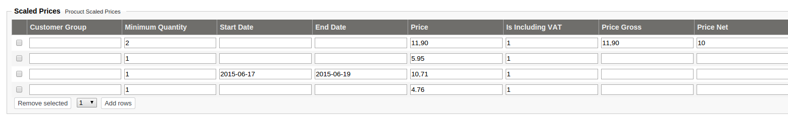

# LocalPriceProvider

## The local price provider

Local Price Provider is able to calculate prices based on product data that was imported to eZ Commerce. It uses the information provided by the catalogElement.

The Local price provider supports the following price models:

| Use case                                     | Price from         |
| -------------------------------------------- | ------------------- |
| List price                                   | The price from CatalogElement is used.  |
| Customer group based prices                  | The Local Price Provider is able to use group based prices. A customer can be part of one or more groups. This rule can be used in combination with the "scaled" prices including date time ranges. |
| Volume discount prices                       | The prices can be defined with a minimum quantity            |
| Prices defined for given date and time range | The prices can be defined for a given time range. It is possible to add a start and or end date including a time.   |

## How does the price logic work

Scaled prices must be stored in the catalog element in a correct format, see [ScaledPriceServiceInterface](../../scaledpriceserviceinterface/scaledpriceserviceinterface.md). This is the task of the CatalogFactory.

The scaled prices may be setup in the eZ backend as described in the screenshot:

!!! note "Rules for finding the matched scaled price"

    Order for checking if a scaled price applies:

    1. Check if given quantity matches the scaled price line (in the example Quantity is 1,  3 lines match)
    2. Check if given start date matches. For multiple lines the highest date will match. E.g. for quantity 1 the start date "2015-06-17" will be at the end of the list, before default empty value. 
    3. If the quantity and start date is the same than the lowest price is taken. Price means Price inc VAT (Price Gross) and may come from "Price" or Price Gross. If Price is used and Is Including VAT is 0 then the VAT has to be added first for comparison reasons. 

    If no scaled price is found the standard price from the product will be used.

    If several scaled prices matches, the best scaled price will be used.

### Examples

Assumption: Quantity is 1 and the current date is 2015-06-18

Result: The last matching rule will win (in this case the rule with the start date ""2015-06-17") and the price will be "10.71" including VAT 

Assumption: Quantity is 1 and the current date is 2015-06-20

Result: The last matching rule will win (in this case the rule without the start date) and the price will be "4.76" including VAT 

## Which data is considered by price calculation?

- scaled prices (if set), see [ScaledPriceServiceInterface](../../scaledpriceserviceinterface/scaledpriceserviceinterface.md)
- base price

If scaled prices are set, they are used to calculate the customer price.

The base price is used to calculate the list price and customer price.

The local price provider is making a best price search. The customer price is always the best price (scaled or base price)\!

## How vat and currency are handled?

- LocalPriceProvider uses the [VatServiceInterface](../../vatserviceinterface/vatserviceinterface.md) to get the vatPercent by the given vatCode.
- As currency always the customer currency is used (set in the price request)

Currently the local price engine does not support using exchange rates to convert a price from one currency to another one.

Usually prices (and the currency) are setup per country and provided during the import from the ERP or PIM system.
