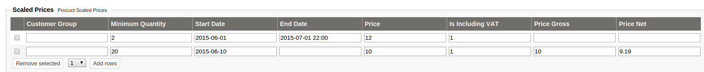

# Ez5ScaledPriceService

## Introduction

This service determines the correct price by comparing base price from PriceRequest to `scaledPrices` array stored in extended data (also in PriceRequest).The service determines the best price if more scaled prices matches.

This data may e.g come from eZ backend. It is the task of the CatalogFactory to store data in the correct format in the catalog element.

The scaled prices can be setup per product in the backend of the shop:



|Field|Identifier|required|Description|Example|
|--- |--- |--- |--- |--- |
|Customer Group|customerGroup|no|Code for the customer group|GROUPA|
|Minimum Quantity|minQuantity|yes|Minimum quantity for the given price. If more than one scaled price entries will match the latest matchin entry will be used|2|
|Start Date|startDate|yes (can be empty)|start date can be set in two formats (date with and without precise hour). If no time is given then "00:00:00" (hour-minutes-seconds) will be used. 2015-06-01 becomes 2015-06-01 00:00:00|2015-06-01 00:00|
|End Date|endDate|no|end date can be set in two formats (date with and without precise hour). If no time is given then "23:59:59" (hour-minutes-seconds) will be used. 2015-06-01 becomes 2015-06-01 23:59:59|2015-06-01 22:00|
|Price|price|yes|Price used to calculate price gross and price net value. Price can be with or without VAT|12.65|
|Is Including VAT|isInclVat|yes|value that determines if Price includes VAT or not.|0 or 1|
|Price Gross|priceGross|no|if not set then it's calculated based on two previous values: Price and Is Including VAT. If set price gross value overrides the calculation.||
|Price Net|priceNet|no|if not set then it's calculated based on two previous values: Price and Is Including VAT. If set price net value overrides the calculation.||

ProductNode contains additional attribute for scaledPrices. Ez5CatalogFactory is extracting this value and putting it into an ArrayField.

``` php
* @property-read ArrayField $scaledPrices

Example:
$scaledPrices = array();
foreach($prices as $price) {
    $scaledPrices[] = array(
        'price' => $price['Price'],
        'isInclVat' => true,
        'minQuantity' => $price['MinQty'],
        'startDate' => '',
        'endDate' => ''
    );
}

return new ArrayField(
    array(
        'array' => $scaledPrices
    )
);
```

#### The scaled price matches in cases below:

- if customer group is not defined or customer group matches the customer group from byuer party
- if price line quantity is greater than scaled price minimum quantity
- if startDate is not defined or current date is more than startDate (if defined)
- if endDate is not defined or current date is less than endDate (if defined)

#### Where the customerGroups are stored ?

In Customer Profile Data inside Buyer Party:

``` xml
<Party ses_unbounded="PartyIdentification PartyName" ses_type="ses:Contact" ses_tree="SesExtension">
    <SesExtension>
        <CustomerGroups>
            <Code>GROUPA</Code>
            <Code>GROUPB</Code>
        </CustomerGroups>
    </SesExtension>
</Party> 
```

``` php
array( 'CustomerGroups' => array (
    0 => array('Code' => 'GROUPA'),
    1 => array('Code' => 'GROUPB'),
));
```
