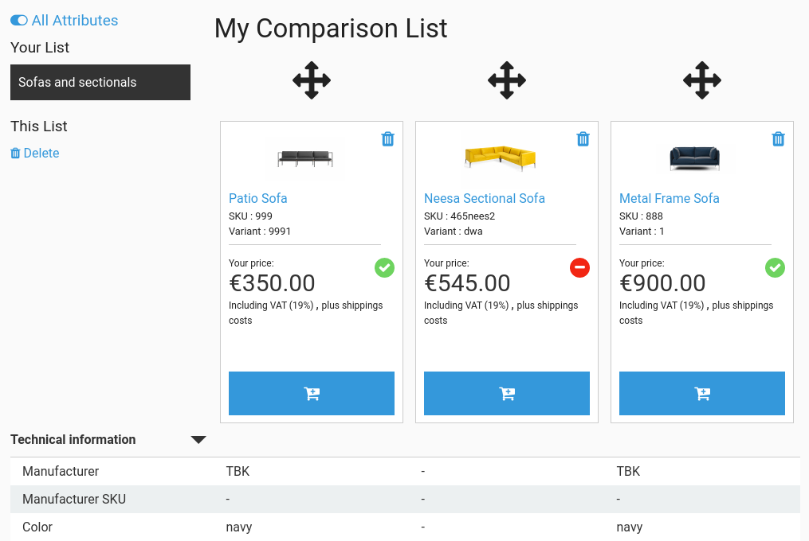

# Product comparison

eZ Commerce offers the option to compare products on a single page.
Customers can save products on their own comparison lists.
Comparison lists are divided per product type (for example speakers, microphones, etc.). 

The comparison function is based on the basket system.

This feature is available for all customers (both logged-in and anonymous).

!!! note

    There can be many comparison lists for all users including unregistered (anonymous) browser sessions.
    It is recommended to use a service to frequently clean old anonymous comparison lists for heavy-loaded sites.

### Adding a product to a comparison list

Only orderable products can be added to comparison.
If a product is a variant, the compare button is only shown when all characteristics for this variant are selected.

You can add a product to the comparison list in two places:
product detail page and product listing page:

If the product is already in the comparison list, the button is greyed out.

After a customer adds a product to the comparison list, a notification message is displayed.

Every item can be stored only once. A notice is displayed if a customer tries to add an item twice:

When adding products, no prices and no quantity is stored in the comparison list.

### Comparison list

The comparison can be found in the header of the website and in the profile page in right user menu.

In the header section the link shows the number of products in the comparison list.

When the customer hovers over the button, a sub-menu is displayed with all types of the comparison lists and their numbers of products per list.

When adding or removing products to or from comparison lists, the page-header information is updated.

The profile page provides a simple link in the right side-navigation.

### Comparison list overview page

#### Grouping products into categories

One group contains one kind of products (for example speakers, notebooks, etc.).
It is determined by internal shop logic and can be overridden in projects.

#### Displaying attributes

Attributes (or product specifications) are grouped for display and can be opened and closed by clicking the arrows in their header rows (accordion UI).

The comparison feature provides the ability to show/hide attribute groups and attributes if they are identical. 

1. Product groups of attributes can be collapsed by default when all contained attributes are identical.
1. Product attributes can be hidden when the are identical.

Configuration parameters determine if eZ Commerce should hide groups which have only identical attributes for compared products and attributes which have an identical value.

#### Sorting

Customers can move or rearrange products in the comparison list using drag and drop (the arrow-cross above the product image in the list is clickable).

After dragging and dropping, the position in the list is stored in the current [comparison-basket](product_comparison_api.md).
In the next call the customer will see sorted list by their preference.

#### Public comparison lists

The shop administrator can create public comparison lists with their own URL (e.g. `http://<site-host>/comparison/best-notebooks`).
They cannot be removed nor changed by customers.

Public comparison lists are useful for example for promotion campaigns.

#### Unavailable products

If a product is not available in the shop's catalog any longer, it is removed from the comparison list, and a notification message appears.
The removal only occurs with an HTTP request to the respective comparison list.
There is no background process which removes all non-existent products from all lists.

#### Printing

Comparison lists can be printed by clicking the respective link in the left sidebar.
The link prints the current page immediately without showing a print-optimized view.  
