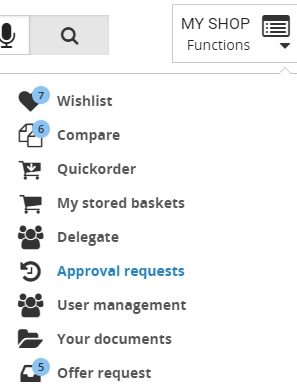
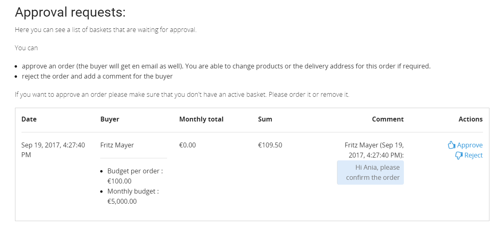
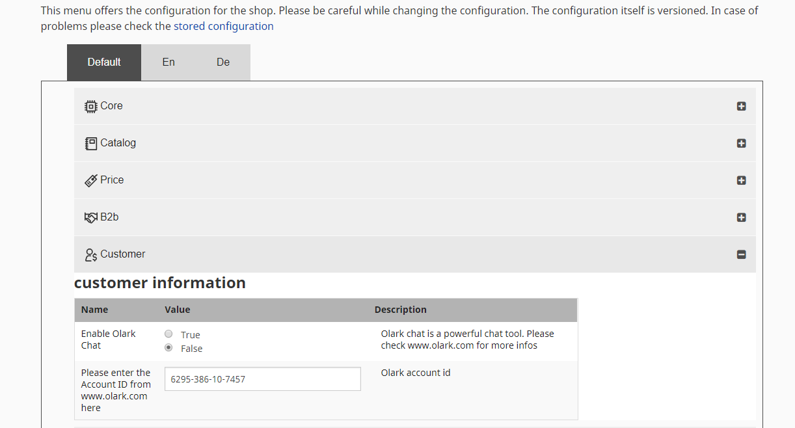
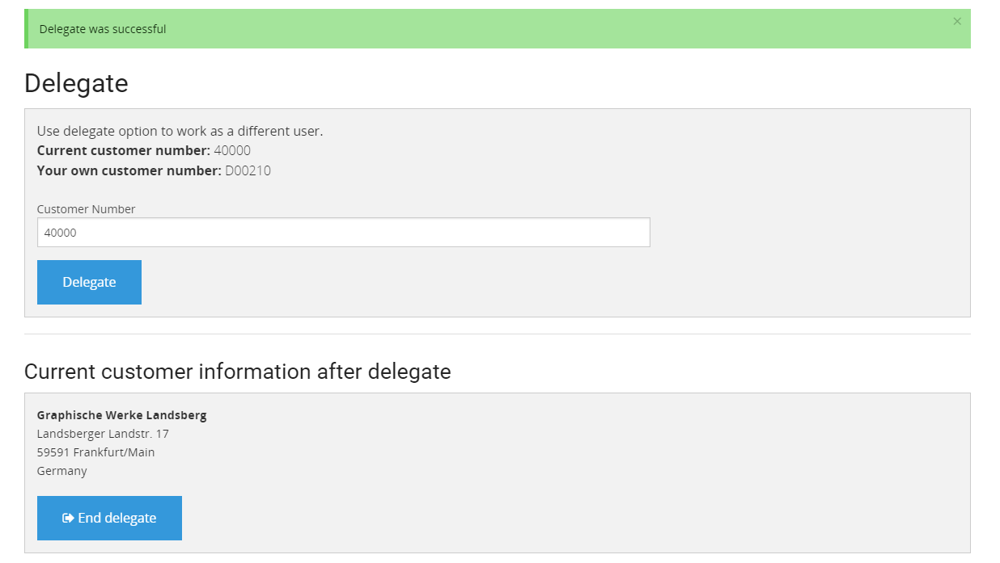
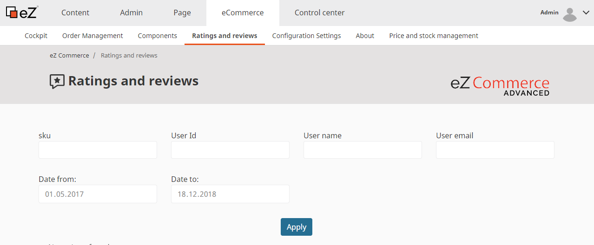
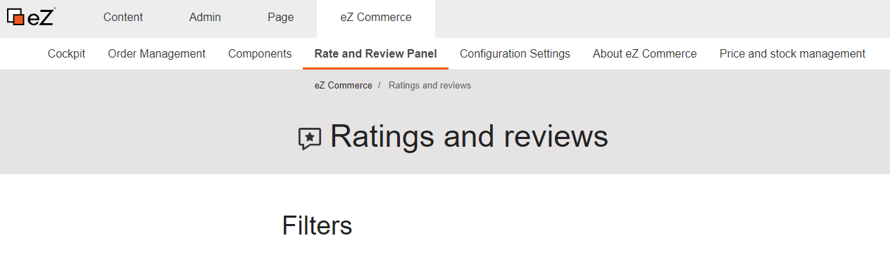

# Add-ons and plugins

## Plugins

### Customer center

The customer center offers B2B advantages especially for large customers.

Via the user management feature, customers are able to grant their own employees access to the shop. It improves the purchasing process since it offers features such as:

- Budget management
- Approval functions for orders
- Different roles and rights

The customer center can be connected to the ERP system and synchronizes customer data and contact data when required. In that case the ERP also controls which customer can use the customer center. 

If a customer has a customer center all employees are stored beneath the company folder. The shop administrator has a good overview of the company and its related employees with a shop account. 

The customer center will enhance the eZ Commerce processes such as:

- Registration
- Login
- Checkout
- Customer center management

## Add-ons

### Olark chat tool

Olark is a powerful chat tool which offers more than a normal chat. The shop is able to forward the name of a user (if logged in) to the service employee. Besides a chat functionality the service employee can assist the customer e.g. in pointing them to the correct place in the shop ("!push /Produkt-Katalog/Mikrofone/URM-Serie"). If no support employee is available, the conversion will be send by email. 

The chat tool can be enabled in the configuration settings of eZCommerce.

Please note that you need a valid license from Olark which might cause extra costs.

### Delegate function

The goal of the delegate function is that a special user can delegate to another user, means that they can move in the shop with a different customer number.

This feature is an important function for sales persons. They can use the delegate feature to support a customer remotely or to prepare a meeting with the customer.

### Rate and review

Customers can submit ratings and product reviews. Shop operators can build up trust, as customers tend to trust the judgment of other customers. Online shops with product reviews can rank higher in search engines which leads to more traffic.

- Storage of ratings and reviews in the shop
- Simple administration and export of reviews in the back end
- Filter and report options for reviews

### Voucher

Discount or value vouchers can easily be created in the shop backend. A voucher contains discount conditions like minimum basket value or discountable products. Create individual vouchers that are valid for a given number of uses, or for a set time period, or personalized vouchers that are only valid for one-time use.

- Easy creation of vouchers in the back end
- Different types of vouchers available
- Settlement with the ERP system
